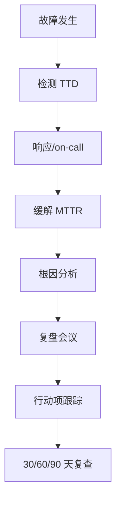

# 线上事故复盘结构

## 30 秒版（开场）

> 复盘目标不是追责，而是 **还原时间线 → 找根因 → 可执行改进项**。资深回答用 **5W1H + 时间线 + 行动项（含 Owner/DDL）**；强调 **Blameless** 与 **错误预算/SLI 关联**。Lead 面考察：能否推动跨团队落地。

## 3 分钟版（一面深度）

1. **是什么**：Postmortem / 事故复盘是对生产故障的结构化回顾文档与会议，输出可验证的改进措施。
2. **为什么**：5 年+ 工程师需证明不仅能修 bug，还能 **降低复发概率**、提升组织韧性；Staff 面常问「你主导过的 P0 复盘」。
3. **怎么做**：按模板写清 **影响面（用户/收入/SLI）→ 检测耗时 → 定位耗时 → 缓解 → 根因 → 行动项**；区分 **触发原因 vs 根本原因**（5 Whys）。

## 10 分钟版（原理 + 图示）

**推荐文档结构**

| 章节 | 内容 |
|------|------|
| 摘要 | 一句话 + 影响等级 P0/P1 |
| 时间线 | UTC/本地时间，精确到分钟 |
| 影响 | 用户量、错误率、持续时间、是否超 SLO |
| 根因 | 技术 + 流程 + 人为因素（不甩锅个人） |
| 为何未发现 | 监控/告警/演练缺口 |
| 行动项 | 预防 / 检测 / 缓解，每项有 Owner、DDL、验收标准 |



**STAR 口述模板（Lead 面）**

- **S**：订单服务 P0，支付成功率跌 15%，持续 23 分钟
- **T**：我作为 on-call TL 协调支付/网关/DB 三线
- **A**：先回滚变更 + 开关降级；并行查连接池耗尽；24h 内完成复盘
- **R**：补连接池指标告警；建立大促前压测 checklist；同类故障 0 复发

## 生产场景

- Go 服务常见：**goroutine 泄漏、GC 抖动、依赖超时雪崩、配置错误、发布未灰度**
- 指标：MTTD（检测）、MTTR（恢复）、复发次数
- 5 年+ 需能讲 **你写的 runbook / 值班手册** 如何被复盘改进

## 排查与工具

- 时间线证据：PagerDuty/Oncall 记录、Git 部署记录、Grafana 截图、Trace ID
- Go 侧：pprof 快照、变更 diff、feature flag 状态
- 文档：Confluence/Notion 模板 + Jira 行动项看板

## 架构取舍

| 做法 | 适用 |
|------|------|
| Blameless 文化 | 鼓励上报；避免隐瞒 |
| 公开复盘 | 中大规模团队知识传播 |
| 小范围复盘 | 敏感业务/合规场景 |

**何时不过度复盘**：无用户影响的小故障 → 轻量记录即可，避免会议疲劳。

## 追问链

1. **触发原因和根因区别？** → 触发：发布引入了 bug；根因：缺少 canary + 集成测试未覆盖该路径。
2. **如何衡量复盘质量？** → 行动项完成率、同类故障复发率、MTTR 趋势。
3. **业务压你「先别写文档」怎么办？** → 先口头 15 分钟同步 + 48h 内补文档；用数据说明复发成本。
4. **你主导的改进项被搁置？** → 绑定 OKR/SLO；拆小步可交付；找 Sponsor 在架构评审过会。

## 反模式与事故

- **甩锅个人** → 隐藏 systemic 问题，同类事故再发
- **行动项空洞**「加强培训」→ 无法验收
- **只修症状** 重启了事 → 未解决泄漏/限流缺失
- **复盘会开成批斗会** → 一线不再如实汇报

## 代码示例

领导力题通常无代码；可引用 Go 服务 **发布与可观测** 实践：

```go
// 变更可观测：结构化日志带 release/version，便于时间线对齐
log.Printf("service_start version=%s commit=%s", version, commit)
```

## 延伸阅读

- [Google SRE — Postmortem Culture](https://sre.google/sre-book/postmortem-culture/)
- [大厂 Go 后端面试 — 工程实践](https://developer.cloud.tencent.com/article/2647941)
