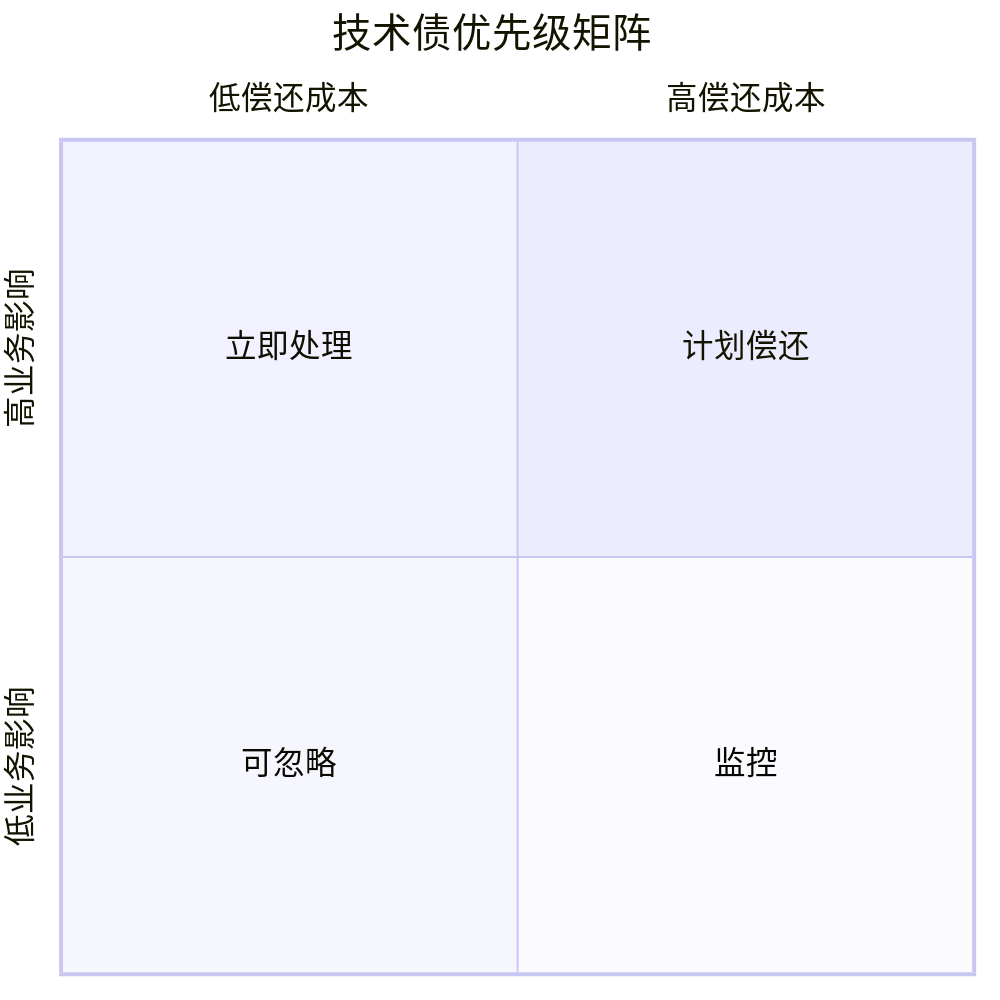

# 技术债识别与偿还策略

## 30 秒版（开场）

> 技术债是 **为短期速度牺牲的长期维护成本**。资深回答要会 **分类（故意/无意）、量化影响（变更 lead time、故障率）、偿还策略（绞杀者、增量重构、预算 20%）**；Lead 面看能否在业务压力下 **谈妥优先级**。

## 3 分钟版（一面深度）

1. **是什么**：设计/实现上的妥协，导致后续修改更慢、更易出错；包括代码、架构、测试、文档、依赖陈旧。
2. **为什么**：5 年+ 不是「零技术债」，而是 **可管理的债**；面试官想听你在 **交付与质量** 间的权衡案例。
3. **怎么做**：建立 **Tech Debt Register**（条目、影响、成本估算、建议偿还窗口）；每迭代预留 **10～20% 容量**；大债用 **Strangler Fig** 渐进替换。

## 10 分钟版（原理 + 图示）

**技术债四分法（面试好用）**

| 类型 | 例子 | 偿还方式 |
|------|------|----------|
| 代码债 | 巨型 handler、无测试、全局变量 | 小步重构 + 测试护栏 |
| 架构债 | 单体耦合、无边界上下文 | 模块提取、接口防腐层 |
| 基础设施债 | Go 1.16、无 CI、vendor 失控 | 升级窗口、自动化 |
| 流程债 | 无 CR 规范、无 ADR | 规范 + 模板 |



**Go 项目常见债**

- `main` 包几千行、无 `internal/` 边界
- handler 直接调 DB，无 service 层
- 错误 `%v` 吞 stack、无 `errors.Is/As`
- 无 `-race` CI、无 benchmark 基线
- `vendor/` 与 `go.mod` 长期不同步

## 生产场景

- **症状**：同样需求估期从 3 天变 2 周；线上小改频繁回归；新人 3 个月仍不敢动核心模块
- **量化**：变更失败率、部署频率、P95 构建时间、测试覆盖率趋势
- **业务对话**：用「不还可预期的 X 月大故障 / Y% 人力浪费」换排期

## 排查与工具

- 静态分析：`staticcheck`、`golangci-lint` 技术债报告
- 依赖：`go mod outdated`、Dependabot
- 代码复杂度：cyclomatic、包耦合（`go dep graph`）
- 文档：ADR（Architecture Decision Record）记录「为何欠债」

## 架构取舍

| 策略 | 何时用 |
|------|--------|
| Boy Scout Rule | 日常 touch 文件顺手改一点 |
| 专项 Sprint | 大版本前集中还「阻塞型债」 |
| Strangler | 老模块旁路新实现，流量渐进切换 |
| 重写 | 仅当域模型清晰且业务可停 feature |

**何时不急着还**：低流量遗留模块、6 个月内要下线、偿还成本 > 重写收益。

## 追问链

1. **业务说没空还债？** → 选 1～2 条 **高影响低成本**（如加 CI race、拆最痛模块测试）；绑定下个故障成本案例。
2. **如何向非技术老板解释？** → 类比「信用卡利息」：现在不还，以后每个需求多付 30% 时间税。
3. **重构引入 regression？** →  characterization test、金丝雀、feature flag 双跑对比。
4. **怎么防止新债？** → CR checklist、架构评审门槛、Definition of Done 含测试与文档。

## 反模式与事故

- **Big Bang 重写** 两年无产出 → 业务失去信任
- **只抱怨不还** → Lead 信誉下降
- **隐藏债** 不报风险 → 估期持续失真
- **为「干净」过度抽象** → 新的一种债

## 代码示例

**绞杀者模式：老接口委托新实现**

```go
// legacy 包逐步下线，新逻辑在 internal/order
func CreateOrder(ctx context.Context, req *Request) (*Order, error) {
    return order.NewService(repo).Create(ctx, req)
}
```

## 延伸阅读

- [Martin Fowler — Technical Debt](https://martinfowler.com/bliki/TechnicalDebt.html)
- [Go project layout 参考](https://github.com/golang-standards/project-layout)
