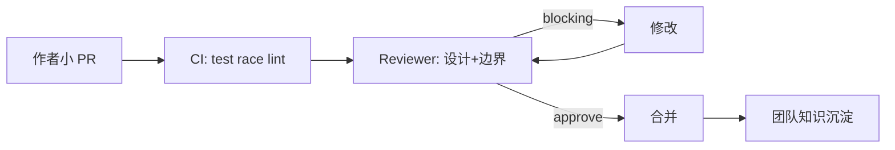

# 带团队与 Code Review 文化

## 30 秒版（开场）

> Tech Lead 的核心是 **提效他人**：清晰标准、有效 CR、成长路径。资深回答强调 **CR 看设计/可维护性/测试，不只格式**；Go 团队应有 **uber-go/guide 或团队 style guide**；5 年+ 需举例 **你如何通过 CR/结对提升 junior 质量**。

## 3 分钟版（一面深度）

1. **是什么**：带团队包括任务拆分、技术方向、CR、1:1、知识传承；CR 是 **集体所有权** 与质量门禁。
2. **为什么**：Staff/Lead 面少考手写算法，多考 **能否 scale 团队产出** 而不成为瓶颈。
3. **怎么做**：CR SLA（如 4h 内首轮）；**nit / optional / blocking** 分级；新人 PR 小步合并；定期 **Go 专题分享**（并发、错误处理）。

## 10 分钟版（原理 + 图示）

**高效 CR 原则（Google Eng Practices 精简）**

| 原则 | 说明 |
|------|------|
| 速度 | 小 PR（<400 行）优先；大改拆 PR |
| 标准 | 团队 written guide：命名、错误、并发、日志 |
| 尊重 | 问问题式评论；对事不对人 |
| 自动化 | fmt、lint、test、security 在 CI，人审更高层 |



**Go 团队 CR Checklist（可口述）**

- [ ] 错误是否 wrap 并保留链？`fmt.Errorf("...: %w", err)`
- [ ] 并发：context 传递、泄漏、锁范围
- [ ] 接口：是否过度抽象？是否面向测试 fake？
- [ ] 日志：结构化、无敏感信息、级别合理
- [ ] 测试：table-driven、边界、`-race`
- [ ] API：向后兼容、版本、文档

## 生产场景

- **Junior 常见**：goroutine 泄漏、忽略 `ctx.Done()`、handler 里写业务 SQL
- **团队瓶颈**：只有 TL 能 approve 核心模块 → 培养 **CODEOWNERS 轮换**
- **远程协作**：异步 CR + 录制设计 walkthrough

## 排查与工具

- GitHub/GitLab PR 模板（动机、测试、风险、回滚）
- `CODEOWNERS`、`golangci-lint` 统一配置
- 度量：PR cycle time、review 评论数、revert 率

## 架构取舍

| 模式 | 适用 |
|------|------|
| 全员 CR | 质量优先、团队 <15 人 |
| Owner CR | 核心模块专家把关 |
| Pair + 轻 CR | 复杂并发/支付逻辑 |

**何时放宽 CR**：紧急 hotfix 可走 break-glass，**事后补 CR 与测试**。

## 追问链

1. **CR 意见冲突？** → 先对齐 guide；无条文则 ADR 或 TL 决策并记录。
2. **Senior 不接受 CR？** → 1:1 谈团队标准；用 revert/故障案例说明成本。
3. **如何带 junior 成长？** → 任务梯度、结对、让 ta 讲设计、逐步放大 PR 范围。
4. **你如何分配时间？** → 示例：30% 编码、30% CR/设计、20% 1:1/规划、20% 救火。

## 反模式与事故

- **CR 人身攻击** → 贡献者回避、质量下降
- **LGTM 刷过** → 线上事故
- **TL 全包核心代码** → 单点、团队不成长
- **只 CR 格式** → 架构腐化

## 代码示例

**CR 友好：小函数 + 可测**

```go
func (s *Service) Transfer(ctx context.Context, from, to string, amount decimal.Decimal) error {
    if err := s.validateTransfer(from, to, amount); err != nil {
        return err
    }
    return s.repo.WithTx(ctx, func(tx Repo) error {
        return s.doTransfer(ctx, tx, from, to, amount)
    })
}
```

## 延伸阅读

- [Google Engineering Practices — Code Review](https://google.github.io/eng-practices/review/)
- [Uber Go Style Guide](https://github.com/uber-go/guide)
