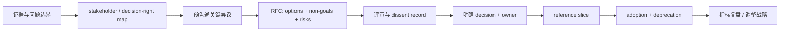

# Staff 技术战略、无职权影响力与案例表达

## 30 秒版（开场）

> Senior 的强项通常是把一个复杂系统做成；Staff 还要在没有直接汇报关系时，让多个团队围绕同一组不变量、接口和迁移顺序交付。技术战略不是技术清单，而是“基于证据的诊断 → 明确原则/非目标 → 目标能力 → 分阶段投资与退出旧路径 → 用业务和工程指标验证”。面试案例要说清我亲自改变了什么机制、如何处理反对意见、哪些结果有证据，以及哪些数字只是目标而非事实。

## 3 分钟版（一面深度）

| 维度 | Senior 常见范围 | Staff/架构师应补充 |
|------|-----------------|--------------------|
| 问题 | 边界相对清楚的复杂项目 | 模糊、跨团队、没人完整拥有的问题 |
| 产出 | 服务、模块、项目交付 | 技术方向、标准接口、迁移机制、组织杠杆 |
| 影响 | 本团队代码与 SLO | 多团队路线图、投资顺序、风险与能力建设 |
| 决策 | 在既定目标内优化 | 澄清目标、非目标、决策权和退出条件 |
| 证据 | 功能、性能、事故结果 | adoption、交付周期、风险、成本与业务结果 |

Staff 不等于“写代码更少”或“所有设计都由我拍板”。可信回答应同时出现：

- 深入关键技术细节的能力；
- 让其他人能安全交付的机制；
- 明确的 owner 和决策权；
- 可反驳、可量化的成功标准；
- 对失败、反事实和个人边界的诚实复盘。

## 10 分钟版（技术战略框架）

### 一页战略应回答什么

```text
1. 诊断：现在为什么不能继续？证据是什么？
2. 目标：用户/业务/工程结果是什么？什么不是目标？
3. 不变量：正确性、安全、兼容、SLO 的不可妥协边界
4. 选项：至少两个可行方案及成本、风险、可逆性
5. 目标能力：未来团队应能做到什么，不先锁死产品名
6. 路线图：薄切片、依赖、owner、门禁、退出旧系统
7. 运营模型：谁决策、谁维护、谁值班、谁承担迁移成本
8. 指标：领先指标、结果指标、guardrail 和停止条件
```

“全面上微服务”“统一用某数据库”“引入 AI”都不是战略。它们只有在诊断、约束和投资顺序
成立时，才可能是实施手段。

### 决策不是 RFC 发出去等点赞



无职权影响力不是“说服所有人”：

1. 先区分决策者、执行 owner、受影响团队、领域专家和 veto/合规方。
2. 在正式评审前预沟通高风险异议，让对方能影响方案，而不是被迫接受成品。
3. 把技术事实、偏好、组织约束和业务优先级分开记录。
4. 达不成共识时按既定 decision right 升级；升级是解决僵局，不是绕过反对者。
5. 决定后保留 dissent 与触发重审的条件，团队可以 disagree and commit。
6. 把 reference implementation、迁移工具、文档、support 和旧路径 deprecation 一起交付；
   “RFC 通过”不是 adoption。

### 可复用 Staff 案例：多链交易生命周期统一

以下是**表达模板**，方括号必须替换成你真实经历，不能当成既成事实背诵。

#### Situation

> `[N]` 个团队各自实现链 adapter，`submitted/confirmed/finalized/failed` 含义不一致；
> 过去 `[周期]` 内有 `[N]` 次重复广播、错误入账或恢复超时。链团队担心统一接口抹平
> Solana/Cosmos/Sui/Bitcoin 语义，业务团队则受不了每接一条链重做状态机。

#### Task

> 我的职责不是重写所有 adapter，而是在 `[期限/资源]` 内建立跨链 orchestration contract、
> 链特有 capability 扩展、迁移门禁和 owner 模型，并让 `[N]` 个团队完成首批 adoption。

#### Action

1. 从事故、代码和 trace 抽取共同不变量：广播 timeout 必须进入 `UNKNOWN`；业务幂等与链上
   observation identity 分离；只有链特有过期证据成立后才可重建交易。
2. 比较三种方案：共享 library、中心化 transaction service、薄 orchestration protocol +
   各链 adapter。根据故障域、团队自治、升级频率和延迟选第三种。
3. 写 RFC 和能力矩阵，明确非目标：不统一 fee/nonce/object/finality 语义，不一次迁完所有链。
4. 与安全、钱包、节点和账本 owner 预评审；把“谁可重播、谁确认最终性、谁冻结 unknown”
   写成 decision table。
5. 先做一条链的 reference slice 和 shadow compare，再按风险分 cohort；提供 contract tests、
   dashboard、runbook 和兼容窗口。
6. 对延期团队不靠命令推进，而是削减迁移成本、给出 owner/DDL，并在影响共享 SLO 时按决策权升级。

#### Result

只填可证明数据：

> 在 `[周期]` 内 adoption 从 `[A]` 到 `[B]`；链接入 lead time 从 `[X]` 到 `[Y]`；
> unknown transaction 自动收敛率达到 `[值]`；重复副作用事故从 `[值]` 到 `[值]`。
> 未达成的是 `[范围]`，因为 `[原因]`；我随后把 `[机制]` 调整为 `[变化]`。

没有精确财务数字时，可以说“事故数、人工工时、P95 恢复时间、迁移完成率”，不要编造节省金额。

## 指标设计

| 类型 | 示例 | 防止的误判 |
|------|------|------------|
| 领先指标 | reference slice 通过、contract coverage、迁移 cohort 完成率 | 等事故下降一年才知道方向错 |
| 结果指标 | 接链 lead time、P95 恢复时间、重复副作用事故、SLO | 只统计 RFC/会议数量 |
| Guardrail | 失败率、人工介入、兼容性回归、链特有能力缺失 | 为追速度牺牲正确性 |
| 组织杠杆 | 非作者贡献比例、值班 owner 覆盖、文档自助率 | 平台变成 Staff 个人单点 |
| 退出指标 | 旧 SDK 调用归零、旧 on-call/runbook 关闭 | 新旧两套永久共存 |

“上线了平台”是里程碑，不是结果。Staff 案例最好有一项业务/可靠性结果、一项组织杠杆和一项
未达预期的复盘。

## 90 秒回答结构

```text
20s  问题规模、业务影响、为什么跨团队
15s  我的 mandate、约束和成功标准
35s  我做的三个关键动作：诊断/决策、最小切片、adoption
10s  可量化结果与证据来源
10s  未达成、学习和下一步
```

使用“我”说明判断和动作，使用“我们”承认团队交付；不要把所有成果据为己有，也不要全程只说
“我们”而让面试官无法判断你的贡献。

## 常见反对意见怎么处理

| 异议 | Staff 回应 |
|------|------------|
| “统一平台会拖慢我们” | 先量化当前重复成本；提供可独立采用的薄切片和明确退出条件 |
| “我的链/业务很特殊” | 把共同 orchestration 与 chain-specific capability 分层，用 contract test 证明 |
| “现在没资源迁移” | 把迁移成本纳入路线图，提供工具/owner；风险超过阈值时交由决策者排序 |
| “这个方案不完美” | 比较可逆性和当前约束，记录触发重审条件，不以完美阻止增量改进 |
| “谁长期维护？” | 在立项时确定产品 owner、on-call、预算和 deprecation 权，不事后甩给平台组 |

## 追问链

1. **没有汇报关系如何推动？**  
   用共同目标、证据、降低 adoption 成本和清晰 decision right；不是靠个人魅力或无限开会。
2. **如何证明这是 Staff 而不是普通项目管理？**  
   展示关键技术判断、跨系统不变量、组织机制和可复用杠杆，而非只报排期。
3. **有人始终不同意怎么办？**  
   先确认是事实、优先级还是 ownership 冲突；记录 dissent，按既定决策权升级并保留重审条件。
4. **路线图延期如何处理？**  
   重算风险与依赖，削减范围或调整顺序；透明暴露 trade-off，不靠加班隐藏。
5. **失败案例怎么讲？**  
   说明错误假设、何时发现、怎样限制损失、改变了什么机制；不要把失败包装成“其实都成功”。

## 反模式与错误表达

- “Staff 就是团队里技术最强、所有方案我说了算。”
- “我写了 RFC，所以已经完成影响力。”
- “所有团队都同意后才能决策。”
- “平台上线就是战略成功。”
- “我推动了很多会议”但说不出机制和结果。
- 把示例中的 `[N]`、`[X]` 当成自己的真实数据。
- 只讲宏观路线图，追问接口、故障域和迁移时没有技术深度。

## 延伸阅读

- [Software Engineering at Google：Design Docs](https://abseil.io/resources/swe-book/html/ch10.html)
- [Software Engineering at Google：Large-Scale Changes](https://abseil.io/resources/swe-book/html/ch22.html)
- [Google Engineering Practices：Code Review Standard](https://google.github.io/eng-practices/review/reviewer/standard.html)
- [S-CLOUD-09 Terraform 安全变更](../09-cloud-native/S-CLOUD-09-terraform-state-drift-safe-change.md)

