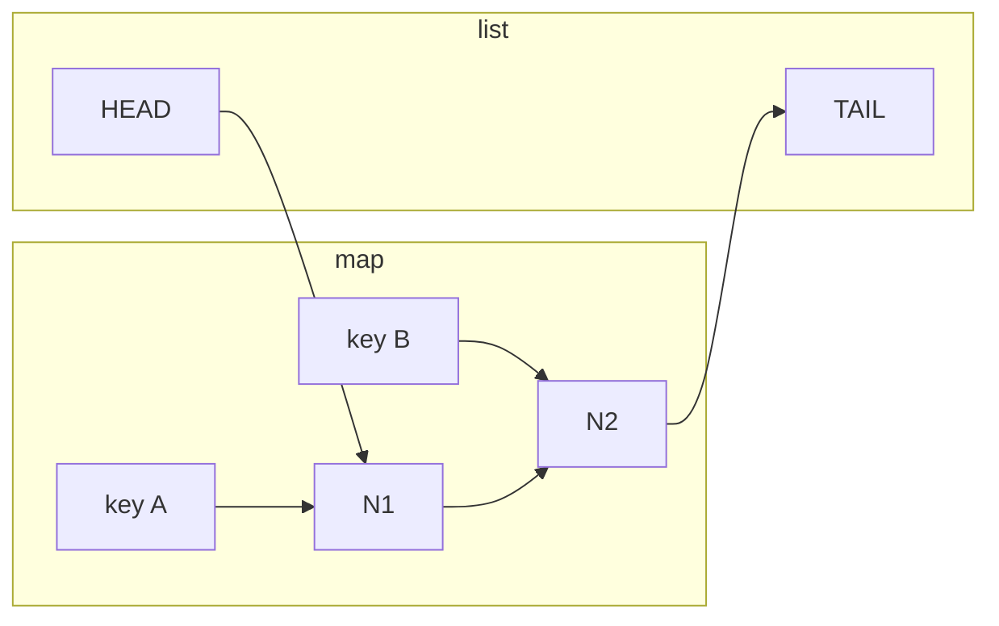

# 并发安全 LRU 缓存

## 30 秒版（开场）

> LRU = **最近最少使用**淘汰。经典实现：**哈希表 + 双向链表**，Get/Put 均 **O(1)**。Go 用 `map` + `container/list`，并发版加 **`sync.Mutex`** 包住临界区。面试关键词：**MoveToFront、超容量删 Back、更新已存在 key**。

## 3 分钟版（一面深度）

1. **是什么**：容量固定，满时淘汰最久未访问的 key。
2. **为什么**：本地缓存、DB 查询缓存、热点数据 — 面试高频手写题（LeetCode 146）。
3. **怎么做**：`map[key]*list.Element` 定位节点；链表头=最新、尾=最旧；Get 命中则 `MoveToFront`；Put 新 key 则 `PushFront`，超 cap 删 `Back` 并从 map 移除。

## 10 分钟版（白板步骤）



**手写顺序（建议口述）**

1. 定义 `entry{key, value}` — 删尾时需要 key 从 map 移除
2. `Cache{cap, mu, items map, order *list.List}`
3. `Get`：不存在 return false；存在 `MoveToFront` 返回值
4. `Put`：已存在则更新 + `MoveToFront`；否则 `PushFront`，若 `Len>cap` 删 `Back`
5. 加 `mu.Lock/defer Unlock`

**复杂度**

| 操作 | 时间 | 空间 |
|------|------|------|
| Get | O(1) | — |
| Put | O(1) | O(capacity) |

## 生产场景

- 进程内缓存（配合 TTL 可扩展为 LRU+过期时间）
- 注意：**单机**缓存；分布式用 Redis
- 高 QPS 时 Mutex 成瓶颈 → 分片 LRU（按 key hash 多把锁）

## 排查与工具

- `go test -race ./lru/...`
- benchmark 对比 `sync.Map`（不适合 LRU 顺序语义）

## 架构取舍

| 方案 | 适用 |
|------|------|
| Mutex + 单 LRU | 面试 / 中等 QPS |
| 分片 LRU | 高并发读写在同一进程 |
| Redis LRU | 多实例共享 |

## 追问链

1. **为何链表 + map？** → map O(1) 找节点，list O(1) 移动/删除，数组做不到。
2. **Get 要 MoveToFront 吗？** → 要，否则「刚读过的」会被误淘汰。
3. **能用单链表吗？** → 删尾/前驱需要 O(n)，双向链表 O(1)。
4. **RWMutex 行吗？** → Put 会改结构，读也 MoveToFront，通常仍用 Mutex；只读且不移位才可 RWMutex。

## 反模式与事故

- 删尾时 **忘记 delete map** → 内存泄漏、逻辑错误
- `list.Element` 存 value 不存 key → 删尾无法定位 map 键
- 无界 map 不做 LRU → OOM

## 代码示例

完整实现见 [examples/senior/lru/lru.go](https://github.com/twodog-tt/Golang-development-manual/blob/master/examples/senior/lru/lru.go)：

```go
func (c *Cache) Put(key string, value interface{}) {
	c.mu.Lock()
	defer c.mu.Unlock()
	if elem, ok := c.items[key]; ok {
		elem.Value.(*entry).value = value
		c.order.MoveToFront(elem)
		return
	}
	elem := c.order.PushFront(&entry{key: key, value: value})
	c.items[key] = elem
	if c.order.Len() > c.cap {
		back := c.order.Back()
		c.order.Remove(back)
		delete(c.items, back.Value.(*entry).key)
	}
}
```

```bash
cd examples/senior && go test ./lru/...
```

## 延伸阅读

- [LeetCode 146. LRU 缓存](https://leetcode.cn/problems/lru-cache/)
- [container/list 文档](https://pkg.go.dev/container/list)
