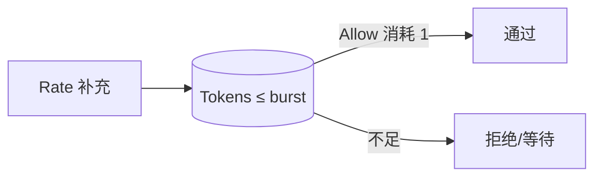

# 令牌桶限流器

## 30 秒版（开场）

> **令牌桶**：以速率 **rate** 向桶中放令牌，上限 **burst**；请求消耗 1 令牌，无令牌则拒绝或等待。允许 **平滑限流 + 短时 burst**。Go 手写：`lastRefill` 记录时间，每次 `Allow` 先 **按 elapsed 补令牌** 再扣减。

## 3 分钟版（一面深度）

1. **是什么**：相对 **漏桶**（固定流出速率），令牌桶允许积累 burst，更适合 API 网关。
2. **为什么**：保护下游、防刷、公平配额；与 [S-ARCH-08 限流](../03-system-design/S-ARCH-08-rate-limiting.md) 系统设计题呼应。
3. **怎么做**：`tokens += elapsed * rate`，cap 到 `burst`；`tokens >= 1` 则 `--` 并 return true；全程 `Mutex` 保护。

## 10 分钟版（原理 + 图示）



**与漏桶对比**

| | 令牌桶 | 漏桶 |
|---|--------|------|
| burst | 允许 | 不允许（平滑输出） |
| 实现 | 时间差补令牌 | 固定间隔漏水 |
| 典型 | API 限流 | 网络流量整形 |

**核心公式**

```
tokens = min(burst, tokens + (now - lastRefill).Seconds() * rate)
```

## 生产场景

- 单机网关：`Allow()` 快速判断
- 分布式：Redis + Lua / 中心化服务（本题为单机手写）
- 生产推荐：`golang.org/x/time/rate.Limiter`（已实现且经 battle test）

## 排查与工具

- 压测验证 burst 后是否按 rate 恢复
- `go test ./ratelimit/...`

## 架构取舍

| 方案 | 适用 |
|------|------|
| 手写 Mutex 桶 | 面试 |
| x/time/rate | 生产默认 |
| 滑动窗口 | 更严的「固定窗口 QPS」统计 |

## 追问链

1. **Wait 怎么实现？** → `select` + `time.Timer` + `ctx.Done()`，或循环 sleep（示例简化版）。
2. **AllowN(n) 呢？** → 补令牌后若 `tokens >= n` 扣 n。
3. **多 goroutine 并发？** → Mutex；高 QPS 可分片或 atomic（实现复杂）。
4. **和 semaphore 区别？** → 信号量控制并发数；令牌桶控制 **速率**。

## 反模式与事故

- **不 cap burst** → 令牌无限涨，失去限流意义
- **用 int 令牌不用 float** → 低速率（0.5 QPS）精度差
- **分布式各机独立桶** → 总 QPS = N × limit，需 Redis 协调

## 代码示例

见 [examples/senior/ratelimit/token_bucket.go](https://github.com/twodog-tt/Golang-development-manual/blob/master/examples/senior/ratelimit/token_bucket.go)：

```go
func (tb *TokenBucket) Allow() bool {
	tb.mu.Lock()
	defer tb.mu.Unlock()
	tb.refill()
	if tb.tokens < 1 {
		return false
	}
	tb.tokens -= 1
	return true
}
```

```bash
cd examples/senior && go test ./ratelimit/...
```

## 延伸阅读

- [golang.org/x/time/rate](https://pkg.go.dev/golang.org/x/time/rate)
- [Token bucket — Wikipedia](https://en.wikipedia.org/wiki/Token_bucket)
