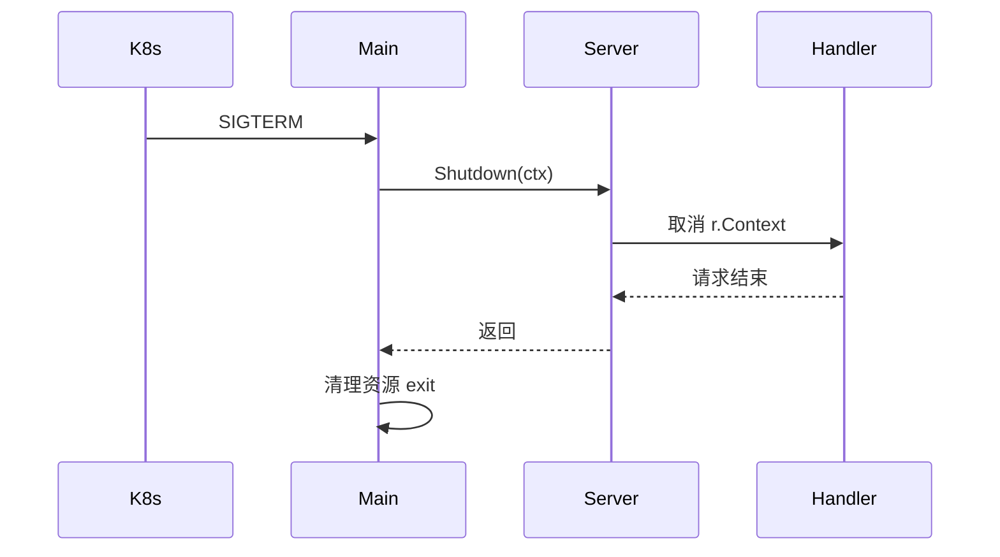

# HTTP 服务优雅关闭

## 30 秒版（开场）

> **优雅关闭** = 收到 SIGTERM/SIGINT 后 **停止接新请求**，**等存量请求完成** 再退出。Go 标准做法：`signal.Notify` 阻塞 → `Server.Shutdown(ctx)`（带超时）→ 区分 `http.ErrServerClosed`。Handler 内应监听 **`r.Context().Done()`**。

## 3 分钟版（一面深度）

1. **是什么**：`Shutdown` 关闭 listener，等待活跃连接处理完；`Close` 则立即断开。
2. **为什么**：K8s 滚动发布发 SIGTERM；直接 kill 导致 **502、数据半写入**。
3. **怎么做**：后台 `go ListenAndServe()`；主 goroutine `<-quit`；`context.WithTimeout` 调 `Shutdown`；handler 里 `select` ctx 与业务逻辑。

## 10 分钟版（流程）



**手写 checklist**

1. `srv := &http.Server{Addr, Handler}`
2. `go srv.ListenAndServe()`，错误过滤 `ErrServerClosed`
3. `signal.Notify(quit, SIGINT, SIGTERM)`；`<-quit`
4. `ctx, cancel := context.WithTimeout(..., 10*time.Second)`
5. `srv.Shutdown(ctx)` 处理超时错误
6. （可选）关闭 DB、flush 日志、等待 worker pool

**K8s 配合**

- `terminationGracePeriodSeconds` ≥ Shutdown 超时 + 缓冲
- readiness 失败后 stop 接新流量，再 SIGTERM

## 生产场景

- 长请求：Shutdown 等待最慢请求；超时后仍可能强杀
- WebSocket：需单独广播关闭帧
- 后台 goroutine：用 `ctx` 从 Shutdown 派生取消

## 排查与工具

- 发布时观察 **5xx 尖刺** 是否消失
- `curl` 发长请求同时 `kill -TERM` 验证

## 架构取舍

| 方案 | 适用 |
|------|------|
| Shutdown + 超时 | HTTP 服务标准 |
| errgroup 等多路服务 | 每个 Server 依次 Shutdown |
| 仅 Close | 开发环境快速退出 |

## 追问链

1. **Shutdown 和 Close 区别？** → Shutdown 优雅；Close 粗暴关 listener。
2. **ListenAndServe 返回什么？** → Shutdown 后 `ErrServerClosed`，需 `errors.Is` 忽略。
3. **Shutdown 超时怎么办？** → 记录日志；K8s 最终 SIGKILL；可 metrics 未完成任务数。
4. **多个 http.Server？** → 共享 parent ctx，依次或并行 Shutdown。

## 反模式与事故

- **主 goroutine 直接 ListenAndServe** → 无法同时等 signal
- **Shutdown 无超时** → 卡死进程，K8s 强杀
- **Handler 忽略 Request.Context** → Shutdown 后仍跑 30s

## 代码示例

见 [examples/senior/graceful_shutdown/main.go](https://github.com/twodog-tt/Golang-development-manual/blob/master/examples/senior/graceful_shutdown/main.go)：

```go
quit := make(chan os.Signal, 1)
signal.Notify(quit, syscall.SIGINT, syscall.SIGTERM)
<-quit

ctx, cancel := context.WithTimeout(context.Background(), 10*time.Second)
defer cancel()
if err := srv.Shutdown(ctx); err != nil {
	log.Fatalf("shutdown: %v", err)
}
```

```bash
cd examples/senior/graceful_shutdown && go run .
# 另开终端: kill -TERM <pid>
```

## 延伸阅读

- [net/http Server.Shutdown](https://pkg.go.dev/net/http#Server.Shutdown)
- 关联：[S-ARCH-15 灰度发布](../03-system-design/S-ARCH-15-release-strategy.md)
- 关联：[S-CLOUD-04 滚动发布与探针](../09-cloud-native/S-CLOUD-04-rolling-update-probes-pdb.md)
