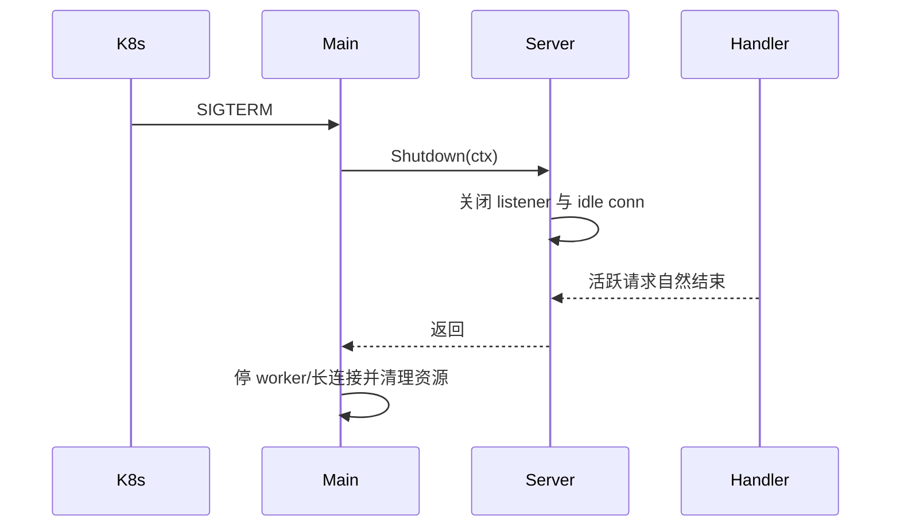

# HTTP 服务优雅关闭

<a id="oral-card"></a>

## 口述卡（高频必背）

[返回 P0 知识图谱](../_meta/p0-knowledge-graph.md)

!!! abstract "30 秒回答"

    **优雅关闭** = 收到 SIGTERM/SIGINT 后 **关闭 listener、关闭空闲连接，并等待活跃请求自然结束**。Go 标准做法：`signal.NotifyContext` → `Server.Shutdown(ctx)`（带超时）→ 必要时 `Server.Close()` 兜底。关键边界：`Shutdown` **不会自动取消活跃 handler 的 `Request.Context`，也不会等待 WebSocket 等 hijacked 连接**。

**3 分钟展开**

1. **是什么**：`Shutdown` 关闭 listener，等待活跃连接处理完；`Close` 则立即断开。
2. **为什么**：K8s 滚动发布发 SIGTERM；直接 kill 导致 **502、数据半写入**。
3. **怎么做**：协调 serve error 与退出 signal；`ListenAndServe` 放主 goroutine或后台 goroutine
   都可以，但必须确保 `Shutdown` 真正完成前 main 不返回。用有超时的 context 调 `Shutdown`；
   后台 worker 和长连接使用独立、显式的应用生命周期 context/registry 管理。

| 记忆槽 | 内容 |
|--------|------|
| 三个不变量 | 先停止接新流量再 drain；Shutdown 超时与应用生命周期分开；长连接和后台任务要单独管理 |
| 手画图 | `SIGTERM → not-ready/drain → Shutdown listener/idle → active done → workers/WS → resources` |
| 项目落点 | 用实际 API、WebSocket 行情或链监听说明 readiness、请求、worker、DB 的关闭顺序；只引用本人实际参与部分和可解释指标 |
| 一个取舍 | 宽 grace 提高完成率但拖慢发布；短 grace 保护部署速度却需要业务幂等与恢复 |

**错误表达**

- ❌ “`Server.Shutdown` 会取消所有 handler 并等待 WebSocket；收到 TERM 先关 DB 最安全。”
- ✅ “Shutdown 不打断活跃连接，也不接管 hijacked 连接；资源要在依赖它的工作完成后关闭。”

**自测追问**：为什么主 goroutine 不能在收到信号后直接返回？Shutdown 超时后如何处理仍在运行的副作用？

## 10 分钟版（流程）


```mermaid
sequenceDiagram
  participant K8s
  participant Main
  participant Server
  participant Handler
  K8s->>Main: SIGTERM
  Main->>Server: Shutdown(ctx)
  Server->>Server: 关闭 listener 与 idle conn
  Handler-->>Server: 活跃请求自然结束
  Server-->>Main: 返回
  Main->>Main: 停 worker/长连接并清理资源
```

**手写 checklist**

1. `srv := &http.Server{Addr, Handler}`
2. 启动 serve，并把非 `ErrServerClosed` 错误送回生命周期协调者
3. `signal.NotifyContext(..., SIGINT, SIGTERM)`；同时等待 signal 或 serve error
4. `ctx, cancel := context.WithTimeout(..., 10*time.Second)`
5. `srv.Shutdown(ctx)` 处理超时错误
6. （可选）关闭 DB、flush 日志、等待 worker pool

**K8s 配合**

- `terminationGracePeriodSeconds` ≥ Shutdown 超时 + 缓冲
- Pod 进入 Terminating 后，应用仍应显式进入 not-ready/draining 状态，并为 endpoints/LB 传播预留时间
- `preStop`（若配置）先执行，完成后 kubelet 才发 TERM；它消耗同一个 termination grace period，不能把两段时间重复计算

## 生产场景

- 长请求：Shutdown 等待最慢请求；超时后仍可能强杀
- WebSocket/hijacked 连接：`Shutdown` 不管，需单独广播 close frame 并等待
- 后台 goroutine：使用应用级 context/errgroup 显式取消；不要假设 `Shutdown` 会替你取消

## 排查与工具

- 发布时观察 **5xx 尖刺** 是否消失
- `curl` 发长请求同时 `kill -TERM` 验证

## 架构取舍

| 方案 | 适用 |
|------|------|
| Shutdown + 超时 | HTTP 服务标准 |
| errgroup 等多路服务 | 每个 Server 依次 Shutdown |
| 仅 Close | 开发环境快速退出 |

## 追问链

1. **Shutdown 和 Close 区别？** → Shutdown 等待活跃 HTTP 连接回到 idle；Close 立即关闭当前活跃网络连接，但两者都不会自动处理 hijacked 连接。
2. **ListenAndServe 返回什么？** → Shutdown 后 `ErrServerClosed`，需 `errors.Is` 忽略。
3. **Shutdown 超时怎么办？** → 记录未完成请求/任务，调用 `Close` 兜底，再在 termination grace period 内退出。
4. **多个 http.Server？** → 共享 parent ctx，依次或并行 Shutdown。

## 反模式与事故

- 只启动 `ListenAndServe` 却没有另一路处理 signal；或 shutdown goroutine 尚未 drain 完成，
  main 就因 `ListenAndServe` 返回而退出。serve 放在哪个 goroutine 不是正确性的关键。
- **Shutdown 无超时** → 卡死进程，K8s 强杀
- 以为 `Shutdown` 会取消 `r.Context()` → handler 继续运行到完成或客户端断开；若业务要求主动中止，需显式取消应用 context
- 只调用 `Shutdown` 处理 WebSocket → 进程仍被长连接或相关 goroutine 拖住

## 代码示例

见 [examples/senior/graceful_shutdown/main.go](https://github.com/twodog-tt/Golang-development-manual/blob/master/examples/senior/graceful_shutdown/main.go)：

```go
signalCtx, stop := signal.NotifyContext(
    context.Background(),
    syscall.SIGINT,
    syscall.SIGTERM,
)
defer stop()
<-signalCtx.Done()

ctx, cancel := context.WithTimeout(context.Background(), 10*time.Second)
defer cancel()
if err := srv.Shutdown(ctx); err != nil {
    log.Printf("graceful shutdown failed: %v", err)
    _ = srv.Close()
}
```

```bash
cd examples/senior/graceful_shutdown && go run .
# 另开终端: kill -TERM <pid>
```

## 延伸阅读

- [net/http Server.Shutdown](https://pkg.go.dev/net/http#Server.Shutdown)
- 关联：[S-ARCH-15 灰度发布](../03-system-design/S-ARCH-15-release-strategy.md)
- 关联：[S-CLOUD-04 滚动发布与探针](../09-cloud-native/S-CLOUD-04-rolling-update-probes-pdb.md)
