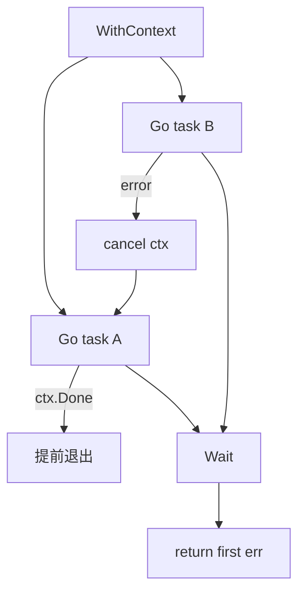

# errgroup 语义实现

## 30 秒版（开场）

> **errgroup** = **WaitGroup + 首个 error + Context 取消**。`WithContext` 派生可取消 ctx；任一 `Go(fn)` 返回 error → **`errOnce` 记录 + cancel**；`Wait` 等全部结束并返回该 error。面试关键词：**errOnce、cancel 传播、Wait 后再 cancel 一次无害**。

## 3 分钟版（一面深度）

1. **是什么**：`golang.org/x/sync/errgroup` 简化「多 goroutine 有一失败则全员停工」。
2. **为什么**：并行调多个 RPC/查多个库，一个失败不应继续浪费资源（见 [S-CONC-17 Pipeline](../01-runtime-concurrency/S-CONC-17-pipeline.md)）。
3. **怎么做**：`WaitGroup` 计数；`Go` 里 `defer Done()`；error 时 `errOnce.Do` 存 err 并 `cancel()`；子任务 `select ctx.Done()`。

## 10 分钟版（原理 + 图示）



**与 WaitGroup 对比**

| | WaitGroup | errgroup |
|---|-----------|----------|
| 错误 | 需自行 channel/atomic | 内置首个 error |
| 取消 | 需自建 ctx | 内置 cancel |
| 适用 | 纯等待 | 并行任务有失败语义 |

**手写要点**

```go
type Group struct {
	wg      sync.WaitGroup
	ctx     context.Context
	cancel  context.CancelFunc
	errOnce sync.Once
	err     error
}
```

- `errOnce` 保证只记录 **第一个** error
- `Wait()` 末尾再 `cancel()`：清理未触发 error 的路径（与官方实现类似）

## 生产场景

- 启动时并行 ping 多个依赖
- 批量导出：任一分片失败则中止
- 与 `gin-example/example_28` errgroup 多服务启动同类

## 排查与工具

- `go test ./errgroup/...`
- 生产直接用 `golang.org/x/sync/errgroup`

## 架构取舍

| 方案 | 适用 |
|------|------|
| 手写 errgroup | 面试 |
| x/sync/errgroup | 生产 |
| channel 收 err | 需收集 **所有** 错误时 |

## 追问链

1. **为何 errOnce？** → 多 goroutine 同时失败，只保留首个有意义。
2. **子任务如何感知取消？** → `fn` 内 `select <-ctx.Done()` 或传 ctx 给 HTTP/DB。
3. **SetLimit(n) 呢？** → 官方扩展：信号量限制并发，手写可加 buffered channel。
4. **Wait 返回 nil 但 ctx 已 cancel？** → 正常；cancel 也可能由外部 parent 触发。

## 反模式与事故

- **Go 里 panic 不 recover** → 进程崩溃；生产应用 `defer recover` 转 error
- **不用 ctx 仍调阻塞 IO** → cancel 无效，Wait  hung
- **在 Go 外再开 goroutine 不 Wait** → 泄漏

## 代码示例

见 [examples/senior/errgroup/errgroup.go](https://github.com/twodog-tt/Golang-development-manual/blob/master/examples/senior/errgroup/errgroup.go)：

```go
func (g *Group) Go(fn func() error) {
	g.wg.Add(1)
	go func() {
		defer g.wg.Done()
		if err := fn(); err != nil {
			g.errOnce.Do(func() {
				g.err = err
				g.cancel()
			})
		}
	}()
}
```

```bash
cd examples/senior && go test ./errgroup/...
```

## 延伸阅读

- [x/sync/errgroup](https://pkg.go.dev/golang.org/x/sync/errgroup)
- [Go Context 博客](https://go.dev/blog/context)
