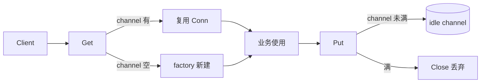

# 连接池实现要点

## 30 秒版（开场）

> 连接池 **复用昂贵连接**（TCP、DB），控制 **最大空闲数**。本实现用 **buffered channel** 存空闲连接：`Get` 先 `select` 取 channel，空则 `factory()` 新建；`Put` 能塞回则复用，否则 `Close` 丢弃。关键词：**maxIdle、Close 关池、ctx 超时**。

## 3 分钟版（一面深度）

1. **是什么**：维护一组已建立连接，borrow / return，避免每次 dial。
2. **为什么**：DB/TCP 握手成本高；无上限会打爆下游（对比 [S-NET-02 HTTP 连接池](../06-network-governance/S-NET-02-http-connection-pool.md)）。
3. **怎么做**：`ch := make(chan Conn, maxIdle)`；`Get` 非阻塞取或 factory；`Put` 非阻塞还或 close；`Close` 设 flag、close(ch)、排空关闭。

## 10 分钟版（原理 + 图示）



**与 database/sql.DB 对比**

| | 本手写池 | sql.DB |
|---|----------|--------|
| 连接类型 | 泛型 Conn | 真实 DB 连接 |
| 最大连接 | maxIdle（仅空闲） | MaxOpen/MaxIdle |
| 健康检查 | 未实现 | 自动 ping/重建 |

**生产扩展**

- `Get` 阻塞等待 + `ctx` 超时（`select` on ch）
- `MaxOpen` 限制总连接（atomic 计数 + factory 前检查）
- 借出前 `Ping` 验证；无效则丢弃再 factory
- 空闲超时清理（后台 goroutine）

## 生产场景

- MySQL：`SetMaxOpenConns` / `SetMaxIdleConns` / `ConnMaxLifetime`
- HTTP：`Transport.MaxIdleConnsPerHost`
- Redis：`go-redis` 内置 pool

## 排查与工具

- `go test ./connpool/...`
- 监控：等待连接数、factory 调用率、Close 丢弃率

## 架构取舍

| 方案 | 适用 |
|------|------|
| channel 池 | 面试、简单 TCP 复用 |
| sync.Pool | 复用 **对象** 非连接；连接有状态慎用 |
| 每请求 dial | 仅低 QPS |

## 追问链

1. **Get 为何 default 分支 factory？** → 无空闲立即新建；可改为阻塞等归还。
2. **Put 时 channel 满？** → 连接过多，Close 释放（本实现）。
3. **Close 后 Get ？** → 返回 `ErrPoolClosed`。
4. **连接泄漏？** → Get 后未 Put/Close；需 `defer Put` 或 RAII 包装。

## 反模式与事故

- **无 maxOpen** → 流量尖刺打满 DB `max_connections`
- **不 SetConnMaxLifetime** → 打到 stale 连接、LB 后端已摘
- **Put 已坏连接** → 下次 Get 失败；应 Ping 或包装 Validator

## 代码示例

见 [examples/senior/connpool/pool.go](https://github.com/twodog-tt/Golang-development-manual/blob/master/examples/senior/connpool/pool.go)：

```go
func (p *Pool) Get(ctx context.Context) (Conn, error) {
	select {
	case <-ctx.Done():
		return nil, ctx.Err()
	default:
	}
	// ... closed check ...
	select {
	case c := <-p.ch:
		return c, nil
	default:
		return p.factory()
	}
}
```

```bash
cd examples/senior && go test ./connpool/...
```

## 延伸阅读

- [database/sql DB 连接池](https://pkg.go.dev/database/sql#DB)
- 关联：[S-DB-05 GORM 陷阱](../middleware/mysql/S-DB-05-gorm-pitfalls.md)
