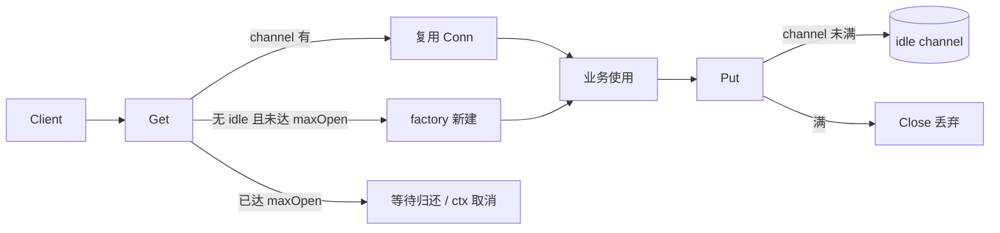

# 连接池实现要点

## 30 秒版（开场）

> 连接池既要 **复用昂贵连接**，也要用 **maxOpen** 限制对下游的总连接压力，并用 **maxIdle** 控制保留多少空闲连接。本实现用 idle channel + open-slot semaphore：`Get` 优先复用，未达上限才新建，否则等待归还或 context 取消；`Put` 池满则关闭并释放 slot。

## 3 分钟版（一面深度）

1. **是什么**：维护一组已建立连接，borrow / return，避免每次 dial。
2. **为什么**：DB/TCP 握手成本高；无上限会打爆下游（对比 [S-NET-02 HTTP 连接池](../06-network-governance/S-NET-02-http-connection-pool.md)）。
3. **怎么做**：`idle := make(chan Conn, maxIdle)` 保存空闲连接，`slots := make(chan struct{}, maxOpen)` 统计已打开/正在打开的连接；`Get` 复用、创建或等待；`Put` 归还，坏连接走 `Discard`；`Close` 原子标记关闭并唤醒等待者，再排空 idle。

## 10 分钟版（原理 + 图示）


```mermaid
flowchart LR
  Client --> Get
  Get -->|channel 有| Reuse[复用 Conn]
  Get -->|无 idle 且未达 maxOpen| New[factory 新建]
  Get -->|已达 maxOpen| Wait[等待归还 / ctx 取消]
  Reuse --> Use[业务使用]
  New --> Use
  Use --> Put
  Put -->|channel 未满| CH[(idle channel)]
  Put -->|满| CloseConn[Close 丢弃]
```

**与 database/sql.DB 对比**

| | 本手写池 | sql.DB |
|---|----------|--------|
| 连接类型 | 泛型 Conn | 真实 DB 连接 |
| 最大连接 | MaxOpen/MaxIdle | MaxOpen/MaxIdle |
| 坏连接处理 | 调用方 `Discard`/可扩展 Validator | driver 通过 `ErrBadConn` 等机制淘汰；不会在每次 checkout 前自动 `Ping` |

**生产扩展**

- 按连接类型增加 Validator；坏连接不要放回池
- 空闲超时清理（后台 goroutine）
- 连接最大生命周期、等待队列指标、创建失败退避

## 生产场景

- MySQL：`SetMaxOpenConns` / `SetMaxIdleConns` / `ConnMaxLifetime`
- HTTP：`Transport.MaxIdleConnsPerHost`
- Redis：`go-redis` 内置 pool

## 排查与工具

- `go test ./connpool/...`
- 监控：等待连接数、factory 调用率、Close 丢弃率

## 架构取舍

| 方案 | 适用 |
|------|------|
| channel 池 | 编码练习、简单 TCP 复用 |
| sync.Pool | 复用 **对象** 非连接；连接有状态慎用 |
| 每请求 dial | 仅低 QPS |

## 深挖问答

1. **什么时候 factory？** → 无空闲且 `open < maxOpen`；达到上限后等待归还或 context 取消，不能继续无限创建。
2. **Put 时 channel 满？** → 连接过多，Close 释放（本实现）。
3. **Close 后 Get ？** → 返回 `ErrPoolClosed`。
4. **连接泄漏？** → Get 后未 Put/Discard；可用受控 helper 确保归还，但检测到网络/协议错误时不能无条件 `defer Put`。

## 反模式与事故

- **无 maxOpen** → 流量尖刺打满 DB `max_connections`
- **不 SetConnMaxLifetime** → 打到 stale 连接、LB 后端已摘
- **Put 已坏连接** → 下次 Get 失败；应 Ping 或包装 Validator

## 代码示例

见 [examples/senior/connpool/pool.go](https://github.com/twodog-tt/Golang-development-manual/blob/master/examples/senior/connpool/pool.go)：

```go
func (p *Pool) Get(ctx context.Context) (Conn, error) {
    // 1. 优先从 idle 复用
    // 2. 未达 maxOpen 时占一个 slot 并调用 factory
    // 3. 否则等待 idle、pool close 或 ctx.Done
    // 完整并发关闭语义见示例文件。
}
```

```bash
cd examples/senior && go test ./connpool/...
```

## 延伸阅读

- [database/sql DB 连接池](https://pkg.go.dev/database/sql#DB)
- 关联：[S-DB-05 GORM 陷阱](../middleware/mysql/S-DB-05-gorm-pitfalls.md)
