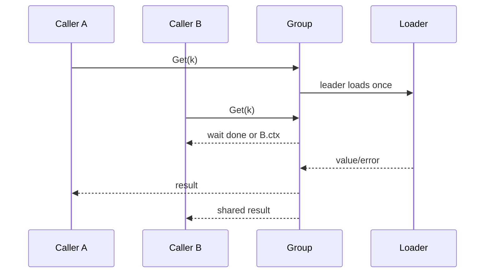

# Singleflight 缓存击穿抑制

## 30 秒版（开场）

> Singleflight 只合并“同一进程、同一 key、同一时刻”的重复加载，不等于缓存，也不提供跨实例全局锁。实现时用 `map[key]*call` 保存进行中的调用，首个请求加载，后续请求等待同一个 `done`。等待者可因自己的 context 提前离开，但共享加载不应被首个 HTTP 请求的取消随意终止，否则一个客户端断开会让所有等待者失败。

## 3 分钟版（一面深度）

1. **双检**：先查缓存；进入 singleflight leader 后再查一次，避免排队期间已被填充。
2. **上下文**：waiter context 只控制等待；loader 使用独立、受限时的 context。
3. **失败策略**：普通错误不缓存；可选短时 negative cache，但要区分“不存在”和“依赖故障”。
4. **边界**：多实例仍会各加载一次；热点 key 还需 TTL jitter、预热、限流或分布式协调。

## 10 分钟版（原理 + 图示）



示例实现把 leader 的 loader context 从请求取消中分离，再施加 `loadTimeout`。这意味着所有 waiter 都离开后，加载可能继续到超时；换来的是不会让第一个调用方拥有取消全部共享工作的权力。更复杂的实现可以计数 waiter，在全部离开时取消，但并发状态明显更难证明。

```go
value, shared, err := cache.Get(ctx, key, loader)
```

- `shared=true` 表示结果来自进行中的共享调用，不代表来自缓存。
- loader panic 会唤醒 waiter，leader 仍重新 panic，避免悄悄返回零值成功。
- TTL 仅在加载成功后写入；错误默认不缓存。
- 示例只演示 TTL 与请求合并，没有容量上限、淘汰和后台清理；生产缓存必须限制 key 数/内存，或使用成熟缓存实现。

## 生产场景

- 配置、权限、Token metadata 等热点 key 过期瞬间。
- RPC 查询同一 block/hash，provider 限流前先在进程内合并。
- 缓存重建成本高时配 stale-while-revalidate，而不是让用户全等冷加载。

## 排查与工具

监控 `cache_hit_total`、`singleflight_shared_total`、loader latency/error、每 key 等待者数和超时。若 shared 比例很高且延迟仍高，根因可能是单个热点 key 的 loader 太慢，而不是缓存容量不足。

## 架构取舍

| 方案 | 解决范围 | 风险 |
|------|----------|------|
| singleflight | 单实例瞬时重复加载 | leader 慢则所有 waiter 慢 |
| TTL jitter | 避免大量 key 同时过期 | 仍会有单 key 击穿 |
| stale-while-revalidate | 降低用户等待 | 允许短时旧数据 |
| 分布式锁 | 跨实例只重建一次 | 锁租约、fencing、可用性复杂 |

## 追问链

1. **为什么要二次查缓存？** → leader 排队前后缓存状态可能已变化。
2. **第一个请求取消怎么办？** → 不应默认取消共享 loader；请求只放弃等待。
3. **错误要共享吗？** → 进行中的调用会共享该次错误；是否短时缓存要按错误类别设计。
4. **进程重启呢？** → singleflight 状态丢失，这正说明它不是持久缓存或分布式锁。
5. **热点 key 一直慢？** → 限并发、独立超时、stale 数据、预计算和降级。

## 反模式与事故

- 把请求 context 直接传给共享 loader，第一个客户端断开导致全体失败。
- 忘记在 panic/错误路径删除 in-flight entry，key 永久卡死。
- 对所有错误做长 TTL negative cache，短暂依赖故障被放大。
- 以为 singleflight 能防止所有 pod 同时回源。

## 代码示例

见 [cache.go](https://github.com/twodog-tt/Golang-development-manual/blob/master/examples/senior/singleflightcache/cache.go)：

```bash
go test -race ./examples/senior/singleflightcache/...
```

## 延伸阅读

- [`x/sync/singleflight`](https://pkg.go.dev/golang.org/x/sync/singleflight)
- [`context`](https://pkg.go.dev/context)
