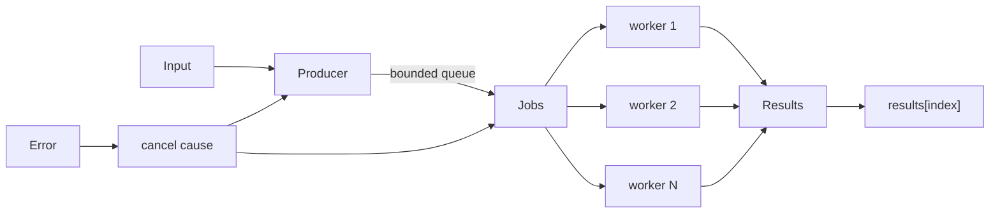

# 有界批处理执行器：取消、顺序与背压

<a id="oral-card"></a>

## 要点卡

[返回 P0 知识图谱](../_meta/p0-knowledge-graph.md)

!!! abstract "30 秒回答"

    批处理并发不能“每个 item 一个 goroutine”。应固定 worker 数，使用有界 job queue 形成背压，用派生 context 在首错或上游取消时停止继续投递，并持续 drain 已启动 worker 的结果，避免 goroutine 卡在发送。若 API 承诺按输入顺序返回，就给 job 编号并写回预分配结果切片，而不是依赖完成顺序。

**3 分钟展开**

1. **并发上限**：worker 数限制正在执行的工作，queue 限制等待内存。
2. **取消**：首错 `cancel(cause)`；producer、worker 和回调都必须观察 context。
3. **收尾**：只有 producer 关闭 jobs，只有等待全部 worker 的 goroutine 关闭 results。
4. **结果语义**：示例采用 fail-fast、无部分结果；资金批处理往往要返回逐项结果并另做业务补偿。

| 记忆槽 | 内容 |
|--------|------|
| 三个不变量 | active worker 与等待队列都要有界；channel 关闭权唯一；取消不能强杀不合作的任务 |
| 手画图 | `producer → bounded jobs → N workers → results[index] → collector`，error 指向 cancel |
| 项目落点 | 用实际多链 RPC、批量归集或对象迁移说明 provider 配额、nonce domain 和逐项结果；只引用本人实际参与部分和可解释指标 |
| 一个取舍 | 保持输入顺序便于调用方但要保留结果槽；完成顺序流式返回延迟低却增加协议复杂度 |

**错误表达**

- ❌ “固定 worker 数就一定有背压；context cancel 可以立即停止任意 fn。”
- ✅ “无界输入/queue 仍会爆内存；取消只对遵守契约的 producer、worker 和回调生效。”

**自测追问**：谁关闭 jobs 和 results？资金批处理为什么通常不能只返回第一个错误？

## 10 分钟版（原理 + 图示）



**关闭所有权**

- 多个 worker 不能关闭共享 `results`，否则会 double close。
- receiver 一般不关闭 sender 拥有的 channel。
- `fn` 若忽略 context 并永久阻塞，外层无法强制杀死 goroutine；接口契约必须写清。

示例中的 producer 在 queue 满时阻塞，因此待处理数量始终有界。首错后它停止投递，worker 完成或取消当前任务；collector 继续读取直到 `results` 被关闭，再返回 cause。

## 生产场景

- 多 RPC 批量查询：worker 数按 provider 并发配额，而不是 CPU 数。
- 批量归集：同一 nonce domain 必须进一步串行，不能只依赖全局 worker pool。
- 文件/对象存储迁移：queue 控内存，单 item 超时与全局 deadline 分开。

## 排查与工具

监控 active workers、queue depth、enqueue wait、item latency、cancel cause 和 batch size。`queue_depth` 长期满说明下游容量不足；盲目增 worker 可能只把压力转移到 DB/RPC。

```bash
go test -race ./examples/senior/batchexec/...
```

## 架构取舍

| 语义 | 适合 |
|------|------|
| fail-fast，无部分结果 | 全部成功才有意义的计算 |
| 收集全部错误 | 独立 item 校验、离线任务 |
| 按 key 串行 | nonce、账户、分区顺序 |
| 保序返回 | API 调用方按输入对齐 |
| 完成顺序流式返回 | 降首条延迟，不要求保序 |

## 深挖问答

1. **queue 越大越好吗？** → 否；只会增加排队延迟和内存，不能提升下游吞吐。
2. **为什么首错后还 drain？** → 已启动 worker 可能正在发送，不 drain 会泄漏。
3. **如何保证输出顺序？** → job 带 index，结果写到对应槽位。
4. **如何限制每个租户？** → 全局池之外增加 per-tenant semaphore/公平队列。
5. **回调不响应 context？** → 无法安全强杀；应给下游 I/O 明确 deadline，并把合作式取消作为契约。

## 反模式与事故

- `for item := range items { go fn(item) }` 导致 goroutine 和连接爆炸。
- worker 自己关闭 results，引发 `send on closed channel`。
- error 后立即 return，不消费其他 worker 的发送。
- 用一个大 buffered channel 假装“背压”，实际只把 OOM 推迟。

## 代码示例

见 [executor.go](https://github.com/twodog-tt/Golang-development-manual/blob/master/examples/senior/batchexec/executor.go)。

## 延伸阅读

- [Go Concurrency Patterns: Pipelines and cancellation](https://go.dev/blog/pipelines)
- [`context`](https://pkg.go.dev/context)

