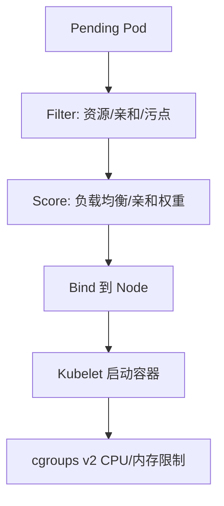

# Kubernetes 调度与 Go 服务资源 limit

## 30 秒版（开场）

> K8s **Scheduler** 按 Request/Limit、亲和性、污点容忍选 Node；Go 服务必须让 **GOMAXPROCS 与 CPU limit 对齐**，否则 throttle 下 P99 爆炸。生产关键词：**requests≠limits 的 Burstable、liveness/readiness 探针、HPA 指标**。

## 3 分钟版（一面深度）

1. **是什么**：Scheduler 过滤（Filter）+ 打分（Score）选 Pod 所在 Node；Go 容器需配置 `resources.requests/limits`，并理解 CFS quota。
2. **为什么**：5 年+ 后端多数跑 K8s；不懂 limit 会导致 **CPU 节流、OOMKilled、GOMAXPROCS 过大**。
3. **怎么做**：CPU request 按常态用量、limit 留 burst；内存 limit 略高于 heap+栈峰值；使用 **automaxprocs** 或 Go 1.25+ 自动感知；readiness 接 `/healthz` 含依赖检查。

## 10 分钟版（原理 + 图示）

**调度简要流程**



**Go 与 CPU limit**

| 现象 | 原因 |
|------|------|
| CPU limit=2 但 GOMAXPROCS=48 | 过多 P 争用 2 核，调度开销大 |
| P99 尖刺 | CFS throttling |
| OOMKilled | limit 低于 Go heap 峰值 |

**推荐实践**

```yaml
resources:
  requests:
    cpu: "500m"
    memory: "512Mi"
  limits:
    cpu: "2"
    memory: "1Gi"
```

```go
import _ "go.uber.org/automaxprocs" // 或监控 GOMAXPROCS 与 cgroup
```

## 生产场景

- 网关类 Go 服务：CPU 密集 + 高并发，limit 过低 → 全链路超时
- 有状态服务：避免频繁 reschedule；用 PDB + 反亲和 spread
- 大促：HPA 基于 CPU 或自定义 QPS；提前压测 **limit 下** 表现

## 排查与工具

- `kubectl describe pod` → Events、OOM、FailedScheduling
- `kubectl top pod`、metrics-server
- 节点：`/sys/fs/cgroup` CPU throttling 指标
- Go：pprof + 容器 limit 对照

## 架构取舍

| QoS 类 | 说明 |
|--------|------|
| Guaranteed | request=limit，关键服务 |
| Burstable | 常见 Go 微服务 |
| BestEffort | 批任务，易被驱逐 |

**何时不用 K8s**：极简边缘、强实时单机、团队无 SRE 能力 → 评估 VM/裸机。

## 追问链

1. **request 和 limit 怎么定？** → request 保调度；limit 防 noisy neighbor；用生产 P95 用量 + 压测。
2. **liveness 和 readiness 区别？** → liveness 失败重启；readiness 失败摘流量。
3. **Pod 被驱逐？** → 节点压力、优先级、是否 BestEffort。
4. **Go 1.22+ 在容器里 GOMAXPROCS？** → 运行时逐步改进 cgroup 感知；仍建议显式验证。

## 反模式与事故

- **未设 memory limit** → 拖垮节点
- **readiness 只 ping 200** 不查 DB → 流量打进坏实例
- **HPA 仅 CPU** 忽略 goroutine 泄漏型内存涨

## 代码示例

```go
http.HandleFunc("/healthz", func(w http.ResponseWriter, r *http.Request) {
    if err := db.PingContext(r.Context()); err != nil {
        http.Error(w, "db down", http.StatusServiceUnavailable)
        return
    }
    w.WriteHeader(http.StatusOK)
})
```

## 延伸阅读

- [Kubernetes Scheduling](https://kubernetes.io/docs/concepts/scheduling-eviction/)
- [uber-go/automaxprocs](https://github.com/uber-go/automaxprocs)
