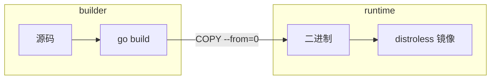

# Docker 多阶段构建与 Go 镜像最佳实践

## 30 秒版（开场）

> Go 静态编译适合 **multi-stage**：builder 阶段编译，runtime 用 **distroless/scratch** 缩小攻击面。生产关键词：**CGO_ENABLED=0、-trimpath -ldflags=-s -w、非 root 用户、镜像扫描**。

## 3 分钟版（一面深度）

1. **是什么**：Multi-stage Dockerfile 在前一 stage 编译，最终镜像只 COPY 二进制，不含编译器与源码。
2. **为什么**：镜像从 1GB+ golang 降到 **10～30MB**；减少 CVE 面；加快拉取与启动。
3. **怎么做**：`FROM golang AS builder` → `go build` → `FROM gcr.io/distroless/static` → `USER nonroot`；CI 中 SBOM + Trivy 扫描。

## 10 分钟版（原理 + 图示）



**推荐 Dockerfile 骨架**

```dockerfile
# syntax=docker/dockerfile:1
FROM golang:1.24-alpine AS builder
WORKDIR /src
COPY go.mod go.sum ./
RUN go mod download
COPY . .
RUN CGO_ENABLED=0 GOOS=linux go build -trimpath -ldflags="-s -w" -o /out/app ./cmd/server

FROM gcr.io/distroless/static-debian12:nonroot
COPY --from=builder /out/app /app
ENTRYPOINT ["/app"]
```

| 选项 | 作用 |
|------|------|
| CGO_ENABLED=0 | 纯静态，便于 scratch/distroless |
| -trimpath | 去除本地路径，可复现构建 |
| -ldflags -s -w |  strip 符号，缩小体积 |
| nonroot | 降低容器逃逸影响 |

## 生产场景

- **需要 CGO**（如 sqlite、某些加密库）→ 用 alpine/debian runtime + 必要 .so，或换纯 Go 依赖
- **调试**：distroless 无 shell → debug 镜像 tag 或 ephemeral debug container
- **私有 module**：BuildKit secret mount `GOPRIVATE` token

## 排查与工具

- `docker history` 看层体积
- `dive` 分析每层
- Trivy/Grype CVE 扫描
- `go version -m ./app` 验证构建信息

## 架构取舍

| 基础镜像 | 优点 | 缺点 |
|----------|------|------|
| distroless/static | 最小、安全 | 难调试 |
| alpine | 小、有 shell | musl 与 CGO 兼容 |
| debian slim | 兼容性好 | 较大 |

**何时不用 multi-stage**：本地 dev 用 `docker compose` 挂载卷热更即可，prod 才 distroless。

## 追问链

1. **scratch 和 distroless 区别？** → scratch 空文件系统；distroless 含 ca-certificates、tzdata 等最小集。
2. **如何传 build 版本号？** → `-ldflags "-X main.version=$GIT_SHA"`。
3. **vendor 构建？** → `COPY vendor vendor` + `go build -mod=vendor` 可离线 reproducible。
4. **镜像层缓存优化？** → 先 COPY go.mod sum 再 download，后 COPY 源码。

## 反模式与事故

- **runtime 仍用 golang 镜像** → 巨大、多 CVE
- **root 用户运行** → 安全风险
- **把 .git、密钥 COPY 进镜像** → 泄漏
- **未固定 base 镜像 digest** → 供应链漂移

## 代码示例

```dockerfile
ARG VERSION=dev
RUN go build -ldflags "-X main.version=${VERSION}" -o /out/app .
```

## 延伸阅读

- [Docker Multi-stage builds](https://docs.docker.com/build/building/multi-stage/)
- [Google distroless](https://github.com/GoogleContainerTools/distroless)
