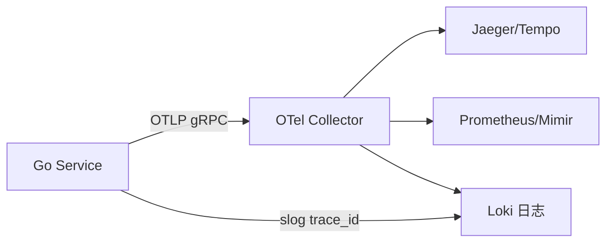

# OpenTelemetry 与 Go 可观测性接入

## 30 秒版（开场）

> **OpenTelemetry（OTel）** 统一 Traces、Metrics、Logs 的采集与导出；Go 用 `otel` SDK + **OTLP** 推到 Collector/Jaeger/Prometheus。生产关键词：**W3C traceparent 传播、采样率、高基数 label 控制、与 slog 关联 trace_id**。

## 3 分钟版（一面深度）

1. **是什么**：OTel 是 CNCF 可观测性标准；Go 通过 `go.opentelemetry.io/otel` 埋点，Exporter 发到后端。
2. **为什么**：微服务下 **跨服务排障** 靠 Trace；5 年+ 需讲清 **三支柱如何关联**（同一 trace_id 串日志）。
3. **怎么做**：HTTP/gRPC 中间件自动创建 span；`otel.SetTracerProvider` + `BatchSpanProcessor`；生产 **ParentBased + 1%～10% 采样**；metrics 避免 `user_id` 等高基数 label。

## 10 分钟版（原理 + 图示）



**最小 Tracer 初始化**

```go
import (
    "go.opentelemetry.io/otel"
    "go.opentelemetry.io/otel/exporters/otlp/otlptrace/otlptracegrpc"
    "go.opentelemetry.io/otel/sdk/resource"
    sdktrace "go.opentelemetry.io/otel/sdk/trace"
    semconv "go.opentelemetry.io/otel/semconv/v1.24.0"
)

func initTracer(ctx context.Context, endpoint string) (*sdktrace.TracerProvider, error) {
    exp, err := otlptracegrpc.New(ctx, otlptracegrpc.WithEndpoint(endpoint), otlptracegrpc.WithInsecure())
    if err != nil {
        return nil, err
    }
    tp := sdktrace.NewTracerProvider(
        sdktrace.WithBatcher(exp),
        sdktrace.WithResource(resource.NewWithAttributes(
            semconv.SchemaURL,
            semconv.ServiceName("order-api"),
        )),
        sdktrace.WithSampler(sdktrace.ParentBased(sdktrace.TraceIDRatioBased(0.1))),
    )
    otel.SetTracerProvider(tp)
    return tp, nil
}
```

**Gin 中间件**：使用 `otelgin.Middleware("service-name")` 自动创建 span 并传播 context。

## 生产场景

- 支付链路 5 跳：缺 Trace → 无法定位慢在 DB 还是下游 RPC
- **高 QPS**：100% 采样拖垮 Collector → 头采样 + tail sampling（Collector 侧）
- 日志：slog 注入 `trace_id`、`span_id` 便于 Loki 查询

## 排查与工具

- Jaeger/Tempo UI 看 critical path
- `go.opentelemetry.io/contrib` 各框架 instrumentation
- Collector pipeline：receiver → processor（batch/memory_limiter）→ exporter
- 告警：基于 RED（Rate、Errors、Duration）指标

## 架构取舍

| 方案 | 适用 |
|------|------|
| Agent 侧车 Collector | K8s 标准，解耦 SDK 配置 |
| SDK 直推 SaaS | 小团队快速接入 |
| 仅 Metrics | 成本低，排障能力弱 |

**何时不全量 OTel**：边缘 IoT、极低延迟路径可只 metrics + 结构化日志。

## 追问链

1. **Trace 和 Log 怎么关联？** → context 中 trace_id 写入 slog 字段；同一 request 共享。
2. **采样策略？** → 错误 span 100%（tail sampling）；正常流量比例采样。
3. **context 传播跨 goroutine？** → 显式 `trace.ContextWithSpan`；异步任务传 ctx。
4. **与 Prometheus 关系？** → OTel metrics 可 export 为 Prometheus 格式；长期可统一 OTLP。

## 反模式与事故

- **每个函数都 span** → 开销大、Collector 爆
- **span 名高基数** `/user/123` → 存储爆炸，应模板化 `/user/:id`
- **未 shutdown TracerProvider** → 丢尾部 span
- **Metrics label 带 order_id** → Prometheus  cardinality 灾难

## 代码示例

```go
ctx, span := otel.Tracer("order").Start(ctx, "CreateOrder")
defer span.End()
logger.InfoContext(ctx, "creating order", "order_id", id) // logger 应提取 trace_id
```

## 延伸阅读

- [OpenTelemetry Go](https://opentelemetry.io/docs/languages/go/)
- [Go slog 官方博客](https://go.dev/blog/slog)
