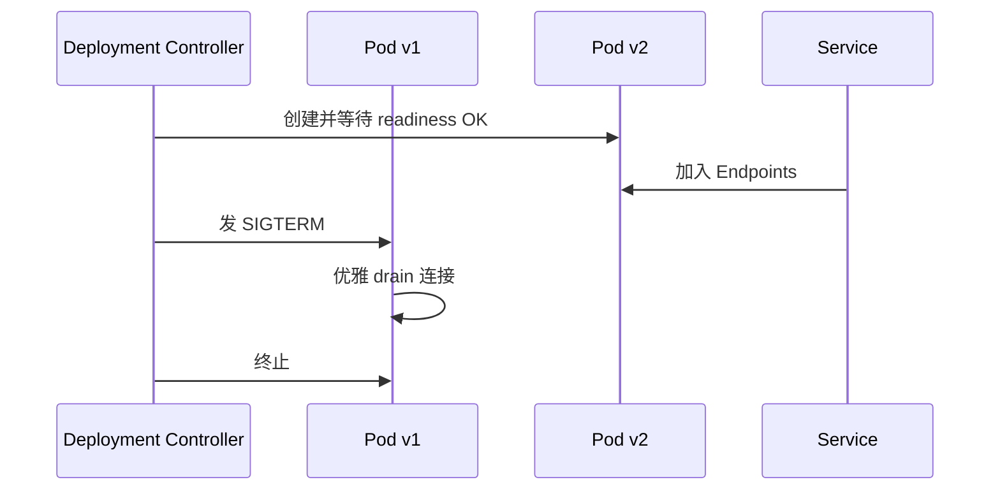

# 滚动发布、探针与 PodDisruptionBudget

## 30 秒版（开场）

> K8s **Deployment 滚动发布** 按 `maxSurge` / `maxUnavailable` 替换 Pod；**readiness** 控制是否接流量，**liveness** 控制是否重启；**PDB** 保证维护/发布时最少可用副本。Go 服务必须配合 **SIGTERM 优雅关闭**（[S-CODE-03](../08-coding-senior/S-CODE-03-graceful-shutdown.md)）。生产关键词：**preStop、terminationGracePeriodSeconds、readiness 查依赖**。

## 3 分钟版（一面深度）

1. **是什么**：Deployment 逐步创建新 ReplicaSet Pod、缩旧 Pod；探针由 kubelet 定期 HTTP/TCP/exec 检查。
2. **为什么**：错误探针 → 502、反复重启、发布雪崩；无 PDB → 节点 drain 时服务全挂。
3. **怎么做**：readiness 含 DB/Redis；liveness 只查进程活；`preStop sleep` + 优雅关闭；PDB `minAvailable: 80%`。

## 10 分钟版（原理 + 图示）



**探针对比**

| 探针 | 失败后果 | Go 服务建议 |
|------|----------|-------------|
| **startup** | 重启（启动慢时用） | 冷启动 >30s 时启用 |
| **liveness** | 重启 Pod | 轻量 `/livez`，勿查外部依赖 |
| **readiness** | 从 Service 摘除 | `/readyz` 查 DB、MQ、依赖 RPC |

**推荐 Deployment 片段**

```yaml
spec:
  strategy:
    type: RollingUpdate
    rollingUpdate:
      maxSurge: 25%
      maxUnavailable: 0        # 关键服务：先启新再杀旧
  template:
    spec:
      terminationGracePeriodSeconds: 60
      containers:
        - name: app
          lifecycle:
            preStop:
              exec:
                command: ["/bin/sh", "-c", "sleep 5"]
          readinessProbe:
            httpGet:
              path: /readyz
              port: 8080
            periodSeconds: 5
            failureThreshold: 3
          livenessProbe:
            httpGet:
              path: /livez
              port: 8080
            initialDelaySeconds: 10
            periodSeconds: 10
```

**PDB 示例**

```yaml
apiVersion: policy/v1
kind: PodDisruptionBudget
metadata:
  name: api-pdb
spec:
  minAvailable: 2
  selector:
    matchLabels:
      app: api
```

## 生产场景

- **发布 502**：新 Pod readiness 未就绪已接流量 → 调 `minReadySeconds`、确保 readiness 严格
- **老 Pod 被强杀**：`terminationGracePeriodSeconds` 过短或 Go 未处理 SIGTERM → 见 [S-CODE-03](../08-coding-senior/S-CODE-03-graceful-shutdown.md)
- **节点维护**：`kubectl drain` 受 PDB 约束；与 [S-CLOUD-01](./S-CLOUD-01-k8s-scheduling.md) QoS 联动
- **WebSocket 服务**：滚动时需客户端重连或网关 sticky；见 [S-NET-05](../06-network-governance/S-NET-05-websocket-gateway.md)

## 排查与工具

- `kubectl rollout status deployment/api`
- `kubectl describe pod` → Readiness probe failed / Liveness probe failed
- `kubectl get endpoints` → 是否仍有就绪后端
- 对比发布前后错误率（与 [S-ARCH-15](../03-system-design/S-ARCH-15-release-strategy.md) 金丝雀指标一致）

## 架构取舍

| maxUnavailable | 适用 |
|----------------|------|
| 0 | 交易 API、支付、核心网关 |
| 25% | 一般微服务 |
| 50%+ | 可容忍短缺的批处理 |

**何时不用 Deployment**：有状态单主 → StatefulSet；一次性任务 → Job。

## 追问链

1. **readiness 和 liveness 能查同一个 DB 吗？** → 不推荐；DB 抖动会 liveness 杀全体 Pod。
2. **preStop sleep 5s 干什么？** → 等 Endpoints 更新后再收 SIGTERM，减少 in-flight 502。
3. **PDB 和 HPA 冲突？** → 缩容时 PDB 可能阻止；规划 minReplicas ≥ PDB minAvailable。
4. **Go 1.22+ http.Server Shutdown 超时？** → 应小于 `terminationGracePeriodSeconds` 留余量给清理。

## 反模式与事故

- **readiness 永远 200** → DB 挂了仍接流量
- **liveness 查 `/readyz`** → 依赖故障导致无限重启
- **无 PDB 节点升级** → 副本同时被驱逐
- **maxUnavailable=50% 核心服务** → 容量腰斩触发级联超时

## 代码示例

```go
func main() {
    srv := &http.Server{Addr: ":8080", Handler: router}
    go func() { _ = srv.ListenAndServe() }()

    quit := make(chan os.Signal, 1)
    signal.Notify(quit, syscall.SIGTERM, syscall.SIGINT)
    <-quit

    ctx, cancel := context.WithTimeout(context.Background(), 45*time.Second)
    defer cancel()
    _ = srv.Shutdown(ctx)
}
```

## 延伸阅读

- [Deployment 滚动更新](https://kubernetes.io/docs/concepts/workloads/controllers/deployment/)
- [PodDisruptionBudget](https://kubernetes.io/docs/tasks/run-application/configure-pdb/)
- [S-CODE-03 优雅关闭](../08-coding-senior/S-CODE-03-graceful-shutdown.md)
