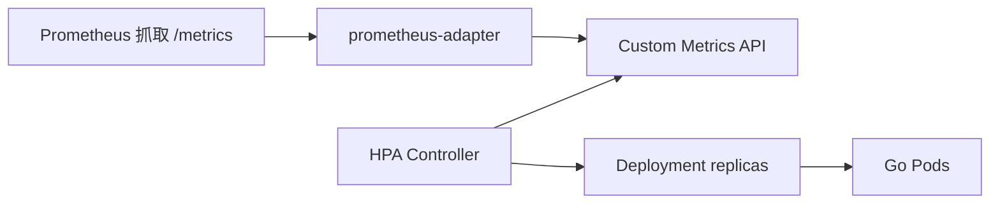

# HPA 与 Go 服务自定义指标扩缩容

## 30 秒版（开场）

> **HPA** 根据 CPU、内存或 **自定义指标**（QPS、队列 lag、goroutine 数）自动改 Deployment 副本数。Go 服务注意：**CPU 被 cgroup throttle 时 HPA 失真**；高并发 I/O 型更适合 **Prometheus + prometheus-adapter** 按 QPS/latency 扩。生产关键词：**稳定窗口、扩缩容速率、min/maxReplicas、与 PDB 对齐**。

## 3 分钟版（一面深度）

1. **是什么**：HorizontalPodAutoscaler 周期性读 metrics-server 或 custom metrics API，计算目标副本数。
2. **为什么**：大促/开盘流量波动；手动扩缩滞后；面试常问「为什么 CPU 不高却不扩容」。
3. **怎么做**：默认 CPU 70% 仅作起点；Go 网关用 **RPS 或 P99**；设置 cooldown 防抖动；压测在 **limit 下** 验证（[S-CLOUD-01](./S-CLOUD-01-k8s-scheduling.md)）。

## 10 分钟版（原理 + 图示）



**副本数公式（简化）**

```
desiredReplicas = ceil(currentReplicas × (currentMetric / targetMetric))
```

**CPU 型 HPA（入门）**

```yaml
apiVersion: autoscaling/v2
kind: HorizontalPodAutoscaler
metadata:
  name: api-hpa
spec:
  scaleTargetRef:
    apiVersion: apps/v1
    kind: Deployment
    name: api
  minReplicas: 3
  maxReplicas: 50
  metrics:
    - type: Resource
      resource:
        name: cpu
        target:
          type: Utilization
          averageUtilization: 70
  behavior:
    scaleUp:
      stabilizationWindowSeconds: 60
    scaleDown:
      stabilizationWindowSeconds: 300
```

**自定义指标（QPS）**

```yaml
  metrics:
    - type: Pods
      pods:
        metric:
          name: http_requests_per_second
        target:
          type: AverageValue
          averageValue: "500"
```

Go 侧暴露：

```go
var reqTotal = prometheus.NewCounterVec(
    prometheus.CounterOpts{Name: "http_requests_total"},
    []string{"method", "path"},
)
// prometheus-adapter 规则将 rate(http_requests_total[1m]) 暴露为自定义指标
```

## 生产场景

- **Go I/O 密集**：CPU 30% 但连接数爆满 → 改按 **inflight 请求数** 或 **P99 延迟** 扩缩
- **Kafka consumer**：按 **consumer lag** 扩（见 [S-DIST-04](../middleware/kafka/S-DIST-04-kafka-semantics.md)）— 扩缩触发 rebalance，需 **scaleDown 慢**
- **交易所开盘**：提前 **manual scale** + HPA max 预留；与 [S-ARCH-18](../03-system-design/S-ARCH-18-capacity-planning.md) 容量规划一致
- **内存泄漏**：CPU HPA 无效 → 需 memory 指标或固定 maxReplicas + 告警

## 排查与工具

- `kubectl get hpa` → TARGETS、REPLICAS 是否 `--`
- `kubectl describe hpa` → FailedGetResourceMetric / 指标缺失
- metrics-server：`kubectl top pod`
- Prometheus：`rate(http_requests_total[1m])` 与 adapter 规则是否一致

## 架构取舍

| 指标 | 优点 | 缺点 |
|------|------|------|
| CPU | 开箱即用 | Go throttle/IO 型失真 |
| Memory | 防 OOM 堆积 | 滞后、易受 GC 影响 |
| RPS / QPS | 贴近业务 | 需 Prometheus 栈 |
| Queue lag | 消费型准确 | 扩缩容扰动消费组 |

**何时不用 HPA**：副本强一致单主、有状态不适合水平扩、流量极平稳且成本敏感。

## 追问链

1. **HPA 和 VPA 区别？** → HPA 改副本数；VPA 改 request/limit；一般不同时开同 Deployment。
2. **扩容后更卡？** → 冷启动、JVM/Go 预热、DB 连接池打满、缓存未热。
3. **Go GOMAXPROCS 与 HPA？** → 单 Pod CPU limit 固定时 GOMAXPROCS 应匹配；多 Pod 线性扩展（[S-CONC-04](../01-runtime-concurrency/S-CONC-04-gomaxprocs.md)）。
4. **自定义指标延迟？** → Prometheus scrape 15s + HPA 15s 周期 → 突发可能 overshoot，配合 KEDA 或预扩容。

## 反模式与事故

- **minReplicas=1 核心服务** → 单点 + 扩容来不及
- **scaleDown 无 stabilization** → 流量波动反复缩扩，缓存失效
- **HPA 仅 CPU 且 limit 过低** → 永远 100% CPU 但实际 throttle
- **maxReplicas 超过 DB 连接上限** → 扩容即打挂数据库

## 代码示例

```go
// 可选：暴露 inflight 供自定义 HPA
var inflight = prometheus.NewGauge(prometheus.GaugeOpts{Name: "http_inflight_requests"})

func inflightMiddleware(next http.Handler) http.Handler {
    return http.HandlerFunc(func(w http.ResponseWriter, r *http.Request) {
        inflight.Inc()
        defer inflight.Dec()
        next.ServeHTTP(w, r)
    })
}
```

## 延伸阅读

- [Horizontal Pod Autoscaling](https://kubernetes.io/docs/tasks/run-application/horizontal-pod-autoscale/)
- [S-CLOUD-01 K8s 调度与 limit](./S-CLOUD-01-k8s-scheduling.md)
- [S-ARCH-18 容量规划](../03-system-design/S-ARCH-18-capacity-planning.md)
