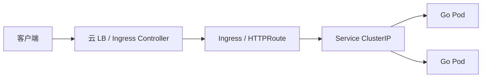

# Ingress、Gateway API 与南北向流量

## 30 秒版（开场）

> **南北向流量** 从公网进集群：传统 **Ingress**（nginx/ALB）或新 **Gateway API**（更细粒度路由）。Go 服务通常 ClusterIP + Ingress 暴露 HTTP/gRPC。生产关键词：**TLS 终止、超时与 body 限制、path 路由、WebSocket 升级、gRPC 需 backend protocol 注解**。

## 3 分钟版（一面深度）

1. **是什么**：Ingress Controller 把外部 HTTP(S) 路由到 Service；Gateway API 用 Gateway + HTTPRoute 替代注解魔法。
2. **为什么**：面试常问 Ingress vs Service LoadBalancer、如何做灰度 path、WebSocket 怎么配。
3. **怎么做**：Go API 用 Ingress path 前缀；长连接单独 host 或 annotation；超时大于 Go `WriteTimeout`；与 [S-SOL-04 BFF/网关](../11-solution-architecture/S-SOL-04-bff-gateway-mesh.md) 分层：Ingress 基础设施，业务限流在应用或 API 网关。

## 10 分钟版（原理 + 图示）



**Service 类型速查**

| 类型 | 场景 |
|------|------|
| ClusterIP | 集群内互访（默认） |
| NodePort | 调试、边缘 |
| LoadBalancer | 云厂商直出（贵） |
| ExternalName | DNS 别名 |

**Ingress 示例（nginx）**

```yaml
apiVersion: networking.k8s.io/v1
kind: Ingress
metadata:
  name: api
  annotations:
    nginx.ingress.kubernetes.io/proxy-read-timeout: "60"
    nginx.ingress.kubernetes.io/proxy-body-size: "10m"
spec:
  ingressClassName: nginx
  tls:
    - hosts: [api.example.com]
      secretName: api-tls
  rules:
    - host: api.example.com
      http:
        paths:
          - path: /v1
            pathType: Prefix
            backend:
              service:
                name: go-api
                port:
                  number: 8080
```

**Gateway API（HTTPRoute 片段）**

```yaml
apiVersion: gateway.networking.k8s.io/v1
kind: HTTPRoute
metadata:
  name: api-route
spec:
  parentRefs:
    - name: public-gateway
  hostnames:
    - api.example.com
  rules:
    - matches:
        - path:
            type: PathPrefix
            value: /v1
      backendRefs:
        - name: go-api
          port: 8080
```

## 生产场景

- **WebSocket 行情推送**：需 `proxy-read-timeout` 很大、`Connection Upgrade`；或独立域名 + [S-NET-05](../06-network-governance/S-NET-05-websocket-gateway.md)
- **gRPC**：部分 Ingress 不支持 HTTP/2 gRPC → 用 **gRPC Gateway**、**独立 LB** 或支持 grpc 的 mesh/gateway
- **大文件上传**：`client_max_body_size` / Go `MaxBytesReader` 对齐
- **多环境**：staging/prod 不同 host；cert-manager 自动续期 TLS

## 排查与工具

- `kubectl describe ingress` → Address、Events、backend 404
- `curl -v https://api.example.com/v1/healthz` 对比 `kubectl port-forward`
- Controller 日志：nginx-ingress / ALB controller
- 502/504：上游 Pod 未 ready、超时过短、Go panic

## 架构取舍

| 方案 | 适用 |
|------|------|
| Ingress + nginx | 成熟、文档多 |
| Gateway API | 多租户路由、Canary 原生 |
| 云 ALB/NLB | 免运维 Controller |
| 应用外 API 网关（Kong/APISIX） | 复杂鉴权、插件、WAF |

**何时不用 Ingress**：纯内网 gRPC 东西向 → Service + Mesh（[S-SOL-04](../11-solution-architecture/S-SOL-04-bff-gateway-mesh.md)）。

## 追问链

1. **Ingress 和 Service 区别？** → Service 集群内负载均衡；Ingress 七层路由 + 域名/TLS。
2. **如何做金丝雀？** → Ingress weight 注解、Gateway API HTTPRoute 权重、或 Flagger（[S-ARCH-15](../03-system-design/S-ARCH-15-release-strategy.md)）。
3. **TLS 在哪终止？** → 多在 Ingress；Pod 内 mTLS 另说（Mesh）。
4. **Go 反向代理超时怎么配？** → Ingress 超时 ≥ Go `ReadHeaderTimeout`/`WriteTimeout` + 业务 P99。

## 反模式与事故

- **Ingress 超时 60s 但 Go 长轮询 120s** → 504
- **WebSocket 走默认短 timeout** → 频繁断连
- **path 路由重叠未排序** → 错误 backend
- **TLS Secret 过期未监控** → 全站 HTTPS 失败

## 代码示例

```go
srv := &http.Server{
    Addr:              ":8080",
    Handler:           router,
    ReadHeaderTimeout: 5 * time.Second,
    ReadTimeout:       30 * time.Second,
    WriteTimeout:      60 * time.Second, // 与 Ingress proxy-read-timeout 对齐
    IdleTimeout:       120 * time.Second,
}
```

## 延伸阅读

- [Kubernetes Ingress](https://kubernetes.io/docs/concepts/services-networking/ingress/)
- [Gateway API](https://gateway-api.sigs.k8s.io/)
- [S-NET-05 WebSocket 网关](../06-network-governance/S-NET-05-websocket-gateway.md)
