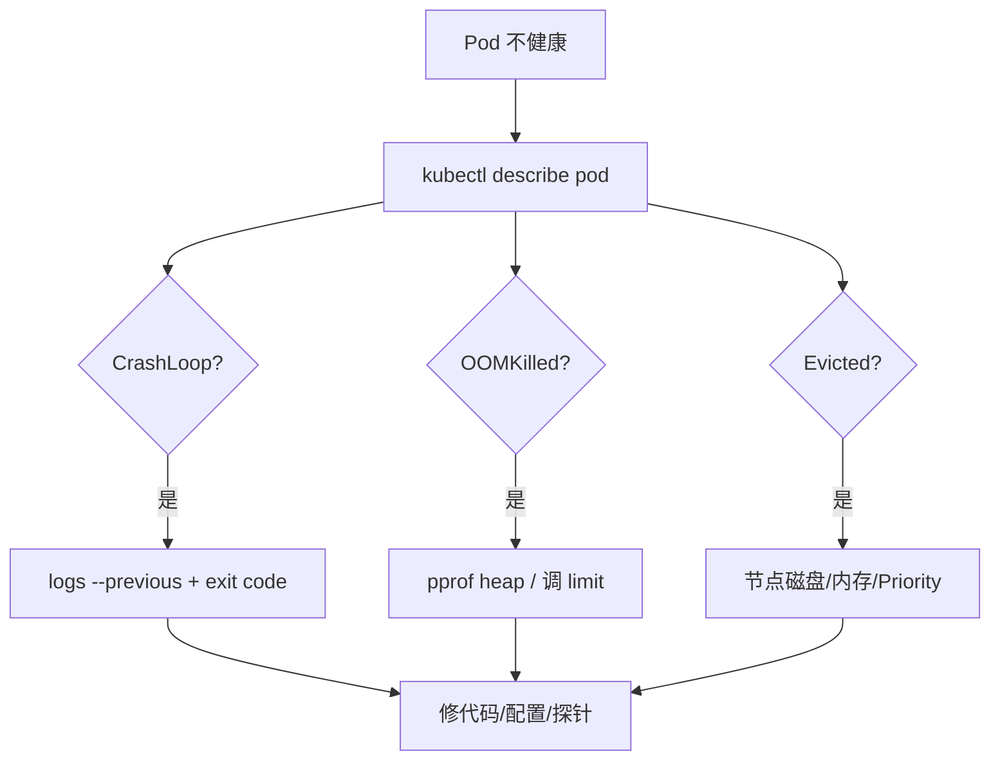

# K8s 故障排查：OOMKilled、CrashLoop 与 Evicted

## 30 秒版（开场）

> Pod 异常三件套：**OOMKilled**（内存超 limit）、**CrashLoopBackOff**（进程反复退出）、**Evicted**（节点磁盘/内存压力驱逐）。Go 服务排查路径：`kubectl describe pod` → Events → 日志 → **pprof heap/goroutine**（[S-MEM-10](../02-memory-gc/S-MEM-10-pprof-heap.md)）。生产关键词：**Last State、Exit Code 137、previous logs、ephemeral debug container**。

## 3 分钟版（一面深度）

1. **是什么**：kubelet/cgroups 杀容器或驱逐 Pod；CrashLoop 是退避重启循环。
2. **为什么**：5 年+ 后端必须会线上排障；面试常给「Pod 一直 Restart 你怎么查」。
3. **怎么做**：按 Events 分类；OOM 调 limit 或修泄漏；Crash 看 exit code 与 `--previous` 日志；Evicted 查节点与 QoS。

## 10 分钟版（排查流程）



**Exit Code 速查**

| Code | 含义 |
|------|------|
| 137 | SIGKILL，常见 **OOMKilled** 或 grace 超时强杀 |
| 143 | SIGTERM，正常优雅退出 |
| 1 | 应用 panic / os.Exit(1) |
| 2 | 参数/用法错误 |

**OOMKilled（Go 特有）**

| 原因 | 处理 |
|------|------|
| memory limit 过低 | 压测定峰值 + 30% 余量 |
| goroutine 泄漏 | pprof goroutine（[S-CONC-13](../01-runtime-concurrency/S-CONC-13-goroutine-leak.md)） |
| 缓存无界 | 限大小、LRU |
| GOGC 不当 | 调 GOGC 或升 limit（[S-MEM-03](../02-memory-gc/S-MEM-03-gogc-tuning.md)） |

**CrashLoopBackOff**

| 原因 | 处理 |
|------|------|
| panic 启动 | `--previous` 日志 + stack |
| liveness 过严 | 调 initialDelay / 改探针路径 |
| 配置缺失 | ConfigMap/Secret 未挂载 |
| 依赖连不上 | 启动顺序；readiness 而非 crash |

**Evicted**

| 原因 | 处理 |
|------|------|
| 节点 DiskPressure | 清镜像、扩盘、限日志 volume |
| 节点 MemoryPressure | 降 BestEffort、升节点 |
| Pod Priority 低 | 关键服务提 priorityClass |

## 生产场景

- **发布后 CrashLoop**：新版本配置 key 改名 → 对比 ConfigMap 版本（[S-CLOUD-08](./S-CLOUD-08-configmap-secret.md)）
- **间歇 OOM**：流量高峰 + slice 预分配过大 → heap profile 看 inuse
- **distroless 无 shell**：`kubectl debug --copy-to` 临时 debug 容器（[S-CLOUD-02](./S-CLOUD-02-docker-multistage.md)）
- **索引器 OOM**：批量 reorg 回放 → 限 batch、升 memory 或水平拆链

## 排查命令清单

```bash
kubectl describe pod POD -n NS
kubectl logs POD -n NS --previous
kubectl get pod POD -o jsonpath='{.status.containerStatuses[0].lastState}'
kubectl top pod POD -n NS
kubectl get events -n NS --field-selector involvedObject.name=POD
kubectl debug POD -it --image=busybox --target=APP_CONTAINER
```

Go 容器内（若有 debug 端点）：

```bash
curl -o heap.prof http://localhost:6060/debug/pprof/heap
go tool pprof -top heap.prof
```

## 架构取舍

| 策略 | 说明 |
|------|------|
| Guaranteed QoS | OOM 优先杀 BestEffort，非关键 |
| VPA 推荐 limit | 长期修正 request（与 HPA 分工） |
| 集中日志 | Loki/ELK 查 previous 实例 |

## 追问链

1. **137 一定是 OOM 吗？** → 也可能是 grace 超时 SIGKILL；看 `reason: OOMKilled`。
2. **如何抓 Crash 前瞬间？** → `--previous`、preStop hook 打日志、Sentry/panic hook。
3. **节点 NotReady 上 Pod 怎样？** → 可能 Evicted 或 Unknown；看 controller 重建。
4. **生产能 kubectl exec pprof 吗？** → 建议独立 admin 端口 + NetworkPolicy 限制；或 sidecar 采集。

## 反模式与事故

- **不设 memory limit「避免 OOM」** → 拖垮整节点
- **liveness 探针 panic 路径** → CrashLoop 雪崩
- **只看当前 logs 不看 previous** → 错过启动期 panic
- **Evicted Pod 未告警** → 副本 silently 不足

## 代码示例

```go
func main() {
    go func() {
        _ = http.ListenAndServe("127.0.0.1:6060", nil) // net/http/pprof
    }()
    // ...
}
```

## 延伸阅读

- [Debug Running Pods](https://kubernetes.io/docs/tasks/debug/debug-application/)
- [S-MEM-10 pprof heap](../02-memory-gc/S-MEM-10-pprof-heap.md)
- [S-CLOUD-01 资源 limit](./S-CLOUD-01-k8s-scheduling.md)
