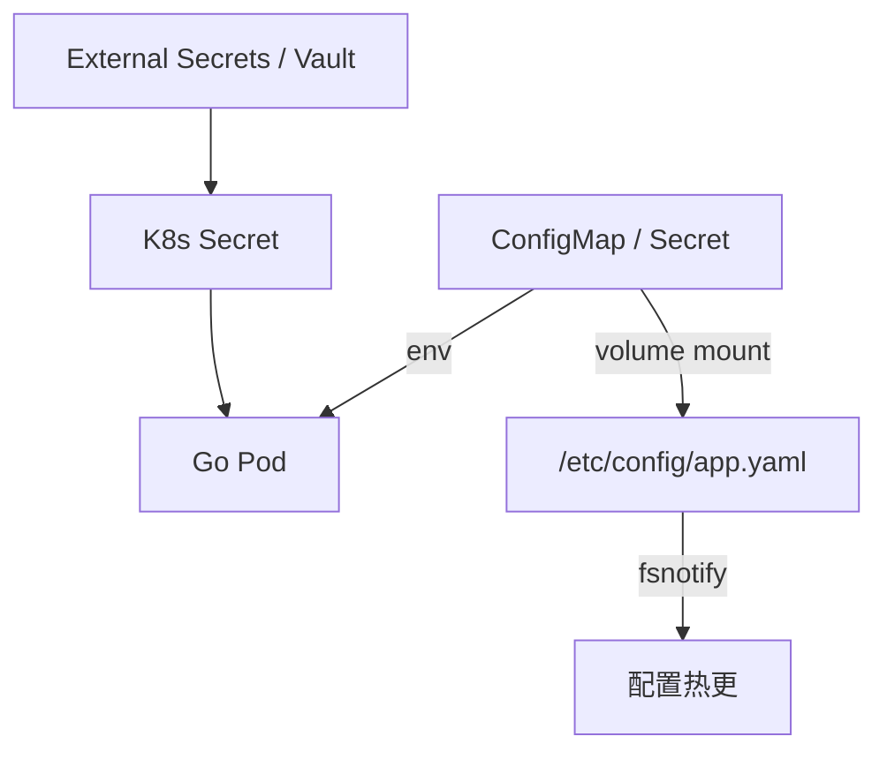

# ConfigMap、Secret 与 Go 配置热更新

## 30 秒版（开场）

> **ConfigMap** 存非敏感配置，**Secret** 存密钥（Base64 非加密）；挂载为 **环境变量** 或 **Volume 文件**。Go 服务推荐：**启动读 env + 可选文件 watch 热更**；Secret **不进镜像**（[S-CLOUD-02](./S-CLOUD-02-docker-multistage.md)）。生产关键词：**12-Factor、Reloader、immutable Secret、敏感配置轮换**。

## 3 分钟版（一面深度）

1. **是什么**：K8s 原生配置分发；修改 ConfigMap/Secret 不会自动触发 Deployment rollout。环境变量不会变；普通 projected volume 会最终更新；`subPath` 挂载不会收到更新。
2. **为什么**：常问「改配置要不要发版」；错用 Secret 泄漏、subPath 不更新是常见坑。
3. **怎么做**：非敏感可热更（watch 文件）；敏感改 Secret + 滚动重启或 Reloader；Go 用 `viper`/自研 atomic.Value 热加载。

## 10 分钟版（原理 + 图示）



**挂载方式对比**

| 方式 | 热更新 | 适用 |
|------|--------|------|
| env | 否（需重启 Pod） | 简单、少量 key |
| volume 整目录 | 是（kubelet 同步，有延迟） | 配置文件 |
| volume subPath 单文件 | **否** | 避免使用若需热更 |
| Secret Store CSI | 依赖驱动 | 与 Vault/AWS SM 集成 |

**Deployment 片段**

```yaml
spec:
  template:
    spec:
      containers:
        - name: app
          envFrom:
            - configMapRef:
                name: app-config
          env:
            - name: DB_PASSWORD
              valueFrom:
                secretKeyRef:
                  name: app-secret
                  key: password
          volumeMounts:
            - name: config
              mountPath: /etc/config
              readOnly: true
      volumes:
        - name: config
          configMap:
            name: app-config
            items:
              - key: app.yaml
                path: app.yaml
```

**Go 热更新示例**

```go
type Config struct {
    RateLimitRPS int `yaml:"rate_limit_rps"`
    FeatureX     bool `yaml:"feature_x"`
}

var cfg atomic.Value // stores Config

func watchConfig(path string) {
    w, err := fsnotify.NewWatcher()
    if err != nil {
        slog.Error("create config watcher", "err", err)
        return
    }
    defer w.Close()
    if err := w.Add(filepath.Dir(path)); err != nil {
        slog.Error("watch config directory", "err", err)
        return
    }
    for {
        select {
        case ev, ok := <-w.Events:
            if !ok {
                return
            }
            if ev.Op&(fsnotify.Write|fsnotify.Create|fsnotify.Rename) != 0 {
                if c, err := loadConfig(path); err == nil {
                    // loadConfig 内应完成全量校验，再一次性发布快照。
                    cfg.Store(c)
                }
            }
        case err, ok := <-w.Errors:
            if !ok {
                return
            }
            slog.Error("config watch", "err", err)
        }
    }
}

func GetConfig() Config {
    return cfg.Load().(Config)
}
```

## 生产场景

- **风控规则 / 限流阈值**：ConfigMap 热更，无需重启（与 [S-ARCH-08](../03-system-design/S-ARCH-08-rate-limiting.md) 联动）
- **RPC 端点切换**：链上节点 URL 变更（[S-BC-02](../12-blockchain-web3/S-BC-02-go-ethereum-rpc.md)）
- **Secret 轮换**：DB 密码双写期 → 新 Secret 版本 + 滚动发布
- **多环境**：configMap 按 namespace 隔离；避免 prod secret 进 staging

## 排查与工具

- `kubectl get cm,secret -n NS`
- `kubectl describe cm app-config` → 是否被 Pod 引用
- Pod 内 `cat /etc/config/app.yaml` 对比期望
- [Reloader](https://github.com/stakater/Reloader) / Argo CD 触发滚动

## 架构取舍

| 方案 | 说明 |
|------|------|
| K8s ConfigMap | 简单、GitOps 友好 |
| Nacos / Apollo | 动态配置、灰度、审计 |
| Vault + CSI | 企业密钥治理 |
| 仅 env | 12-Factor 极简，无热更 |

**何时不用热更**：涉及结构变更、连接池重建 → 滚动发布更安全。

## 深挖问答

1. **Secret Base64 安全吗？** → 否，仅编码；靠 RBAC、etcd 加密 at rest、External Secrets。
2. **改 ConfigMap 后 Pod 何时感知？** → volume 更新受 kubelet sync period、缓存策略等影响，不是即时 SLA；目录通常通过原子替换更新，watcher 应监听父目录并容忍 rename。env 必须重启。
3. **subPath 为什么不更新？** → subPath 绑定创建时 inode；用目录挂载或重启。
4. **Go 热更线程安全？** → `atomic.Value` / `RWMutex`；业务读配置走快照，避免半写。

## 反模式与事故

- **密钥写 Dockerfile / git** → 泄漏
- **ConfigMap 存 DB 密码** → 应用 Secret + 最小 RBAC
- **热更改连接串不重建连接池** → 仍连旧库
- **全量配置一个 giant yaml** → 难 review；按域拆分 CM

## 代码示例

```go
// 启动：env 覆盖文件（12-Factor）
func loadConfig(path string) (Config, error) {
    var c Config
    b, err := os.ReadFile(path)
    if err != nil {
        return Config{}, err
    }
    if err := yaml.Unmarshal(b, &c); err != nil {
        return Config{}, err
    }
    if v := os.Getenv("RATE_LIMIT_RPS"); v != "" {
        n, err := strconv.Atoi(v)
        if err != nil {
            return Config{}, fmt.Errorf("RATE_LIMIT_RPS: %w", err)
        }
        c.RateLimitRPS = n
    }
    return c, validateConfig(c)
}
```

## 延伸阅读

- [ConfigMap](https://kubernetes.io/docs/concepts/configuration/configmap/)
- [Secrets](https://kubernetes.io/docs/concepts/configuration/secret/)
- [S-CLOUD-04 滚动发布](./S-CLOUD-04-rolling-update-probes-pdb.md)
