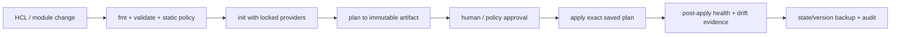

# Terraform State、模块、Drift 与安全变更

## 30 秒版（开场）

> Terraform state 是“配置地址 ↔ 远端真实对象”的绑定和最近属性快照，不是可随手编辑的缓存；它可能含敏感值，团队使用应放在支持访问控制、加密、版本恢复和适当 locking 的远端后端。`plan` 只是基于当时配置、state、refresh 与 provider 行为计算出的变更提案，不是永不过期的事实。生产变更要固定 provider/module、审查同一份 saved plan、限制权限和 blast radius，并用 `moved`、`import`、`removed` 等声明式迁移记录代替直接改 state。

## 3 分钟版（一面深度）

1. **State 的职责**：记录 resource address 与 provider 对象身份的绑定、依赖元数据和属性快照。
   同一远端对象不应同时绑定多个 resource address。
2. **Lock 的边界**：支持 locking 的后端可避免两个 Terraform writer 同时提交 state；它不能阻止
   云控制台、其他 IaC 栈或 provider 外部系统并发修改资源。
3. **Plan 的边界**：默认会 refresh 后比较 desired config 与 observed remote state；saved plan
   让审批和 apply 针对同一份动作，但计划之后的外部变化仍可能让执行失败或产生新风险。
4. **Module 的边界**：围绕所有权、生命周期和稳定接口拆分，而不是为了“文件少一点”就抽模块。
5. **Drift 的处理**：先分类是紧急人工修复、恶意/误操作、provider 默认值，还是另一个控制器的
   合法变更，再决定采纳到代码、导入、忽略特定字段或回滚现场。

## 10 分钟版（安全变更流水线）



关键控制点：

- `.terraform.lock.hcl` 锁 provider 选择；module source 也要用不可变版本或 commit，不追浮动分支。
- CI 读取 plan 的凭证尽量只读；apply 使用独立的短期、最小权限身份。
- plan artifact 绑定 commit、workspace/state identity、provider lock、变量摘要和审批记录。
- 高风险资源设置独立审批与维护窗口，但 `prevent_destroy` 只是护栏，不是备份或灾难恢复。
- apply 后验证服务健康、路由、数据面和成本，不把“Terraform exit 0”当业务验收。

### State 与环境边界

生产 state 至少需要：

| 能力 | 原因 |
|------|------|
| 访问控制与审计 | state 可能包含密码、token、连接串或其他敏感属性 |
| 加密与传输保护 | 降低泄漏面，但不替代最小权限 |
| 版本恢复 | 错误 apply/state 写入后可恢复上一快照 |
| locking/并发控制 | 防止两个 Terraform run 互相覆盖 |
| 明确所有权 | 一个对象只能由一个 stack/address 管理 |

CLI workspace 适合复用同一配置的多个 state，但不自动提供强权限隔离。生产、预发以及不同
blast radius 的平台域通常还应拆 backend、身份和流水线；“切错 workspace”本身就是风险。

### Module 设计

好 module 暴露稳定能力，例如“带组织默认安全策略的 PostgreSQL 集群”，而不是把 provider
的每个参数原样透传：

- 输入有清楚类型、语义和校验；输出只暴露消费者需要的契约。
- 子资源共享生命周期和 owner；独立升级/销毁的资源不强塞进同一个 state。
- 默认值体现平台策略，但不隐藏会导致替换或数据丢失的行为。
- 升级 module 时写 migration note，并用 `moved` block 保留地址重构历史。
- 不让下游依赖 module 内部资源地址；否则抽象一重构就大面积 replace。

### Import、重构与删除

```hcl
import {
  to = aws_s3_bucket.audit
  id = "company-audit-prod"
}

moved {
  from = aws_s3_bucket.audit
  to   = module.audit.aws_s3_bucket.this
}

removed {
  from = module.legacy
  lifecycle {
    destroy = false
  }
}
```

- import 只建立管理绑定；配置仍要与真实对象匹配，并审查后续 plan。
- 重命名或移入 module 时优先 `moved`，让迁移随代码评审，而不是要求每个操作者手敲
  `terraform state mv`。
- `removed` 可明确“停止管理但不销毁”；真正销毁要有备份、依赖分析和恢复方案。
- 直接编辑 state JSON、在多人环境执行 `state push`，只应是受控事故处置，不是日常流程。

### Drift 决策树

```text
plan 显示 drift
  ├─ 未授权变更 -> 冻结/审计 -> 代码恢复或事件响应
  ├─ 紧急修复   -> 验证效果 -> 补写 HCL -> plan 收敛
  ├─ 外部 controller 合法管理 -> 明确 ownership -> 避免双控制器
  ├─ provider/default 噪声 -> 升级或精确建模，谨慎 ignore_changes
  └─ 已存在未纳管对象 -> import + 配置审查
```

`terraform plan -refresh-only` 用来查看远端变化将如何更新 state；apply refresh-only 是接受
远端事实进入 state，不会把基础设施改回配置。它不是“自动修复 drift”，也不能代替原因调查。

## 生产风险与排查

| 风险 | 证据 | 控制 |
|------|------|------|
| 意外 replace 数据库 | plan 中 `-/+`、ForceNew 属性、依赖传播 | 单独审批、备份恢复演练、分阶段迁移 |
| state lock 长期占用 | 当前 run、CI job、backend lock owner | 先确认无活跃 writer，再受控解锁 |
| state 与实际不一致 | refresh-only plan、provider API、审计日志 | 查 ownership，不直接手改 JSON |
| `for_each`/`count` 地址漂移 | address diff、key 变化 | 用稳定业务 key，重构配合 `moved` |
| provider 升级大面积 diff | lockfile、schema/version change | 独立升级 PR，小范围验证 |
| `ignore_changes` 掩盖风险 | 长期 drift、字段 owner 不明 | 只忽略明确由另一控制器拥有的字段 |

`-target` 适合故障恢复或例外拆解，不是常规部署策略；它产生的是依赖图的局部计划，容易留下
未收敛状态。使用后应再跑完整 plan。

## Staff/架构师表达

回答“你如何治理 IaC”时，不要只报工具名。按以下顺序：

1. state 和资源 ownership 如何拆分；
2. 变更身份、审批和 plan artifact 如何绑定；
3. 数据资源替换、导入、重构如何 fail closed；
4. drift 与紧急人工修复如何回到代码事实源；
5. 用 lead time、失败率、回滚时长、未授权 drift 数量和策略拦截率衡量结果。

## 深挖问答

1. **State 为什么不能直接放 Git？**  
   它含敏感值和资源绑定，需要并发控制、访问控制及版本恢复；普通 Git 工作流不提供 Terraform
   所需的 state locking。
2. **有 locking 是否就不会 drift？**  
   不会。Lock 只协调 Terraform writer，外部 API、控制台和其他控制器仍能改资源。
3. **saved plan 是否绝对安全？**  
   它固定已审批动作，但远端状态在 plan 后仍可变化；apply 可能失败，外部副作用也要复核。
4. **什么时候用 `ignore_changes`？**  
   只有字段明确由另一控制器拥有且已记录契约时；不能用来消除看不懂的 diff。
5. **module 越通用越好吗？**  
   不。过度参数化会变成 provider 透传层，失去策略、所有权和稳定接口。

## 反模式与错误表达

- “State 只是缓存，删了再 plan 就会自动恢复。”
- “远端 backend 一定支持锁。”
- “Plan 通过就说明 apply 不会有意外。”
- “用了 Terraform 后禁止任何紧急人工操作。”
- “`ignore_changes` 可以解决 drift。”
- “生产和测试只要用 workspace 区分就已经安全隔离。”

## 延伸阅读

- [Terraform State](https://developer.hashicorp.com/terraform/language/state)
- [Modules Overview](https://developer.hashicorp.com/terraform/language/modules)
- [Import Resources](https://developer.hashicorp.com/terraform/language/import)
- [Manage Resource Drift](https://developer.hashicorp.com/terraform/tutorials/state/resource-drift)

