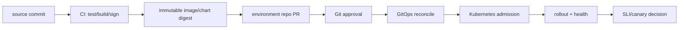

# Helm 与 GitOps：持续收敛、发布顺序和回滚

## 30 秒版（开场）

> Helm 主要解决 Kubernetes manifest 的打包、模板与 release 记录；GitOps controller 持续比较 Git 中的期望状态和集群 live state，并主动收敛。Git commit 只是部署意图，不代表资源已健康；回滚也不是一句 `helm rollback`，因为 CRD、数据库迁移、消息格式和外部副作用未必可逆。生产方案要把 immutable artifact、Git 审批、sync wave/hook、健康门禁、prune/self-heal 权限、secret 管理和 expand/contract 数据迁移放在同一条状态机里。

## 3 分钟版（一面深度）



每个箭头的证据不同：

- CI 成功：artifact 可构建且通过门禁；
- Git merge：期望版本已获批；
- `Synced`：live spec 与目标 revision 收敛；
- `Healthy`：控制器定义的资源健康；
- 业务验收：SLI、交易正确性、兼容性和数据校验通过。

不能把任一层的成功扩大成后续所有层都成功。

## 10 分钟版（发布状态机）

### Helm 与 GitOps 的分工

| 能力 | Helm | GitOps controller |
|------|------|-------------------|
| 模板/参数化 | Chart、values、functions | 通常调用 Helm/Kustomize 等渲染 |
| artifact | chart package/OCI | 跟踪 Git/OCI revision |
| release history | Helm release revision | Application/Kustomization reconciliation history |
| drift 收敛 | 命令式 install/upgrade 本身不持续运行 | controller 持续对比 desired/live |
| 健康与重试 | `--wait`/hook 等有限门禁 | health assessment、retry、notification |

GitOps 不是“CI 执行 `kubectl apply` 后把 YAML 备份到 Git”。关键是 Git 作为声明式期望状态，
controller 从受控来源拉取并持续 reconcile，使 CI 不必持有直接部署 API 的长期权限。

### Artifact 和配置必须可追溯

推荐环境仓库引用 immutable image digest，而不是仅写可移动 tag：

```yaml
image:
  repository: registry.example.com/wallet-api
  digest: sha256:...
```

一次部署应能回答：

- 哪个源码 commit 和构建身份产生 artifact；
- 哪个 chart/module 版本渲染 manifest；
- 哪个 Git revision 修改生产期望状态；
- controller 实际同步了哪个 revision；
- 哪些资源、migration 和 SLI 门禁通过。

### Sync wave、hook 与“顺序”

Argo CD 的 phase/wave 可表达粗细两级顺序：先 phase，再按 wave 从小到大；同一应用会从首个
OutOfSync/Unhealthy wave 开始推进。它能帮助安排 CRD、operator、migration job 和 workload，
但不能替代业务兼容设计。

```yaml
metadata:
  annotations:
    argocd.argoproj.io/sync-wave: "-1"
```

Hook/job 必须：

- 用 migration/version 作为幂等键；
- 重跑可安全识别“已完成”；
- 有 deadline、日志、指标和清理策略；
- 失败时让发布停止，而不是无限重试写数据；
- 不依赖只存在于旧 Pod 内存中的状态。

### CRD 是典型回滚陷阱

Helm 当前 CRD 处理有意保守：`crds/` 中的 CRD 在安装时先创建，但不会在 upgrade/rollback
时自动升级，也不会随 uninstall 自动删除。原因是删除 CRD 可能删除全体 custom resources。

所以：

1. CRD 生命周期通常由独立 platform stack/owner 管理；
2. 先发布向后兼容的新 schema/served version；
3. 升级 controller，再迁移 custom resources；
4. 等旧版本无消费者后才停止 served/删除字段；
5. 对 conversion webhook 的可用性单独设门禁。

“Helm release 回滚成功”不证明 CRD 已降级，也不证明新版本写入的数据仍能被旧 controller 解释。

### 数据迁移用 expand / migrate / contract

```text
expand:   新旧版本都能工作的 schema / API / event
migrate:  backfill + shadow compare + progress checkpoint
cutover:  按租户/分片逐步切流，监控业务 SLI
contract: 确认旧读写者归零后再移除旧字段/格式
```

- 先让 N 与 N-1 代码兼容，再滚动部署。
- migration 不跟 Pod 启动无界绑定，避免每个副本同时执行。
- 回滚窗口内保留旧 schema 和旧事件解析能力。
- destructive migration 通常 forward-fix 或从备份恢复，不能假设应用镜像回退即可逆转。

## 自动同步、Prune 与 Self-heal

Argo CD 自动同步会在 desired/live 差异时触发收敛；自动 prune 和 self-heal 是独立风险开关：

- prune 默认不是自动删除，开启前要有资源 ownership、孤儿检测和 allow-empty 防护；
- self-heal 会把人工现场修改拉回 Git，适合防 drift，也可能覆盖正在进行的应急修复；
- ApplicationSet 管理的 Application 不能靠直接改子 Application 长期关闭 auto-sync；
- sync window、项目 RBAC 和 break-glass 流程应写进运维协议。

应急修改若确有必要，要记录 TTL/owner，随后把有效修复补回 Git；否则下一次 reconcile 会覆盖，
或形成无法解释的永久 drift。

## Secret 与供应链边界

- Git 不存明文 secret；使用加密文件、外部 secret manager 或 controller 引用时，仍要控制
  解密身份、审计和轮换。
- Base64 不是加密；Helm values、渲染日志和 diff 都可能泄漏敏感值。
- chart、image 和 Git 来源应固定 digest/commit 并验证来源；“私有仓库”不等于可信 artifact。
- GitOps controller 权限很高，应按 project/namespace 限权，并限制可引用的 repo、cluster
  和 resource kind。

## 故障定位

| 状态 | 先查 | 常见根因 |
|------|------|----------|
| OutOfSync | target revision、diff、ignore rule | Git revision 错、live drift、渲染不稳定 |
| Synced 但 Unhealthy | resource health、events、probe | rollout 失败、依赖未就绪、错误 health rule |
| 卡在早期 wave | 首个 unhealthy wave/hook 日志 | migration 非幂等、CRD/webhook 不可用 |
| 一直重建资源 | controller ownership、默认字段、mutating webhook | 两个控制器争同一字段、diff 噪声 |
| 回滚后仍故障 | DB/event/CRD、外部副作用 | 数据已不可逆、旧代码不兼容新格式 |
| prune 误删 | Git diff、ApplicationSet、ownership | 路径/生成器为空、资源归属错误 |

## 架构取舍

- **自动同步**提高收敛速度；支付、签名和数据面可叠加人工 promotion 与 SLI gate，而不是完全
  关闭自动化。
- **单仓库 vs 多仓库**要按权限、审计、变更耦合和团队所有权选择，不背“一仓最好”。
- **Helm hook migration**适合边界清楚的小迁移；长时 backfill 更适合独立、可暂停、可观测的
  migration controller/job。
- **回退 Git commit**恢复期望状态可审计；对不可逆数据变化应优先兼容性 forward-fix。

## 追问链

1. **Git 已 merge 是否代表已部署？**  
   不代表。还要有 controller observed revision、sync/health 和业务 SLI 证据。
2. **Helm rollback 能回滚数据库吗？**  
   不能自动做到；它回退 Kubernetes release manifest，外部副作用和 schema 要独立设计。
3. **为什么 CRD 不跟 chart 一起随便 rollback？**  
   CRD 是集群级 API，删除或降级可能破坏全部 custom resources；Helm 因此不在 upgrade/
   rollback 自动管理 `crds/` 中 CRD。
4. **Self-heal 是否越强越好？**  
   它减少 drift，也会覆盖 break-glass 修改；需要明确暂停、审计和回写 Git 的流程。
5. **Sync wave 是否解决依赖？**  
   只表达应用顺序和健康推进；协议、数据和 N/N-1 兼容仍由系统设计保证。

## 反模式与错误表达

- “GitOps 就是把 YAML 放到 Git。”
- “Synced 就表示业务健康。”
- “Helm rollback 会还原所有东西。”
- “CRD 放 `crds/` 后 Helm 会自动升级和回滚。”
- “数据库 migration 放 init container，每个 Pod 跑一次也没关系。”
- “Secret 做 Base64 后可以提交 Git。”
- “开启 prune/self-heal 就不需要 break-glass 流程。”

## 延伸阅读

- [Helm Chart Best Practices](https://helm.sh/docs/chart_best_practices/)
- [Helm CRD Best Practices](https://helm.sh/docs/chart_best_practices/custom_resource_definitions/)
- [Argo CD Automated Sync](https://argo-cd.readthedocs.io/en/stable/user-guide/auto_sync/)
- [Argo CD Sync Phases and Waves](https://argo-cd.readthedocs.io/en/stable/user-guide/sync-waves/)
- [Flux Core Concepts](https://fluxcd.io/flux/concepts/)

