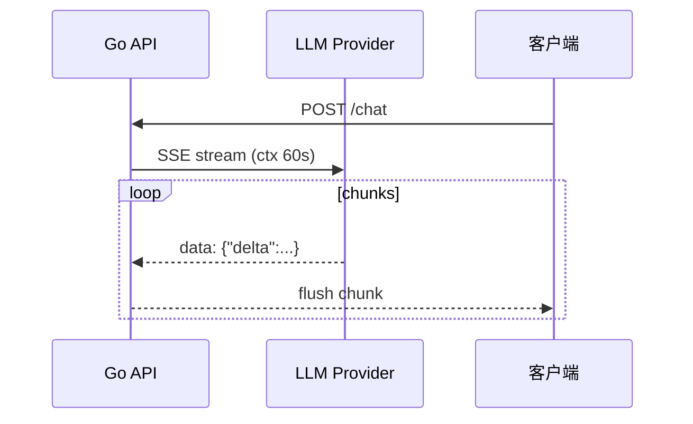

# Go 接入大模型 API：流式、重试、超时

## 30 秒版（开场）

> 大模型调用本质是 **高延迟、不可靠的 HTTP/RPC**；Go 侧用 **Context 超时**、**SSE 流式**、**指数退避重试** 和 **连接池复用**。生产关键词：**OpenAI 兼容协议、首 token 延迟 TTFT、429 限流、断路器**。

## 3 分钟版（一面深度）

1. **是什么**：通过 REST（OpenAI-compatible）或 gRPC 调用推理服务；请求体含 `messages`/`tools`，响应可为一次性 JSON 或 `text/event-stream` 流。
2. **为什么**：LLM 推理 P99 常 3～30s，比传统 API 慢 1～2 个数量级；必须 **异步感知**（流式）和 **故障隔离**（不把 goroutine 挂死）。
3. **怎么做**：`http.Client` 设合理 `Timeout`；流式用 `bufio.Scanner` 读 SSE；`context.WithTimeout` 贯穿；429/5xx 用 `retry-go` 或自研退避；多模型路由走 **抽象 Client 接口**。

## 10 分钟版（原理 + 图示）



**流式 SSE 最小骨架**

```go
req, _ := http.NewRequestWithContext(ctx, http.MethodPost, baseURL+"/chat/completions", body)
req.Header.Set("Authorization", "Bearer "+apiKey)
req.Header.Set("Accept", "text/event-stream")

resp, err := httpClient.Do(req)
if err != nil { return err }
defer resp.Body.Close()

scanner := bufio.NewScanner(resp.Body)
for scanner.Scan() {
    line := scanner.Text()
    if !strings.HasPrefix(line, "data: ") { continue }
    payload := strings.TrimPrefix(line, "data: ")
    if payload == "[DONE]" { break }
    // 解析 delta，写入 flusher（Gin c.Stream 或 http.Flusher）
}
```

**Client 配置要点**

| 项 | 建议 |
|----|------|
| `http.Client.Timeout` | 整请求上限；流式可设更大或只靠 ctx |
| `Transport.MaxIdleConnsPerHost` | 10～100，避免连接风暴 |
| Context | 用户取消 → 立即 `req.Cancel` 省 token |
| 重试 | 仅 429/502/503；**不重试** 4xx 业务错误 |

## 生产场景

- **智能客服**：流式降低首字等待；前端 WebSocket 转发 SSE
- **批处理摘要**：非流式 + 队列削峰；并发受 provider QPS 限制
- **私有化部署**：vLLM/Ollama 同样 OpenAI 兼容，换 `baseURL` 即可

## 排查与工具

- 指标：`llm_request_duration_seconds`、`llm_tokens_total`、`llm_errors_total{code=429}`
- 日志：记录 `model`、`prompt_tokens`、`completion_tokens`（勿记全文 prompt）
- 链路：OTel span 包住 LLM 调用，标注 `gen_ai.system`

## 架构取舍

| 方案 | 适用 |
|------|------|
| 官方 SDK（go-openai 等） | 快速上线、兼容性好 |
| 自封装 `LLMClient` 接口 | 多厂商切换、单测 mock |
| 网关代理（LiteLLM 等） | 统一鉴权、限流、审计 |

**何时不用流式**：短回答、批处理、仅需结构化 JSON 且要完整校验。

## 追问链

1. **用户断开连接还要不要继续调模型？** → 监听 `ctx.Done()`，取消上游请求省成本。
2. **429 怎么处理？** → 读 `Retry-After`；队列排队；多 key 轮询（注意 ToS）。
3. **和 gRPC 流对比？** → 多数 SaaS 仍是 HTTPS+SSE；自建 Triton 可用 gRPC streaming。
4. **超时设多少？** → 交互 30～60s；后台任务可更长；**TTFT** 单独告警。

## 反模式与事故

- **无超时** → goroutine 泄漏、连接占满
- **每个请求 `http.Client{}`** → TLS 握手开销巨大
- **重试幂等性未考虑** → 重复扣费、重复写库
- **把完整 API Key 打日志** → 安全事故

## 代码示例

```go
type ChatClient interface {
    StreamChat(ctx context.Context, req ChatRequest, w io.Writer) error
    Complete(ctx context.Context, req ChatRequest) (ChatResponse, error)
}
```

可用 `examples/senior/` 风格自研 mock 实现做单元测试。

## 延伸阅读

- [OpenAI API Reference](https://platform.openai.com/docs/api-reference)
- [go-openai](https://github.com/sashabaranov/go-openai)
- [Go Context](https://go.dev/blog/context)
