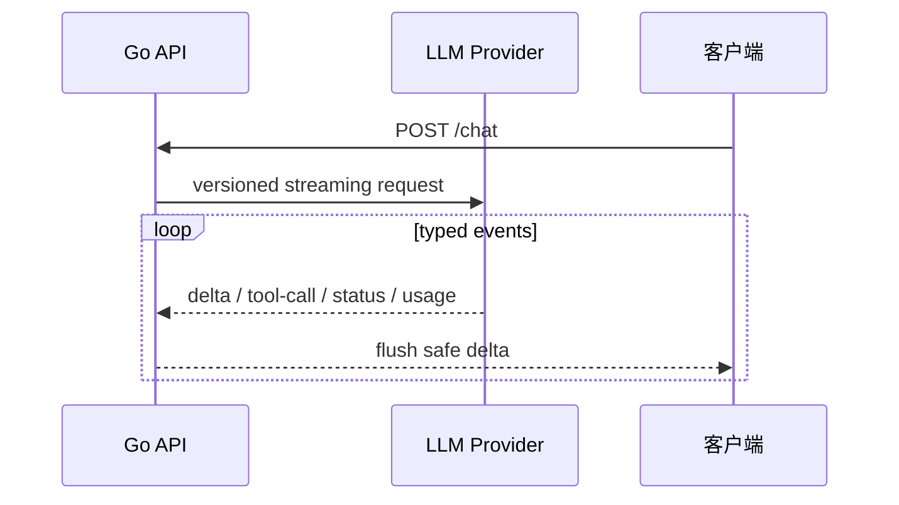

# Go 接入大模型 API：流式、重试、超时

<a id="oral-card"></a>

## 口述卡（高频必背）

[返回 P0 知识图谱](../_meta/p0-knowledge-graph.md)

!!! abstract "30 秒回答"

    大模型 API 应按“慢、贵、可能限流且结果可能部分返回的外部依赖”治理。Go 侧复用连接，
    让 context deadline 和用户取消贯穿调用，分别观测 TTFT、总时延、token、错误和重试。
    流式协议必须由 provider adapter 按 API 版本解析：当前 OpenAI Responses API 是带类型的
    SSE 事件，部分兼容服务仍返回 Chat Completions chunk，不能共用一个 `[DONE]` 解析假设。

**3 分钟展开**

1. 适配层声明 provider、API surface 和版本，把 typed events 归一化为内部 `delta/tool/status/usage` 事件。
2. 只重试明确可重试的状态或网络错误，遵守 `Retry-After`、总 deadline、退避与 jitter；流已向用户输出或工具已产生副作用后不能盲重试。
3. 超时/断线可能是“结果未知”而不是“上游没处理”，因此记录 provider request ID，并避免把两次生成拼成同一次响应。
4. 限制并发、队列、输入/输出 token 和 Agent steps；取消上游可以减少继续计算，但具体计费仍以 provider 语义为准。

| 记忆槽 | 内容 |
|--------|------|
| 三个不变量 | API/事件版本显式化；重试受 deadline 与副作用边界约束；partial stream 不能冒充完整成功 |
| 手画图 | `client → Go adapter → provider`，旁边标 `deadline / limiter / retry / typed events / metrics` |
| 项目落点 | OctoAgentFlow 讲统一 client、流式事件归一化、预算与取消传播；原型证据不包装成生产规模 |
| 一个取舍 | Streaming 改善首段可见时间，但增加部分输出审核、断流恢复和状态机复杂度 |

**错误表达**

- ❌ “OpenAI-compatible 都是 `data: ...` 加 `[DONE]`，429/5xx 统一重试即可。”
- ✅ “不同 API 的事件和终止语义不同；重试必须结合错误分类、deadline、部分输出与副作用。”

**自测追问**：用户断线、provider 超时和首个 token 已返回时，三种场景分别能否重试？

## 10 分钟版（原理 + 图示）


```mermaid
sequenceDiagram
  participant Gin as Go API
  participant LLM as LLM Provider
  participant User as 客户端
  User->>Gin: POST /chat
  Gin->>LLM: versioned streaming request
  loop typed events
    LLM-->>Gin: delta / tool-call / status / usage
    Gin-->>User: flush safe delta
  end
```

**流式事件处理骨架**

```go
stream, err := adapter.Stream(ctx, req) // adapter 固定 provider/API 版本
if err != nil {
    return classifyProviderError(err)
}
defer stream.Close()

for stream.Next() {
    switch event := stream.Event().(type) {
    case TextDelta:
        if err := downstream.Write(event.Text); err != nil {
            return err // ctx 取消会继续传到上游
        }
    case ToolArgumentsDone:
        toolQueue <- event // 仍须 schema、授权和业务校验
    case ResponseCompleted:
        usage.Record(event.Usage)
    case ResponseFailed:
        return event.Err
    }
}
return stream.Err()
```

当前 OpenAI Responses API 常见事件包括 `response.created`、`response.output_text.delta`、
`response.completed` 和 `error`，工具参数也有独立的增量/完成事件。Chat Completions 风格的
chunk 与 `[DONE]` 是另一套 surface。若不用 SDK，自写 SSE decoder 还必须正确处理事件分帧、
多行 `data`、超长事件和连接中断，不能把“逐行 Scanner”当完整协议实现。

**Client 配置要点**

| 项 | 建议 |
|----|------|
| Deadline | 从端到端 SLO 分配连接、首事件、流式空闲和总时长预算；流式不机械套固定秒数 |
| Transport | 复用单例并按并发压测配置连接池；限制并发与等待队列 |
| Context | 用户取消贯穿下游写入与上游请求；是否节省费用取决于 provider 处理/计费语义 |
| 重试 | 按错误分类和 provider 指引；遵守 `Retry-After`、总预算、指数退避与 jitter |

## 生产场景

- **智能客服**：流式降低首字等待；前端 WebSocket 转发 SSE
- **批处理摘要**：非流式 + 队列削峰；并发受 provider QPS 限制
- **私有化部署**：即使服务宣称 OpenAI-compatible，也要用契约测试确认事件、工具、usage、
  错误码和取消语义；不能只换 `baseURL` 就假设完全兼容

## 排查与工具

- 指标：`llm_request_duration_seconds`、`llm_tokens_total`、`llm_errors_total{code=429}`
- 日志：记录 `model`、`prompt_tokens`、`completion_tokens`（勿记全文 prompt）
- 链路：OTel span 包住 LLM 调用，标注 `gen_ai.system`

## 架构取舍

| 方案 | 适用 |
|------|------|
| 官方 SDK（go-openai 等） | 快速上线、兼容性好 |
| 自封装 `LLMClient` 接口 | 多厂商切换、单测 mock |
| 网关代理（LiteLLM 等） | 统一鉴权、限流、审计 |

**何时不用流式**：短回答、批处理、仅需结构化 JSON 且要完整校验。

## 追问链

1. **用户断开连接还要不要继续调模型？** → 监听 `ctx.Done()`，取消上游请求省成本。
2. **429 怎么处理？** → 读 `Retry-After`；在总 deadline 内退避加 jitter；限制本地并发/队列并按配额治理，不能用轮换 key 绕过服务条款。
3. **和 gRPC 流对比？** → 多数 SaaS 仍是 HTTPS+SSE；自建 Triton 可用 gRPC streaming。
4. **超时设多少？** → 交互 30～60s；后台任务可更长；**TTFT** 单独告警。

## 反模式与事故

- **无超时** → goroutine 泄漏、连接占满
- **每个请求新建自定义 `http.Transport`** → 连接池无法复用，TCP/TLS 握手开销巨大（多个零值 `http.Client{}` 仍共享 `DefaultTransport`）
- **重试边界未考虑** → 可能重复生成/计费；若后续工具有副作用还会重复写业务状态
- **把完整 API Key 打日志** → 安全事故

## 代码示例

本仓库 Mock 实现：`examples/senior/llmclient/`（`go test ./examples/senior/llmclient/...`）。

```go
type ChatClient interface {
    StreamChat(ctx context.Context, req ChatRequest, w io.Writer) error
    Complete(ctx context.Context, req ChatRequest) (ChatResponse, error)
}
```

## 延伸阅读

- [OpenAI Streaming API Responses](https://developers.openai.com/api/docs/guides/streaming-responses)
- [OpenAI Function Calling](https://developers.openai.com/api/docs/guides/function-calling)
- [go-openai](https://github.com/sashabaranov/go-openai)
- [Go Context](https://go.dev/blog/context)
