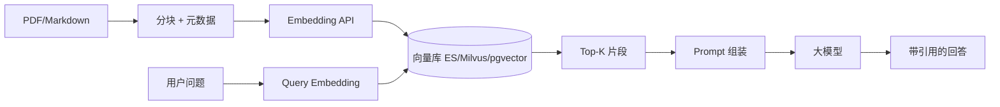

# RAG 架构：分块、向量检索与 Go 落地

## 30 秒版（开场）

> **RAG（检索增强生成）** = 用户问题 → **Embedding 检索** 相关文档片段 → 拼进 Prompt → LLM 生成。生产关键词：**分块策略、Hybrid 检索、重排序 Rerank、引用溯源**。

## 3 分钟版（一面深度）

1. **是什么**：用外部知识库弥补模型幻觉与知识截止；检索层与生成层解耦。
2. **为什么**：企业文档私有、需可审计答案；纯微调成本高、更新慢。
3. **怎么做**：Ingest（解析→分块→向量化→入库）+ Query（改写→召回→Rerank→组装 Prompt）；Go 常负责 **API 编排、任务队列、权限过滤**。

## 10 分钟版（原理 + 图示）



**分块策略对比**

| 策略 | 优点 | 缺点 |
|------|------|------|
| 固定长度 + overlap | 实现简单 | 切断语义 |
| 按标题/段落 | 结构清晰 | 长短不一 |
| 语义分块 | 质量高 | 成本高 |

**Go 编排示例（伪代码）**

```go
func (s *RAGService) Answer(ctx context.Context, q string, userID string) (string, error) {
    // 1. ACL：先按 userID 过滤可见 doc_id 集合
    allowed := s.acl.VisibleDocIDs(ctx, userID)

    // 2. 向量检索（可叠加 BM25 hybrid）
    chunks, err := s.vector.Search(ctx, q, allowed, 20)
    if err != nil { return "", err }

    // 3. Rerank（可选小模型或 cross-encoder）
    chunks = s.reranker.TopN(ctx, q, chunks, 5)

    // 4. 组装 prompt + 调 LLM
    prompt := buildRAGPrompt(q, chunks)
    return s.llm.Complete(ctx, prompt)
}
```

## 生产场景

- **内部知识库问答**：Confluence/Notion 同步 → 夜间 ingest
- **客服**：商品详情 + 政策文档 RAG；答案必须带 `source_id` 链接
- **代码助手**：repo 分块 + 路径元数据；与 IDE 索引类似

## 排查与工具

- 评估：**Hit Rate@K**、答案 groundedness、人工抽检
- Bad case：检索为空 → 检查 embedding 模型一致性、分块是否过碎
- ES：`knn` + `bool` filter；Milvus：collection schema 与索引类型（HNSW）

## 架构取舍

| 向量库 | 适用 |
|--------|------|
| Elasticsearch | 已有 ES、要 Hybrid 全文+向量 |
| pgvector | 数据量中小、事务一致 |
| Milvus/Qdrant | 纯向量、亿级规模 |

**何时不用 RAG**：强实时数据（用 API 查库）；极小知识集（直接塞进 system prompt）。

## 追问链

1. **Embedding 模型换了怎么办？** → 全量 re-embed；双写过渡期。
2. **怎么防幻觉？** → 要求「仅根据上下文回答」+ 无上下文拒答 + 引用段落。
3. **长文档表格怎么处理？** → 结构化抽取或 HTML 表转 Markdown 再分块。
4. **和微调怎么选？** → 风格/格式用微调；事实知识用 RAG。

## 反模式与事故

- **chunk 无元数据** → 无法做权限过滤，**数据泄露**
- **检索 Top-1** → 召回不足；一般 Top-10 再 Rerank 到 3～5
- **query 不改写** → 口语化问题检索差；可加 HyDE 或 query expansion
- **ingest 与线上 embedding 模型不一致** → 检索几乎随机

## 代码示例

与 [S-ES-01 倒排索引](../middleware/elasticsearch/S-ES-01-inverted-index.md) 结合：生产可用 ES `dense_vector`；本仓库教学示例：

```bash
go test ./examples/senior/rag/...
```

`examples/senior/rag/` 演示分块、哈希向量、Top-K 检索与 `llmclient.MockClient` 编排。

## 延伸阅读

- [Pinecone: What is RAG](https://www.pinecone.io/learn/retrieval-augmented-generation/)
- [Elasticsearch dense vector](https://www.elastic.co/guide/en/elasticsearch/reference/current/dense-vector.html)
