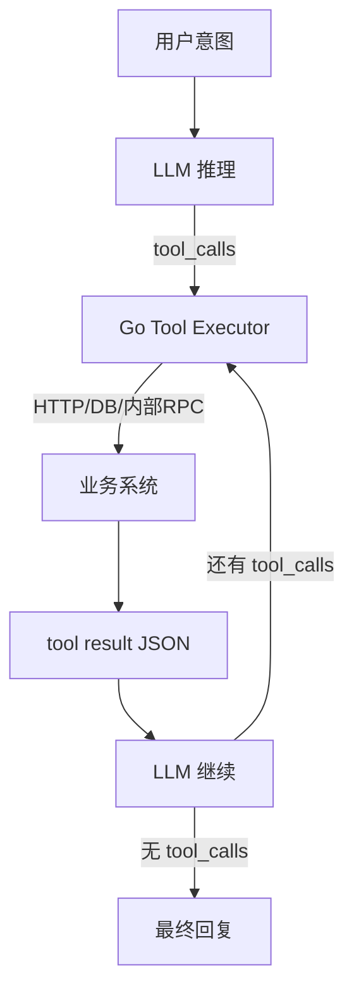

# AI Agent 与 Function Calling

## 30 秒版（开场）

> **Agent** = LLM + **工具调用循环**（规划→执行→观察→再规划）。**Function Calling / Tool Use** 让模型输出结构化 `tool_calls`，由 Go 服务执行真实 API。生产关键词：**ReAct、最大步数、人机确认、MCP 协议**。

## 3 分钟版（一面深度）

1. **是什么**：模型不直接改数据库，而是声明要调用的函数及参数；宿主程序校验后执行并回传 `tool` 结果。
2. **为什么**：弥补 LLM 不能访问实时数据、不能执行副作用；把 **确定性逻辑留在代码里**。
3. **怎么做**：注册 tools schema（JSON Schema）→ chat 请求带 `tools` → 解析 `tool_calls` → Go 执行 → 把结果作为 `role: tool` 消息续聊；设 **max_steps** 防死循环。

## 10 分钟版（原理 + 图示）



**Agent 循环（Go）**

```go
func (a *Agent) Run(ctx context.Context, messages []Message) (string, error) {
    for step := 0; step < a.maxSteps; step++ {
        resp, err := a.llm.Chat(ctx, messages, a.toolSchemas)
        if err != nil { return "", err }

        if len(resp.ToolCalls) == 0 {
            return resp.Content, nil
        }

        for _, tc := range resp.ToolCalls {
            if !a.policy.Allow(tc.Name, tc.Args) {
                return "", fmt.Errorf("tool denied: %s", tc.Name)
            }
            out, err := a.tools.Execute(ctx, tc.Name, tc.Args)
            if err != nil { out = map[string]any{"error": err.Error()} }
            messages = append(messages, toolResultMessage(tc.ID, out))
        }
    }
    return "", ErrMaxStepsExceeded
}
```

**Tool 设计原则**

| 原则 | 说明 |
|------|------|
| 幂等 | 读操作优先；写操作要 confirm |
| 小粒度 | 一个 tool 一件事，便于模型选择 |
| 强类型 | Args 用 JSON Schema 校验 |
| 可观测 | 每步记 span：tool_name、latency |

## 生产场景

- **运维 Copilot**：查监控、拉日志、**禁止**直接 `kubectl delete` 无审批
- **订单助手**：`get_order` + `create_refund`；退款走人工或规则引擎二次校验
- **Cursor/IDE 类**：文件读写、终端命令 — 与 **MCP** 标准化工具暴露

## 排查与工具

- 日志：每轮 `step`、`tool_calls`、token 用量
- 失败：参数 JSON 解析错误 → 收紧 schema 描述（description 要写清示例）
- 评估：工具选择准确率、任务完成率（benchmark）

## 架构取舍

| 模式 | 适用 |
|------|------|
| 单 Agent + 多 Tool | 大多数业务助手 |
| 多 Agent 编排 | 复杂流程；注意延迟与成本 |
| MCP Server | 工具跨项目复用、IDE/Agent 生态 |

**何时不用 Agent**：固定流程用传统 API + 状态机更可靠；Agent 适合意图多变、步骤不固定的场景。

## 追问链

1. **和 RAG 关系？** → RAG 是检索增强；Agent 可 **把 RAG 封装成一个 tool**（`search_knowledge_base`）。
2. **并行 tool_calls？** → 模型可能一次返回多个；无依赖的可 `errgroup` 并行。
3. **MCP 是什么？** → Model Context Protocol，标准化 **工具/资源/提示** 的宿主-服务器协议，利于 Cursor 等生态。
4. **怎么防 Agent 乱跑？** → max_steps、allowlist、敏感操作 HITL（human-in-the-loop）。

## 反模式与事故

- **工具描述含糊** → 模型乱调 `delete_user`
- **无步数上限** → 无限循环烧 token
- **把 SQL 生成交给模型直接执行** → 注入风险；用参数化查询 + 只读账号
- **工具返回巨大 JSON** → 撑爆 context；要摘要或分页

## 代码示例

OpenAI `tools` 字段与 `tool_choice: auto`；Anthropic Claude `tools` 类似。Go 侧统一抽象：

```go
type Tool interface {
    Name() string
    Schema() json.RawMessage
    Run(ctx context.Context, args json.RawMessage) (any, error)
}
```

## 延伸阅读

- [OpenAI Function Calling](https://platform.openai.com/docs/guides/function-calling)
- [Model Context Protocol](https://modelcontextprotocol.io/)
