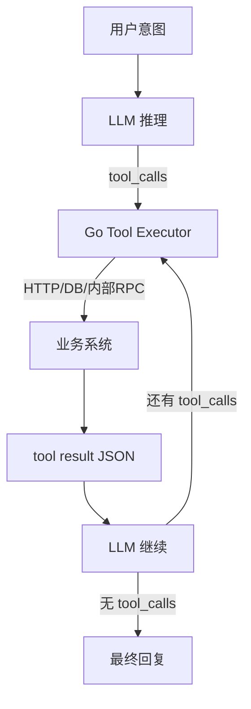

# AI Agent 与 Function Calling

<a id="oral-card"></a>

## 要点卡

[返回 P0 知识图谱](../_meta/p0-knowledge-graph.md)

!!! abstract "30 秒回答"

    Agent 是“模型 + 状态 + 受控工具执行器”的循环，不等于让模型直接操作系统。Function
    Calling 只是让模型提出结构化 tool proposal，名称和参数仍是不可信输入；Go 宿主必须做
    schema、身份、权限、业务状态、幂等和风险审批校验后才能执行。循环还要有 max steps、
    总 deadline、token/成本预算和可审计 trace。

**3 分钟展开**

1. 注册最小、强类型的 tool schema，模型返回 tool call，宿主校验后执行，再按 API 要求把
   `call_id`、必要的模型输出项和裁剪后的 tool result 回传，不能只拼一段自然语言结果。
2. schema 合法只代表结构合法，不代表当前用户有权退款、金额合理或资源状态允许。
3. 写工具使用 intent key/状态机；高风险工具走 HITL；无依赖且无冲突的只读工具才能安全并行。
4. 固定流程优先传统状态机或 DAG，只有步骤和工具选择确实需要非确定性决策时才引入 Agent。

| 记忆槽 | 内容 |
|--------|------|
| 三个不变量 | 模型只能提议不能授权；工具参数始终不可信；副作用必须有幂等、预算和审计边界 |
| 手画图 | `user → LLM proposal → policy/schema/authz → tool executor → result → LLM` |
| 项目落点 | OctoAgentFlow 讲 tool registry、执行器、step budget 和 policy；按个人项目/原型证据表达 |
| 一个取舍 | 单 Agent + 多工具易治理；多 Agent 可分工，但增加上下文漂移、延迟、成本和授权面 |

**错误表达**

- ❌ “模型输出符合 JSON Schema 就可以执行；用了 ReAct 才叫 Agent。”
- ✅ “Schema 只是第一层校验；Agent 模式不要求固定推理提示，授权永远在确定性系统。”

**自测追问**：并行 tool calls 的安全前提是什么？RAG 与 Agent、MCP 分别解决什么问题？

## 10 分钟版（原理 + 图示）


```mermaid
flowchart TD
  U[用户意图] --> LLM1[LLM 推理]
  LLM1 -->|tool_calls| Exec[Go Tool Executor]
  Exec -->|HTTP/DB/内部RPC| Sys[业务系统]
  Sys --> Result[tool result JSON]
  Result --> LLM2[LLM 继续]
  LLM2 -->|无 tool_calls| Out[最终回复]
  LLM2 -->|还有 tool_calls| Exec
```

**Agent 循环（Go）**

```go
func (a *Agent) Run(ctx context.Context, messages []Message) (string, error) {
    for step := 0; step < a.maxSteps; step++ {
        resp, err := a.llm.Chat(ctx, messages, a.toolSchemas)
        if err != nil { return "", err }

        if len(resp.ToolCalls) == 0 {
            return resp.Content, nil
        }

        for _, tc := range resp.ToolCalls {
            if err := a.schemas.Validate(tc.Name, tc.Args); err != nil {
                return "", fmt.Errorf("invalid tool arguments: %w", err)
            }
            if !a.policy.Allow(tc.Name, tc.Args) {
                return "", fmt.Errorf("tool denied: %s", tc.Name)
            }
            out, err := a.tools.Execute(ctx, tc.Name, tc.Args)
            if err != nil {
                out = safeToolError(err) // 不把内部堆栈、SQL、凭证回送给模型
            }
            messages = append(messages, toolResultMessage(tc.ID, out))
        }
    }
    return "", ErrMaxStepsExceeded
}
```

**Tool 设计原则**

| 原则 | 说明 |
|------|------|
| 幂等 | 重试可能发生；写操作使用幂等键/状态机，高风险操作再加确认 |
| 小粒度 | 一个 tool 一件事，便于模型选择 |
| 强类型 | Args 用 JSON Schema 校验 |
| 可观测 | 每步记 span：tool_name、latency |

## 生产场景

- **运维 Copilot**：查监控、拉日志、**禁止**直接 `kubectl delete` 无审批
- **订单助手**：`get_order` + `create_refund`；退款走人工或规则引擎二次校验
- **Cursor/IDE 类**：文件读写、终端命令 — 与 **MCP** 标准化工具暴露

## 排查与工具

- 日志：每轮 `step`、`tool_calls`、token 用量
- 失败：参数 JSON 解析错误 → 收紧 schema 描述（description 要写清示例）
- 评估：工具选择准确率、任务完成率（benchmark）

## 架构取舍

| 模式 | 适用 |
|------|------|
| 单 Agent + 多 Tool | 大多数业务助手 |
| 多 Agent 编排 | 复杂流程；注意延迟与成本 |
| MCP Server | 工具跨项目复用、IDE/Agent 生态 |

**何时不用 Agent**：固定流程用传统 API + 状态机更可靠；Agent 适合意图多变、步骤不固定的场景。

## 深挖问答

1. **和 RAG 关系？** → RAG 是检索增强；Agent 可 **把 RAG 封装成一个 tool**（`search_knowledge_base`）。
2. **并行 tool_calls？** → 只有在调用之间无数据依赖、无顺序要求且副作用不会冲突时才能并行；否则按 DAG/状态机顺序执行。
3. **MCP 是什么？** → Model Context Protocol，标准化 **工具/资源/提示** 的宿主-服务器协议，利于 Cursor 等生态。
4. **怎么防 Agent 乱跑？** → max_steps、allowlist、敏感操作 HITL（human-in-the-loop）。

## 反模式与事故

- **工具描述含糊** → 模型乱调 `delete_user`
- **无步数上限** → 无限循环烧 token
- **把 SQL 生成交给模型直接执行** → 注入风险；用参数化查询 + 只读账号
- **工具返回巨大 JSON** → 撑爆 context；要摘要或分页
- 只依赖模型生成的 JSON Schema 合法性 → 类型合法不代表当前用户有权执行，也不代表金额、资源状态等业务约束合法

## 代码示例

OpenAI `tools` 字段与 `tool_choice: auto`；Anthropic Claude `tools` 类似。Go 侧统一抽象：

```go
type Tool interface {
    Name() string
    Schema() json.RawMessage
    Run(ctx context.Context, args json.RawMessage) (any, error)
}
```

## 延伸阅读

- [OpenAI Function Calling](https://developers.openai.com/api/docs/guides/function-calling)
- [Model Context Protocol](https://modelcontextprotocol.io/)
