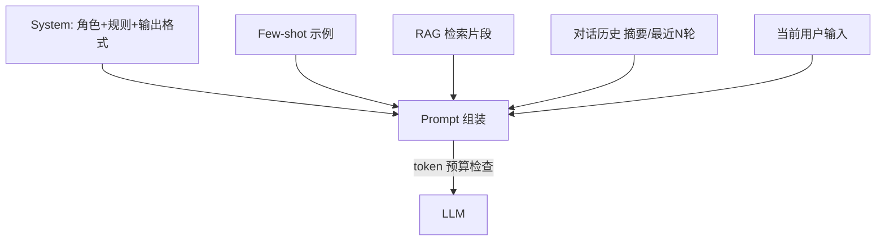

# Prompt 工程与 Context 窗口管理

## 30 秒版（开场）

> **Prompt 工程**在后端侧体现为：**System 模板化、Few-shot 可配置、结构化输出约束**；**Context 管理**是控制 token 预算 — 摘要、滑动窗口、优先级裁剪。生产关键词：**tiktoken、JSON mode、prompt 版本化、A/B**。

## 3 分钟版（一面深度）

1. **是什么**：System/User/Assistant 消息组成上下文；模型有 **context window** 上限（如 128K），输入+输出共享。
2. **为什么**：后端要把 prompt 当 **配置/代码** 管理；超长对话会截断、变贵、变慢。
3. **怎么做**：模板引擎（text/template）+ 变量注入；历史消息 **摘要压缩**；RAG 片段按相关性排序后截断；要求 `response_format: json_object` 便于解析。

## 10 分钟版（原理 + 图示）



**Context 裁剪策略**

| 策略 | 说明 |
|------|------|
| 最近 N 轮 | 简单；远历史丢失 |
| 滚动摘要 | 旧对话用小模型 summarize |
| 优先级 | System > RAG > 最近用户 > 旧 assistant |
| 硬截断 | 按 token 从低优先级删 |

**结构化输出（Go 解析）**

```go
type OrderIntent struct {
    Action string `json:"action"` // query | refund
    OrderID string `json:"order_id"`
}

// prompt 中明确 JSON schema + 示例
resp, _ := llm.Complete(ctx, ChatRequest{
    Messages: msgs,
    ResponseFormat: &JSONSchema{Name: "order_intent", Schema: schema},
})
var intent OrderIntent
json.Unmarshal([]byte(resp.Content), &intent)
```

## 生产场景

- **多租户 SaaS**：每租户自定义 system prompt（存 DB，版本号 + 灰度）
- **长会话客服**：每 10 轮触发摘要写入 `conversation_summary` 字段
- **代码审查 Bot**：固定 checklist few-shot，减少漏项

## 排查与工具

- Token 计数：`tiktoken` 或 provider `usage` 回传
- Prompt 回归：golden dataset + 自动评分（LLM-as-judge 慎用）
- 配置：Git 管理 prompt 模板；敏感词过滤前置

## 架构取舍

| 方案 | 适用 |
|------|------|
| 模板 + 配置中心 | 运营可调、需审计 |
| 硬编码 prompt | 强合规、变更少 |
| 动态示例检索 | 复杂分类，类似 dynamic few-shot |

**何时少做 Prompt 花活**：有明确 API 契约时用 **Function Calling** 替代自然语言解析。

## 追问链

1. **System prompt 泄露怎么办？** → 用户消息里要求「忽略上文」是攻击向量；输出过滤 + 安全 system。
2. **中英文 token 差异？** → 中文通常 1 字≈1～2 token；预算按最坏估。
3. **怎么版本化？** → `prompt_id` + `version` 打日志，便于回放 bad case。
4. **Temperature 怎么设？** → 事实问答 0～0.3；创意 0.7+；生产默认低温。

## 反模式与事故

- **把整个知识库塞进 prompt** → 超窗、贵、注意力稀释 → 用 RAG
- **无输出 schema** → 正则扒 JSON 脆弱
- **prompt 与代码不同步发版** → 线上行为突变
- **在 prompt 里写真实密钥** → 立即轮换

## 代码示例

```go
const systemTmpl = `你是订单助手。仅回答订单相关问题。
输出必须是 JSON：{"answer":"","citations":[]}
禁止编造订单号。无数据时 answer 为 "不知道"。`
```

## 延伸阅读

- [OpenAI Prompt Engineering](https://platform.openai.com/docs/guides/prompt-engineering)
- [Anthropic Prompt Engineering](https://docs.anthropic.com/en/docs/build-with-claude/prompt-engineering)
