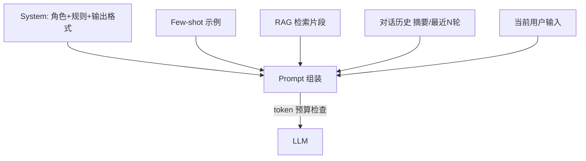

# Prompt 工程与 Context 窗口管理

<a id="oral-card"></a>

## 口述卡（高频必背）

[返回 P0 知识图谱](../_meta/p0-knowledge-graph.md)

!!! abstract "30 秒回答"

    Prompt 在生产系统里是有版本、有评估、有回滚的行为配置；Context 管理同时解决预算、
    相关性和信任边界。系统约束、用户输入、历史、RAG 和工具结果分层组装，先做租户/资源授权，
    再按目标模型 tokenizer 与输出预算裁剪。Structured Outputs 或 strict schema 约束结构，
    但不证明事实正确、业务合法或用户有权执行。

**3 分钟展开**

1. 记录 `prompt_id/version`、模型/API 版本和评估集；变更先离线回归再灰度，不靠主观读几条回答。
2. Context 预算优先保留高优先级约束与当前任务；RAG 和工具结果都是不可信数据，先授权、再裁剪、再明确引用边界。
3. 摘要是有损压缩，应保留事实来源、版本和可回溯原文；不能把摘要中的猜测升级为长期记忆。
4. Schema 输出仍需 JSON 解码、枚举/范围/状态和授权校验；真正副作用交给确定性 executor。

| 记忆槽 | 内容 |
|--------|------|
| 三个不变量 | Prompt 可版本化可回归；上下文先授权再预算；结构正确不等于语义或权限正确 |
| 手画图 | `policy + history + authorized RAG + user → budgeter → model → validator` |
| 项目落点 | OctoAgentFlow 讲 prompt registry、memory namespace、context budget 和发布回滚 |
| 一个取舍 | 更长 context 保留信息但增加成本、延迟和攻击面；摘要节省 token 但可能丢事实 |

**错误表达**

- ❌ “JSON mode/strict schema 能保证业务答案正确；temperature=0 就完全可复现。”
- ✅ “Schema 约束输出形状，业务语义和授权由代码校验；模型行为仍需基于版本和评估集验证。”

**自测追问**：RAG 片段、历史摘要和 system 约束冲突时，如何排序并保留审计证据？

## 10 分钟版（原理 + 图示）


```mermaid
flowchart TD
  Sys[System: 角色+规则+输出格式]
  Few[Few-shot 示例]
  RAG[RAG 检索片段]
  Hist[对话历史 摘要/最近N轮]
  User[当前用户输入]
  Sys --> Assemble[Prompt 组装]
  Few --> Assemble
  RAG --> Assemble
  Hist --> Assemble
  User --> Assemble
  Assemble -->|token 预算检查| LLM
```

**Context 裁剪策略**

| 策略 | 说明 |
|------|------|
| 最近 N 轮 | 简单；远历史丢失 |
| 滚动摘要 | 旧对话用小模型 summarize |
| 优先级 | 保留系统/开发者约束与当前用户请求；RAG 是不可信数据，按相关性裁剪，不能当更高优先级指令 |
| 硬截断 | 按 token 从低优先级删 |

**结构化输出（Go 解析）**

```go
type OrderIntent struct {
    Action string `json:"action"` // query | refund
    OrderID string `json:"order_id"`
}

// 优先使用 provider/API 支持的 schema 约束；仍需业务校验
resp, err := llm.Complete(ctx, ChatRequest{
    Messages: msgs,
    ResponseFormat: &JSONSchema{Name: "order_intent", Schema: schema},
})
if err != nil {
    return err
}
var intent OrderIntent
if err := json.Unmarshal([]byte(resp.Content), &intent); err != nil {
    return fmt.Errorf("decode order intent: %w", err)
}
if err := validateIntent(intent); err != nil {
    return err
}
```

## 生产场景

- **多租户 SaaS**：每租户自定义 system prompt（存 DB，版本号 + 灰度）
- **长会话客服**：每 10 轮触发摘要写入 `conversation_summary` 字段
- **代码审查 Bot**：固定 checklist few-shot，减少漏项

## 排查与工具

- Token 计数：目标模型 tokenizer 的本地估算 + provider `usage` 回传；两者可能因隐藏/缓存等 token 口径不同
- Prompt 回归：golden dataset + 自动评分（LLM-as-judge 慎用）
- 配置：Git 管理 prompt 模板；敏感词过滤前置

## 架构取舍

| 方案 | 适用 |
|------|------|
| 模板 + 配置中心 | 运营可调、需审计 |
| 硬编码 prompt | 强合规、变更少 |
| 动态示例检索 | 复杂分类，类似 dynamic few-shot |

**何时少做 Prompt 花活**：有明确 API 契约时用 **Function Calling** 替代自然语言解析。

## 追问链

1. **System prompt 泄露怎么办？** → 不把 system prompt 当秘密存储或授权边界；其中不得放密钥。按它可能被部分推断/泄露设计，真正权限在代码层。
2. **中英文 token 差异？** → tokenizer 和模型不同，不能用固定“字/token”换算；用目标模型 tokenizer 或 provider usage 实测，并预留输出预算。
3. **怎么版本化？** → `prompt_id` + `version` 打日志，便于回放 bad case。
4. **Temperature 怎么设？** → 不同模型支持范围和语义不同，有些推理模型不开放该参数。通过任务评估集调参，不背固定区间；低温也不能保证事实正确或完全可复现。

## 反模式与事故

- **把整个知识库塞进 prompt** → 超窗、贵、注意力稀释 → 用 RAG
- **无输出 schema** → 正则扒 JSON 脆弱
- **prompt 与代码不同步发版** → 线上行为突变
- **在 prompt 里写真实密钥** → 立即轮换

## 代码示例

```go
const systemTmpl = `你是订单助手。仅回答订单相关问题。
输出必须是 JSON：{"answer":"","citations":[]}
禁止编造订单号。无数据时 answer 为 "不知道"。`
```

## 延伸阅读

- [OpenAI Prompting](https://developers.openai.com/api/docs/guides/prompting)
- [OpenAI Structured Outputs](https://developers.openai.com/api/docs/guides/structured-outputs)
- [Anthropic Prompt Engineering](https://docs.anthropic.com/en/docs/build-with-claude/prompt-engineering)
