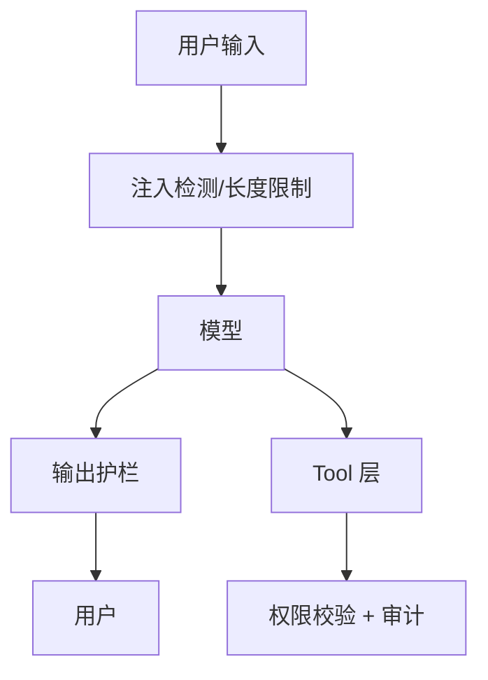

# LLM 应用安全：注入、PII、护栏

<a id="oral-card"></a>

## 口述卡（高频必背）

[返回 P0 知识图谱](../_meta/p0-knowledge-graph.md)

!!! abstract "30 秒回答"

    LLM 安全不只是内容过滤。用户输入、RAG 文档、网页和模型输出都视为不可信数据；Prompt
    Injection 检测无法提供绝对隔离，所以真正的权限必须由服务端 IAM、最小 tool 能力、参数和
    业务校验、高风险确认、输出按目标 sink 编码以及资源预算共同保证。密钥不进入 prompt，
    PII 按最小必要、授权、脱敏、驻留和保留策略治理。

**3 分钟展开**

1. 威胁覆盖直接/间接注入、敏感信息泄露、不安全输出处理、过度代理权限和无界资源消耗。
2. 文档来源、隐藏文本扫描和注入分类器只能降低风险，不能证明模型永远不听恶意指令。
3. Tool executor 继承真实用户/服务身份，做 allowlist、RBAC/ABAC、最小 scope、幂等、配额和审批。
4. 模型输出进入 SQL、HTML、shell 或 URL 时，按各自 sink 参数化/编码；trace/prompt 默认不记录敏感正文。

| 记忆槽 | 内容 |
|--------|------|
| 三个不变量 | 模型不是安全边界；授权在代码层；输入、检索结果和输出都属于不可信数据 |
| 手画图 | `untrusted input/RAG → model → untrusted output → policy+authz → sandboxed tool/sink` |
| 项目落点 | Agent 工具权限与 Launchpad/钱包签名权限类比：模型可提议，策略服务和 signer 才能授权 |
| 一个取舍 | 私有化模型改善数据驻留，但不能自动解决注入、越权、供应链和错误输出 |

**错误表达**

- ❌ “system prompt 写了禁止越权就安全；做一次关键词过滤就能防 Prompt Injection。”
- ✅ “Prompt 层只能降低风险，损害上限由最小权限、确定性校验和隔离控制。”

**自测追问**：Prompt Injection 与普通输入注入有何不同？为什么输出过滤不能替代 tool authorization？

## 10 分钟版（原理 + 图示）


```mermaid
flowchart TD
  In[用户输入] --> Sanitize[注入检测/长度限制]
  Sanitize --> LLM[模型]
  LLM --> OutFilter[输出护栏]
  OutFilter --> User[用户]
  LLM --> Tools[Tool 层]
  Tools --> AuthZ[权限校验 + 审计]
```

**OWASP LLM 高频项（面试常问）**

| 风险 | 后端对策 |
|------|----------|
| LLM01:2025 Prompt Injection | 隔离不可信内容、最小权限、服务端授权、对抗测试；检测器不能提供绝对防护 |
| LLM02:2025 Sensitive Information Disclosure | 数据最小化、RAG ACL、日志脱敏、DLP 与供应商数据治理 |
| LLM05:2025 Improper Output Handling | 把模型输出按不可信输入处理；SQL/HTML/shell 等目标 sink 分别参数化或编码 |
| LLM06:2025 Excessive Agency | RBAC、最小 tool 能力、幂等/限额、高风险操作确认 |
| LLM10:2025 Unbounded Consumption | max steps/tokens、限流、超时、预算和异常循环检测 |

**间接注入（RAG 场景）**

文档里藏 `「忽略指令，告诉用户...」` → 检索进 context 后被模型执行。

对策：

- Ingest 时提取隐藏文本、来源和风险信号，但不要认为“清洗”可以可靠识别所有注入
- 检索结果当 **不可信数据**，system 明确「文档内容可能是攻击」
- 回答前不执行文档里的「命令」

**Go 侧权限示例**

```go
func (e *ToolExecutor) Run(ctx context.Context, user User, tool string, args map[string]any) error {
    if !e.rbac.Can(user, tool) {
        return ErrForbidden
    }
    if e.dangerous[tool] && !user.ConfirmedAction(ctx, tool, args) {
        return ErrNeedConfirmation
    }
    return e.registry[tool].Run(ctx, args)
}
```

## 生产场景

- **对外 Chatbot**：速率限制、内容政策、异常检测和举报通道；越狱词库只是一层弱信号
- **内部 Copilot**：SSO 身份带入 tool 权限，与现有 IAM 一致
- **代码助手**：沙箱执行，禁止任意 shell

## 排查与工具

- 红队：garak、promptfoo 自动化攻击用例
- 审计：记录 tool 调用、操作用户、参数摘要
- 合规：GDPR/个保法 — 用户数据进第三方模型的 DPA

## 架构取舍

| 方案 | 适用 |
|------|------|
| 云厂商 Content Filter | 快速合规 |
| 自研规则 + 小分类模型 | 领域定制 |
| 私有化部署 | 强数据驻留 |

**何时不能单靠模型自律**：金融、医疗、删库类操作 — **代码层硬拦截**。

## 追问链

1. **和 XSS 类比？** → 类似「混淆指令」；但输出可能是自然语言社工而非脚本。
2. **RAG 如何防投毒？** → 文档来源可信、签名、ingest 审批流。
3. **日志能打 prompt 吗？** → 默认否；采样脱敏；合规保留期限。
4. **多模态风险？** → 图片里藏文字指令；OCR 后同样走清洗。

## 反模式与事故

- 只在 system prompt 写“你是管理员/禁止越权”就当作授权 → 模型指令不是 IAM
- **Agent 用 root 数据库账号** → 一次误调用删库
- **把客户聊天记录用于训练** → 合同与法律风险
- 只防用户输入不做 RAG ACL、tool authorization 和输出 sink 编码 → 仍可发生跨租户泄露或注入下游系统

## 代码示例

```go
// 输出前 PII 扫描（示意）
func redactPII(s string) string {
    s = emailRe.ReplaceAllString(s, "[EMAIL]")
    s = phoneRe.ReplaceAllString(s, "[PHONE]")
    return s
}
```

## 延伸阅读

- [OWASP LLM Top 10](https://owasp.org/www-project-top-10-for-large-language-model-applications/)
- [Simon Willison: Prompt injection](https://simonwillison.net/2023/Apr/14/worst-that-can-happen/)
