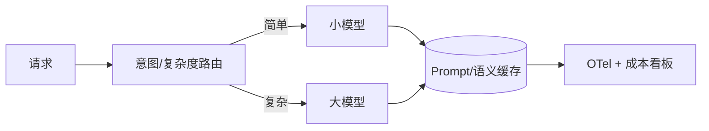

# LLM 可观测性、成本与延迟优化

## 30 秒版（开场）

> LLM 服务要观测 **TTFT、tokens、成本、工具步数**；优化靠 **缓存、小模型路由、批处理、流式**。生产关键词：**GenAI 语义约定、Prompt 缓存、semantic cache、模型降级**。

## 3 分钟版（一面深度）

1. **是什么**：在传统 RED 指标外，增加 token 级、生成级维度；LLMOps 平台（Langfuse/LangSmith）做 trace 与评估。
2. **为什么**：按 token 计费，一次 Agent 十步可烧掉普通 API 百倍成本；P99 延迟直接影响留存。
3. **怎么做**：每次调用记 `model`、`input_tokens`、`output_tokens`、`latency_ms`、`trace_id`；相同 system+问题走 **语义缓存**；简单意图路由到小模型。

## 10 分钟版（原理 + 图示）



**核心指标**

| 指标 | 含义 |
|------|------|
| TTFT | 首 token 时间，体感关键 |
| TPOT | 每 token 耗时 |
| $/1K requests | 商业指标 |
| Tool steps | Agent 深度 |
| Cache hit rate | 优化效果 |

**OTel GenAI 语义（示意）**

```go
ctx, span := tracer.Start(ctx, "chat.completions",
    trace.WithAttributes(
        attribute.String("gen_ai.system", "openai"),
        attribute.String("gen_ai.request.model", model),
    ))
defer span.End()
// 响应后
span.SetAttributes(
    attribute.Int("gen_ai.usage.input_tokens", usage.Prompt),
    attribute.Int("gen_ai.usage.output_tokens", usage.Completion),
)
```

**成本优化手段**

| 手段 | 效果 |
|------|------|
| Prompt 缓存（OpenAI 等） | 重复 system 省 input 价 |
| 语义缓存（Redis+embedding） | 相似问题直接返回答案 |
| 模型路由 | 80% 简单问句用小模型 |
| 压缩历史 | 减 input tokens |
| 限制 max_tokens | 防输出失控 |

## 生产场景

- **高峰客服**：缓存 FAQ；夜间批处理摘要用批 API
- **Agent 账单爆炸**：某用户循环提问 → 按 user 限流 + max_steps
- **多 region**：就近调推理节点降 RTT

## 排查与工具

- Langfuse / LangSmith：prompt 版本、trace 回放
- Grafana：token rate、cost dashboard
- 压测：模拟长 context，观察 OOM 与超时

## 架构取舍

| 方案 | 适用 |
|------|------|
| 全链路 OTel | 与现有微观测一致 |
| 专用 LLM 观测 SaaS | 快速看 prompt 级细节 |
| 仅账单对账 | 太粗，排障困难 |

**何时不做语义缓存**：强实时、个性化、合规要求每次重新生成。

## 追问链

1. **和 S-ARCH-16 可观测性关系？** → LLM 是慢依赖，span 要单独标 `gen_ai.*`；SLO 用 TTFT+P95 总时长。
2. **缓存错了怎么办？** → TTL + 版本号；关键业务不走缓存或人工审核。
3. **批处理 API？** → 非实时场景 50% 折扣类；Go worker 聚合请求。
4. **私有化 GPU 成本？** → CapEx vs 云 API；要看利用率与运维人力。

## 反模式与事故

- **无 token 预算告警** → 单月账单惊呆财务
- **生产开 debug 全量记 prompt** → 存储与合规双爆
- **所有流量上大模型** → 浪费；路由层是必选项
- **忽略失败重试成本** → 重试 doubling 费用

## 代码示例

与 [S-CLOUD-03 OpenTelemetry](../09-cloud-native/S-CLOUD-03-opentelemetry.md) 结合：同一 `trace_id` 串起 API → RAG → LLM → Tool。

```go
metrics.Counter("llm_tokens_total", "type").Add(float64(tokens), metric.WithAttributes(
    attribute.String("model", model),
    attribute.String("type", "input"),
))
```

## 延伸阅读

- [OTel GenAI SemConv](https://opentelemetry.io/docs/specs/semconv/gen-ai/)
- [OpenAI Production Best Practices](https://platform.openai.com/docs/guides/production-best-practices)
