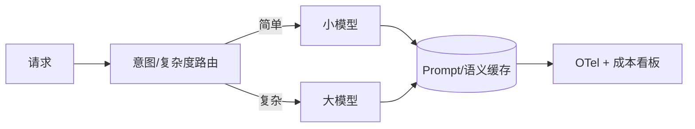

# LLM 可观测性、成本与延迟优化

<a id="oral-card"></a>

## 口述卡（高频必背）

[返回 P0 知识图谱](../_meta/p0-knowledge-graph.md)

!!! abstract "30 秒回答"

    LLM 服务除了 RED 指标，还要观测 TTFT、总时延、输入/输出及 provider 返回的其他 token 用量、
    重试、tool steps、任务质量和单位任务成本。一次 Agent run 要串起 RAG、模型和工具 span，
    但 prompt、tool 参数和结果默认不全量记录。缓存和模型路由必须经过评估；semantic cache
    还要把租户、权限、prompt/model 版本和数据时效放进隔离边界。

**3 分钟展开**

1. 区分模型调用与整个 run：单次 latency 低，不代表十步 Agent 的总时延和成本可接受。
2. 记录 provider/model/version、TTFT、总时延、token、重试、错误、cache hit 和估算/账单成本，
   质量用离线集、人工反馈和任务完成率共同评价。
3. 优化顺序是先减少无效步骤和上下文，再考虑 prompt caching、semantic cache、模型路由、batch
   和 streaming；每种手段都有质量、时效和安全边界。
4. OpenTelemetry GenAI 约定仍在演进和迁移，项目要锁定 semconv/instrumentation 版本，不把高基数
   prompt 正文当 span attribute。

| 记忆槽 | 内容 |
|--------|------|
| 三个不变量 | 成本按完整任务统计；优化不能越过质量门槛；缓存 key 必须包含授权与版本边界 |
| 手画图 | `request → RAG → LLM₁ → tool → LLM₂ → output`，每段标 latency/token/cost/quality |
| 项目落点 | OctoAgentFlow 展示预算、step 上限和 trace 设计；无生产账单时只说测试数据和观测方案 |
| 一个取舍 | 小模型/缓存降低成本和 TTFT，但可能损失质量、时效或隔离性，必须离线+灰度验证 |

**错误表达**

- ❌ “streaming 降低了模型总计算时间；语义相似的回答可以跨用户直接复用。”
- ✅ “streaming 主要改善首屏体验；缓存必须满足租户、权限、版本和时效约束。”

**自测追问**：TTFT、TPOT 和端到端时延分别说明什么？失败重试为什么会造成隐蔽成本放大？

## 10 分钟版（原理 + 图示）


```mermaid
flowchart LR
  Req[请求] --> Router[意图/复杂度路由]
  Router -->|简单| Small[小模型]
  Router -->|复杂| Large[大模型]
  Small --> Cache[(Prompt/语义缓存)]
  Large --> Cache
  Cache --> OTel[OTel + 成本看板]
```

**核心指标**

| 指标 | 含义 |
|------|------|
| TTFT | 首 token 时间，体感关键 |
| TPOT | 每 token 耗时 |
| 成本/成功任务 | 把多次模型、检索和工具调用汇总到完整任务；同时保留 provider 账单维度 |
| Tool steps | Agent 深度 |
| Cache hit rate | 优化效果 |

**OTel GenAI 语义（示意）**

```go
ctx, span := tracer.Start(ctx, "chat",
    trace.WithAttributes(
        attribute.String("gen_ai.operation.name", "chat"),
        attribute.String("gen_ai.provider.name", provider),
        attribute.String("gen_ai.request.model", model),
    ))
defer span.End()
// 响应后
span.SetAttributes(
    attribute.Int("gen_ai.usage.input_tokens", usage.Prompt),
    attribute.Int("gen_ai.usage.output_tokens", usage.Completion),
)
```

GenAI semantic conventions 已迁移到 OpenTelemetry 的独立仓库，仍在持续演进；属性名和稳定性
应锁定到项目采用的 semconv/instrumentation 版本。prompt、tool arguments/results 可能含敏感
信息，默认不记录正文。

**成本优化手段**

| 手段 | 效果 |
|------|------|
| Provider prompt caching | 对重复前缀可能降低延迟/费用，规则与价格以具体 provider 为准 |
| 语义缓存（Redis+embedding） | 仅对可安全复用的请求；key 必须含租户、权限、版本和时效 |
| 模型路由 | 用离线/在线质量门槛把合适请求送到较小模型 |
| 压缩历史 | 减 input tokens |
| 限制 max_tokens | 防输出失控 |

## 生产场景

- **高峰客服**：缓存满足权限与时效约束的 FAQ；非实时摘要可评估 provider 的异步/批处理能力
- **Agent 账单爆炸**：某用户循环提问 → 按 user 限流 + max_steps
- **多 region**：在数据驻留、模型可用区、故障域和成本约束下选择路由；距离只是网络时延的一部分

## 排查与工具

- Langfuse / LangSmith：prompt 版本、trace 回放
- Grafana：token rate、cost dashboard
- 压测：模拟长 context，观察 OOM 与超时

## 架构取舍

| 方案 | 适用 |
|------|------|
| 全链路 OTel | 与现有微观测一致 |
| 专用 LLM 观测 SaaS | 快速看 prompt 级细节 |
| 仅账单对账 | 太粗，排障困难 |

**何时不做语义缓存**：强实时、个性化、合规要求每次重新生成。

## 追问链

1. **和 S-ARCH-16 可观测性关系？** → LLM 是慢依赖，span 要单独标 `gen_ai.*`；SLO 用 TTFT+P95 总时长。
2. **缓存错了怎么办？** → TTL + 版本号；关键业务不走缓存或人工审核。
3. **批处理 API？** → 非实时任务可利用 provider batch/异步接口提高吞吐或降低成本，但折扣、完成窗口与限制是动态产品能力，不能背固定比例。
4. **私有化 GPU 成本？** → CapEx vs 云 API；要看利用率与运维人力。

## 反模式与事故

- **无 token 预算告警** → 单月账单惊呆财务
- **生产开 debug 全量记 prompt** → 存储与合规双爆
- 未经评估就让全部流量上最贵模型，或反过来强行路由小模型 → 成本或质量失控；路由层是否值得引入取决于流量和质量收益
- **忽略失败重试成本** → 多次尝试会放大 token、工具调用和链路成本，且超时请求是否计费取决于 provider

## 代码示例

与 [S-CLOUD-03 OpenTelemetry](../09-cloud-native/S-CLOUD-03-opentelemetry.md) 结合：同一 `trace_id` 串起 API → RAG → LLM → Tool。

```go
tokenCounter, err := meter.Int64Counter("gen_ai.client.token.usage")
if err != nil {
    return err
}
tokenCounter.Add(ctx, int64(tokens), metric.WithAttributes(
    attribute.String("gen_ai.request.model", model),
    attribute.String("gen_ai.token.type", "input"), // 应与项目采用的 semconv 版本对齐
))
```

## 延伸阅读

- [OpenTelemetry GenAI Semantic Conventions](https://github.com/open-telemetry/semantic-conventions-genai)
- [OpenAI Production Best Practices](https://developers.openai.com/api/docs/guides/production-best-practices)
