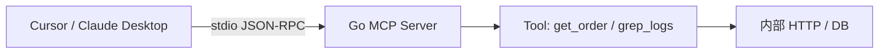

# Go 实现 MCP Server：工具暴露与 stdio/HTTP 部署

## 30 秒版（开场）

> **MCP（Model Context Protocol）** 用 JSON-RPC 把 **工具、资源、提示** 标准化暴露给 Cursor/Claude 等宿主。Go 用官方 **`modelcontextprotocol/go-sdk`** 注册 Tool，**stdio** 给 IDE 子进程挂载，**Streamable HTTP** 给远程服务。生产关键词：**类型安全 AddTool、权限边界、结构化输出**。

## 3 分钟版（一面深度）

1. **是什么**：MCP Server 对外提供 `tools/list`、`tools/call` 等能力；宿主（IDE Agent）代替用户调用你的 Go 逻辑。
2. **为什么**：比「每个 IDE 写一套插件」统一；Go 后端把 **订单查询、日志检索、内部 API** 封装成 Tool，Agent 可组合调用（见 [S-AI-03](./S-AI-03-agent-tool-calling.md)）。
3. **怎么做**：`mcp.NewServer` → `mcp.AddTool`（In/Out 结构体自动生成 JSON Schema）→ `server.Run(ctx, &mcp.StdioTransport{})`。

## 10 分钟版（原理 + 图示）



**官方 SDK 最小 Tool（与本仓库示例一致）**

```go
type greetInput struct {
    Name string `json:"name" jsonschema:"要问候的人名"`
}
type greetOutput struct {
    Greeting string `json:"greeting"`
}

func greet(ctx context.Context, req *mcp.CallToolRequest, in greetInput) (
    *mcp.CallToolResult, greetOutput, error,
) {
    return nil, greetOutput{Greeting: "Hello, " + in.Name}, nil
}

server := mcp.NewServer(&mcp.Implementation{Name: "my-svc", Version: "1.0.0"}, nil)
mcp.AddTool(server, &mcp.Tool{Name: "greet", Description: "打招呼"}, greet)
server.Run(ctx, &mcp.StdioTransport{})
```

**传输方式选型**

| 传输 | 场景 |
|------|------|
| Stdio | Cursor、Claude Desktop 本地子进程 |
| Streamable HTTP | 远程多客户端、K8s 部署 |
| InMemory | 单测（`mcp.NewInMemoryTransports()`） |

**Cursor 挂载示例（stdio）**

```json
{
  "mcpServers": {
    "golang-manual": {
      "command": "go",
      "args": ["run", "./examples/senior/mcp/"],
      "cwd": "/path/to/Golang-development-manual"
    }
  }
}
```

## 生产场景

- **内部运维 Copilot**：`query_metrics`、`search_logs` Tool 接 Prometheus/Loki
- **业务 Agent**：`create_ticket` 只读/写分离；写操作 Tool 内二次鉴权
- **多 Tool 聚合**：一个 MCP Server 注册 10+ 小粒度 Tool，优于一个大而全 SQL Tool

## 排查与工具

- MCP Inspector / `mcp` CLI 调试 stdio
- 日志：**不要**写 stdout（破坏 JSON-RPC），用 stderr 或 slog
- 单测：`NewInMemoryTransports` + `client.Connect` + `CallTool`

## 架构取舍

| 方案 | 适用 |
|------|------|
| 官方 go-sdk | 跟 spec 最快，推荐新项目 |
| 每个能力一个 MCP Server | 权限隔离清晰 |
| MCP + 传统 REST 并存 | MCP 给 Agent，REST 给前端 |

**何时不用 MCP**：固定 UI 工作流、强表单校验场景 — 直接 API 更简单。

## 追问链

1. **和 Function Calling 区别？** → FC 在模型 API 内；MCP 是 **宿主↔服务** 标准协议，可跨进程/跨语言。
2. **Tool 返回什么？** → 结构化 JSON（`AddTool` Out 类型）或 `TextContent`；错误用 `IsError` 或业务字段。
3. **如何做鉴权？** → HTTP 传输加 OAuth/mTLS；stdio 依赖本机用户身份 + Tool 内 RBAC。
4. **资源 Resources 与 Tool？** → Resource 只读暴露文件/URI；Tool 可执行副作用。

## 反模式与事故

- **stdout 打日志** → 协议损坏，IDE 连不上
- **一个 Tool 执行任意 SQL** → 注入与越权
- **无超时** → Tool 内 HTTP 挂死拖垮 Agent
- **返回巨型 JSON** → 撑爆 Agent context

## 代码示例

本仓库可运行示例：

```bash
go test ./examples/senior/mcp/internal/server/...
go run ./examples/senior/mcp/
```

实现见 `examples/senior/mcp/internal/server/server.go`：`greet`、`get_order` 两个演示 Tool。

## 延伸阅读

- [Model Context Protocol](https://modelcontextprotocol.io/)
- [modelcontextprotocol/go-sdk](https://github.com/modelcontextprotocol/go-sdk)
