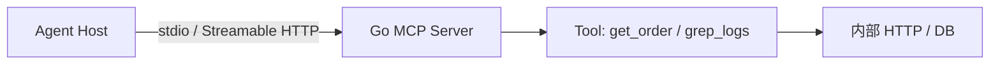

# Go 实现 MCP Server：工具暴露与 stdio/HTTP 部署

<a id="oral-card"></a>

## 口述卡（高频必背）

[返回 P0 知识图谱](../_meta/p0-knowledge-graph.md)

!!! abstract "30 秒回答"

    MCP 用 JSON-RPC 生命周期和 capability negotiation 标准化宿主与工具、资源、提示等服务的连接。
    Go 可用官方 SDK；stdio 适合宿主拉起的本地进程，stdout 必须保持纯协议。远程 Streamable HTTP
    使用单一 endpoint 的 POST/GET 与可选 SSE，还要做协议版本协商、认证、token audience、
    Origin 校验、会话/超时和逐工具授权，不能把 JSON Schema 当权限边界。

**3 分钟展开**

1. 客户端先 `initialize` 协商协议版本与 capabilities，再进入正常请求；服务端不能假定所有客户端支持同一特性。
2. Tool schema 只描述输入输出；执行时仍从可信身份解析 tenant/resource scope，校验业务状态、预算、幂等和高风险审批。
3. stdio 从宿主/环境获取凭证并只向 stderr 记录日志；远程 HTTP 遵循 OAuth 资源服务器语义，校验 access token 是否发给本服务，禁止 token passthrough。
4. 限制返回体、并发、执行时间和取消传播；能力或协议升级要做兼容测试。

| 记忆槽 | 内容 |
|--------|------|
| 三个不变量 | 先协商再调用；schema 不授权；远程 token 必须绑定本资源且不得透传下游 |
| 手画图 | `host/client ⇄ MCP transport ⇄ Go server → policy → internal API` |
| 项目落点 | 将 OctoAgentFlow 的最小工具注册表、执行超时、审计和本仓库 Go MCP 示例串起来讲 |
| 一个取舍 | MCP 提高跨宿主复用性，但增加协议兼容、远程身份与工具治理成本 |

**错误表达**

- ❌ “MCP 就是把 Function Calling 包一层 HTTP；有 schema 就能安全执行。”
- ✅ “MCP 是宿主到服务的有状态协议边界；协议连通、输入结构和业务授权是三件事。”

**自测追问**：stdio 与 Streamable HTTP 的凭证、日志、Origin 和会话边界分别有什么不同？

## 10 分钟版（原理 + 图示）


```mermaid
flowchart LR
  Host[Agent Host] -->|stdio / Streamable HTTP| MCP[Go MCP Server]
  MCP --> Tools[Tool: get_order / grep_logs]
  Tools --> API[内部 HTTP / DB]
```

**官方 SDK 最小 Tool（与本仓库示例一致）**

```go
type greetInput struct {
    Name string `json:"name" jsonschema:"要问候的人名"`
}
type greetOutput struct {
    Greeting string `json:"greeting"`
}

func greet(ctx context.Context, req *mcp.CallToolRequest, in greetInput) (
    *mcp.CallToolResult, greetOutput, error,
) {
    return nil, greetOutput{Greeting: "Hello, " + in.Name}, nil
}

server := mcp.NewServer(&mcp.Implementation{Name: "my-svc", Version: "1.0.0"}, nil)
mcp.AddTool(server, &mcp.Tool{Name: "greet", Description: "打招呼"}, greet)
if err := server.Run(ctx, &mcp.StdioTransport{}); err != nil {
    return err
}
```

**传输方式选型**

| 传输 | 场景 |
|------|------|
| Stdio | 宿主拉起的本地子进程；stdout 只承载协议 |
| Streamable HTTP | 远程多客户端；单一 MCP endpoint 使用 POST/GET，可选 SSE |
| InMemory | 单测（`mcp.NewInMemoryTransports()`） |

**Cursor 挂载示例（stdio）**

```json
{
  "mcpServers": {
    "golang-manual": {
      "command": "go",
      "args": ["run", "./examples/senior/mcp/"],
      "cwd": "/path/to/Golang-development-manual"
    }
  }
}
```

## 生产场景

- **内部运维 Copilot**：`query_metrics`、`search_logs` Tool 接 Prometheus/Loki
- **业务 Agent**：`create_ticket` 只读/写分离；写操作 Tool 内二次鉴权
- **多 Tool 聚合**：一个 MCP Server 注册 10+ 小粒度 Tool，优于一个大而全 SQL Tool

## 排查与工具

- MCP Inspector / `mcp` CLI 调试 stdio
- 日志：**不要**写 stdout（破坏 JSON-RPC），用 stderr 或 slog
- 单测：`NewInMemoryTransports` + `client.Connect` + `CallTool`

## 架构取舍

| 方案 | 适用 |
|------|------|
| 官方 go-sdk | 跟 spec 最快，推荐新项目 |
| 每个能力一个 MCP Server | 权限隔离清晰 |
| MCP + 传统 REST 并存 | MCP 给 Agent，REST 给前端 |

**何时不用 MCP**：固定 UI 工作流、强表单校验场景 — 直接 API 更简单。

## 追问链

1. **和 Function Calling 区别？** → FC 在模型 API 内；MCP 是 **宿主↔服务** 标准协议，可跨进程/跨语言。
2. **Tool 返回什么？** → 结构化 JSON（`AddTool` Out 类型）或 `TextContent`；错误用 `IsError` 或业务字段。
3. **如何做鉴权？** → HTTP 传输按 MCP authorization 与部署环境采用 OAuth/mTLS，校验 token audience/resource 与 Origin 防 DNS rebinding；本地 HTTP 只绑定 loopback。stdio 从环境/宿主取得凭证，但 Tool 内仍按最终用户与资源做授权。
4. **资源 Resources 与 Tool？** → Resource 只读暴露文件/URI；Tool 可执行副作用。

## 反模式与事故

- **stdout 打日志** → 协议损坏，IDE 连不上
- **一个 Tool 执行任意 SQL** → 注入与越权
- **无超时** → Tool 内 HTTP 挂死拖垮 Agent
- **返回巨型 JSON** → 撑爆 Agent context
- Streamable HTTP 对任意 Origin 开放或本地监听 `0.0.0.0` 且无认证 → DNS rebinding/越权调用风险
- 把客户端给 MCP Server 的 access token 原样透传给下游 API → 混淆资源受众并扩大凭证泄露半径

## 代码示例

本仓库可运行示例：

```bash
go test ./examples/senior/mcp/internal/server/...
go run ./examples/senior/mcp/
```

实现见 `examples/senior/mcp/internal/server/server.go`：`greet`、`get_order` 两个演示 Tool。

## 延伸阅读

- [Model Context Protocol](https://modelcontextprotocol.io/)
- [modelcontextprotocol/go-sdk](https://github.com/modelcontextprotocol/go-sdk)
