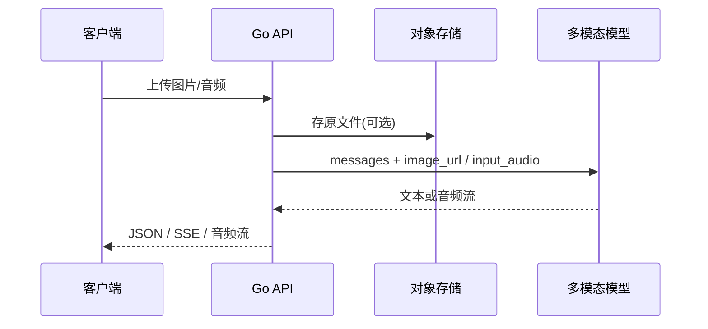

# 多模态与语音接入：图像、音频在 Go 服务中的工程实践

## 30 秒版（开场）

> 多模态 = 同一对话里传 **文本 + 图片 + 音频**；Go 后端负责 **上传校验、转码、流式转发、计费**。语音链路常见 **ASR（Whisper）→ LLM → TTS**。生产关键词：**multipart 限大小、base64 vs 对象存储 URL、实时语音 WebSocket**。

## 3 分钟版（一面深度）

1. **是什么**：Vision 模型读图答问；ASR 把语音转文本；TTS 把回复合成语音；部分模型支持 **音频输入直接理解**（原生多模态）。
2. **为什么**：客服、质检、会议助手、电商以图搜款 — JD  increasingly 要求「接过大模型 + 语音/图像」。
3. **怎么做**：小图 base64 内联；大图走 **S3/OSS URL** + 短期签名；音频用 `audio/wav`/`webm` 上传或流式 chunk；Go `http.MaxBytesReader` 限体积。

## 10 分钟版（原理 + 图示）



**OpenAI 兼容消息结构（Go 侧组装）**

```go
// 图像：推荐 URL 方式（省请求体）
msg := map[string]any{
    "role": "user",
    "content": []any{
        map[string]any{"type": "text", "text": "这张图里有什么？"},
        map[string]any{
            "type": "image_url",
            "image_url": map[string]any{
                "url":    signedURL,
                "detail": "low", // low/high 影响 token 与费用
            },
        },
    },
}
```

**语音 ASR（Whisper 类 API）**

```go
req, _ := http.NewRequestWithContext(ctx, http.MethodPost, baseURL+"/audio/transcriptions", body)
req.Header.Set("Authorization", "Bearer "+apiKey)
// multipart: file + model=whisper-1 + language=zh
```

**TTS 流式播放**

- 请求 `response_format: opus/mp3`，`stream: true`
- Go 用 `io.Copy` 转发到客户端，或边收边推 WebSocket

| 能力 | 典型延迟 | Go 注意点 |
|------|----------|-----------|
| 图像理解 | 1～5s | `detail=high` token 暴涨 |
| ASR | 实时因子 0.3～1x | 16kHz mono 足够客服 |
| TTS | 首包 200～500ms | 流式降低等待 |
| 实时语音 API | 双向流 | 独立 WebSocket，与文本 Chat 分离 |

## 生产场景

- **智能客服**：用户发截图 + 语音；ASR 失败时降级纯文字
- **工单质检**：录音 ASR → LLM 提取违规话术 → 结构化入库
- **会议助手**：长音频分片 ASR + 时间戳对齐

## 排查与工具

- 指标：`asr_duration_seconds`、`vision_request_bytes`、`tts_first_byte_ms`
- 抽样保存 **脱敏** 原文件用于 bad case（合规审批）
- `ffprobe` 检查客户端上传格式是否异常

## 架构取舍

| 方案 | 适用 |
|------|------|
| 云 API（OpenAI/Azure/阿里） | 快速上线 |
| 私有化 Whisper + vLLM 视觉 | 数据不出域 |
| 端侧 ASR + 云端 LLM | 降带宽，复杂度高 |

**何时不用端到端多模态**：仅需 OCR — 专用 OCR 更便宜更准。

## 追问链

1. **图片 base64 还是 URL？** → 小图(<1MB)可 base64；大图 URL + HTTPS + 短 TTL 签名。
2. **实时语音和批处理 ASR？** → 实时用 WebSocket/专用 Realtime API；离线批处理用文件 API 更便宜。
3. **如何防恶意上传？** → 限制 MIME、尺寸、时长；病毒扫描；异步队列处理。
4. **和 [S-AI-01](./S-AI-01-llm-api-integration.md) 流式关系？** → 同一套 ctx 超时与连接池；TTS/Chat 共用 `http.Client` 要注意 body 类型不同。

## 反模式与事故

- **无限 multipart** → 内存 OOM
- **高清图全用 detail=high** → 费用十倍
- **ASR 结果直接执行 SQL** → 语音注入
- **TTS 全量缓存用户隐私对话** → 合规风险

## 代码示例

多模态请求体组装可与 `examples/senior/llmclient` 的 `Message` 扩展为 `Content []Part`；流式转发逻辑同 [S-AI-01](./S-AI-01-llm-api-integration.md) SSE 处理。

```go
type Part struct {
    Type     string // text | image_url | input_audio
    Text     string
    ImageURL string
    AudioURL string
}
```

## 延伸阅读

- [OpenAI Speech to text](https://platform.openai.com/docs/guides/speech-to-text)
- [OpenAI Text to speech](https://platform.openai.com/docs/guides/text-to-speech)
- [OpenAI Images & vision](https://platform.openai.com/docs/guides/images)
