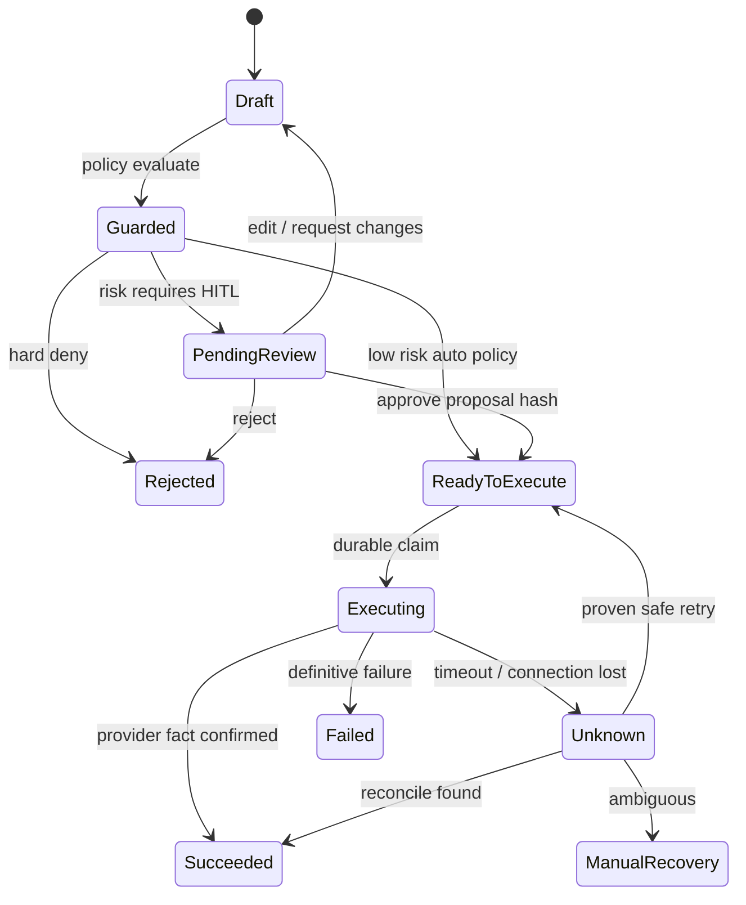
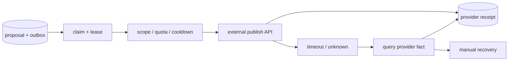

# Agent 工作流、Human-in-the-loop 与可靠发布控制面

<a id="oral-card"></a>

## 口述卡（高频必背）

[返回高频必背题单](../../high-frequency-roadmap.md)

!!! abstract "30 秒回答"

    生产 Agent 必须把模型生成和外部副作用分开。模型生成不可变 proposal，审批绑定 proposal
    hash、策略版本和 reviewer；批准后由持久化 execution job 执行。worker 用 lease 加 fencing
    claim 任务，外部调用保存 intent key 和 receipt；网络超时进入 `UNKNOWN`，先查询 provider
    事实再决定重试或人工恢复，不能让模型从头规划并盲目重发。

**3 分钟展开**

1. 决策面产生 draft/proposal 和风险等级；控制面维护 draft→review→approved→executing→终态。
2. Review Queue 管“人批准了什么”，Execution Queue 管“机器执行什么”，两者不能共用一个布尔状态。
3. 审批后执行前重新检查内容版本、权限、OAuth scope、配额和 cooldown；编辑内容使旧审批失效。
4. checkpoint 解决流程恢复，不是外部事实源；HTTP 200/timeout 都要结合 provider object ID、
   查询接口和 receipt 对账。

| 记忆槽 | 内容 |
|--------|------|
| 三个不变量 | 审批对象不可静默变化；过期 worker 不能提交状态；UNKNOWN 必须 reconcile 后再重试 |
| 手画图 | `proposal(hash) → review → execution job(lease+epoch) → provider → receipt/UNKNOWN → reconcile` |
| 项目落点 | OctoAgentFlow 讲工作流和 HITL 的设计/原型边界；不要把 checkpoint 设计表述成生产 exactly-once |
| 一个取舍 | 自建 Go 状态机语义清晰；通用工作流引擎恢复能力成熟，但引入新运行时和版本治理 |

**错误表达**

- ❌ “加一个 `approved=true` 就完成 HITL；发布超时直接重试即可。”
- ✅ “审批必须绑定不可变 proposal；模糊成功先对账，只有证明安全时才自动重试。”

**自测追问**：lease 已过期为什么还需要 fencing token？reviewer 编辑内容后如何处理旧审批？

## 10 分钟版（原理 + 图示）



### 五类持久化对象

| 对象 | 关键字段 | 不变量 |
|------|----------|--------|
| `agent_run` | tenant、bot、workflow/version、checkpoint | 同一 run 可暂停和恢复，不靠进程内存 |
| `action_proposal` | args、content hash、risk、policy version | 审批对象不可悄悄变化 |
| `review_task` | proposal hash、reviewer、decision、reason | 编辑 proposal 后必须重新审批 |
| `execution_job` | intent key、attempt、lease owner/epoch、next retry | 同一业务 intent 只有一个有效执行谱系 |
| `external_receipt` | provider、request ID、object ID、status、raw digest | 外部事实可对账，不把 HTTP 200 当最终成功 |

`Review Queue` 是 **人的决策队列**，`Execution Queue` 是 **机器的副作用队列**。两者不能共用一个
“待处理”状态，否则无法回答：谁批准了什么、批准后内容是否改变、任务是否已经被外部平台接受。

### 审批绑定与恢复

```text
approval_subject =
  tenant_id
  + action_type
  + canonical_args_hash
  + content_hash
  + policy_version
  + credential_scope
```

- 审批应绑定 tool call/proposal 的稳定 ID，而不是只绑定一次自然语言对话。
- pause 前发生的副作用必须幂等；否则 resume 可能重复执行。
- checkpoint 记录的是可恢复状态，不是业务事实的唯一来源；外部发布结果仍需 reconcile。
- workflow/prompt/tool schema 升级后，旧 run 要么按旧版本恢复，要么显式迁移，不能静默套用新语义。

### 发布可靠性



外部平台不一定支持幂等键，也无法与本地数据库做同一事务，因此目标不是宣称“严格 exactly-once”，而是：

- 本地 `tenant + account + intent_key` 唯一；
- proposal、审批和 payload hash 冻结；
- provider 支持幂等键时传稳定键；不支持时保存 request fingerprint 和返回对象 ID；
- 网络超时先查询，只有证明未创建或 provider 明确支持同键重放时才自动重试；
- 重试使用指数退避、jitter、`Retry-After`、租户配额和账号 cooldown；
- 撤回、删除、退款等补偿是新 action，不篡改历史状态。

### OAuth2 与凭据边界

- access/refresh token 加密存储，日志和 prompt 中禁止出现明文；
- scope 最小化，按 tenant/account 隔离，记录授权主体与过期时间；
- refresh 也要 singleflight/分布式互斥，避免多 worker 同时轮换导致 token 失效；
- `401` 不等于无限 refresh；区分过期、撤销、scope 不足和账号风控；
- OAuth2 安全实践会演进，面试时不要背死 provider 的固定有效期或限额。

## 生产场景

以社媒运营 Agent 为例：

1. Opportunity 进入后生成 draft，并保存输入来源与 prompt/workflow 版本。
2. Guardrail 检测禁区、事实声明、语言和重复内容，产出 risk reason。
3. 高风险 draft 进入 Review Queue；reviewer 可批准、拒绝或编辑后重新评估。
4. 批准结果通过事务内 outbox 生成 Execution Job。
5. worker claim 后检查账号授权、日配额、cooldown 和内容版本，再调用发布 API。
6. timeout 进入 `unknown`；reconciler 查询平台对象，确认后写 receipt，无法判定则人工处理。

## 排查与工具

重点指标：

- `review_queue_age`、approval/rejection/edit 比例；
- `execution_queue_age`、claim 冲突、lease takeover；
- publish success/definitive failure/unknown 比例；
- provider 429、401、5xx，按 tenant/account/provider 分组；
- 每个 workflow 版本的完成率、人工介入率、token/成本和副作用重复数。

排障先按 `run_id → proposal_id → review_id → execution_id → provider_object_id` 串联，不只看
模型 trace。

## 架构取舍

| 方案 | 优点 | 风险 |
|------|------|------|
| Go 自建状态机 + DB/outbox | 业务语义清晰、审计可控 | 要自行实现 checkpoint、迁移和运维 |
| Agent 框架 persistence/HITL | pause/resume 与开发体验好 | 仍不能替代业务授权、账本和外部对账 |
| 通用工作流引擎 | 长流程、定时、重试成熟 | 引入新运行时与版本治理成本 |

固定发布流程优先确定性状态机；LLM 只负责候选生成、分类或非确定性决策，不要让模型拥有整个
workflow 的最终状态写权限。

## 追问链

1. **人工审批后 worker 为什么还要重新校验？** → 审批到执行之间凭据、策略、配额和内容版本可能变化。
2. **HTTP 200 是否代表发布成功？** → 只代表接口层响应；还要解析业务状态并保存 provider object ID，必要时查询最终事实。
3. **任务超时能否直接重试？** → 不能一概而论；先判断外部副作用是否可能已经发生。
4. **HITL 框架是否自动保证一次执行？** → 不保证；checkpoint 解决恢复，副作用仍需幂等与对账。
5. **reviewer 编辑内容怎么办？** → 生成新 proposal/version，重新过 guardrail；旧审批不能沿用。
6. **Execution Queue 为什么需要 fencing？** → lease 过期不代表旧 worker 已停止，epoch 可阻止过期 owner 提交新状态。

## 反模式与事故

- 把 `approved=true` 放在可编辑 draft 上，审批后内容被替换仍直接发布。
- Review Queue 与 Execution Queue 共用状态，无法区分“未审批”和“已批准但未执行”。
- worker 收到超时立即创建新请求，外部平台最终出现重复内容或重复扣费。
- refresh token 进入 prompt/trace，形成跨租户凭据泄漏。
- 发布前只信模型输出的“安全”，没有代码层 policy、账号 scope 和配额校验。
- 进程重启后让模型重新规划整个流程，得到不同 tool args，却沿用旧审批。

## 延伸阅读

- [OpenAI Agents SDK: Human-in-the-loop](https://openai.github.io/openai-agents-python/human_in_the_loop/)
- [LangGraph Interrupts](https://docs.langchain.com/oss/python/langgraph/interrupts)
- [LangGraph Persistence](https://docs.langchain.com/oss/python/langgraph/persistence)
- [OAuth 2.0 Security Best Current Practice](https://www.rfc-editor.org/rfc/rfc9700)
- 关联：[S-AI-03 Agent 与 Function Calling](./S-AI-03-agent-tool-calling.md)、
  [S-ARCH-04 幂等设计](../03-system-design/S-ARCH-04-idempotency.md)
