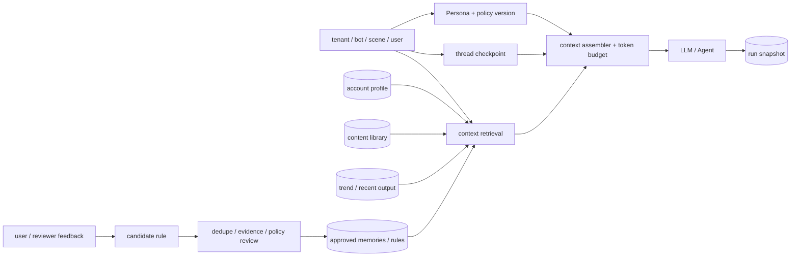
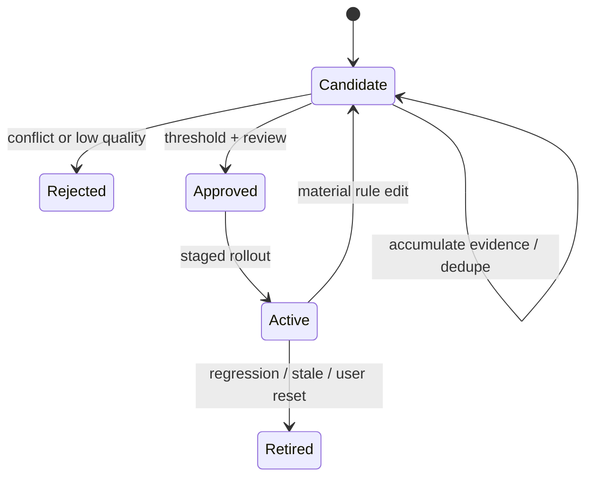

# Persona、分层 Memory 与反馈学习治理

<a id="oral-card"></a>

## 口述卡（高频必背）

[返回高频必背题单](../../high-frequency-roadmap.md)

!!! abstract "30 秒回答"

    Agent Memory 不是把全部聊天历史塞进 prompt。我会分开版本化 Persona/Policy、线程短期状态、
    长期事实与偏好、RAG 内容和反馈学习规则，并按 tenant/bot/user/scene 做 namespace、权限、
    TTL 和来源治理。检索必须先做授权过滤再排序；一次 run 保存实际使用的版本和 memory snapshot。
    用户反馈先成为 candidate，经证据聚合、审核和灰度后才可变成 active rule。

**3 分钟展开**

1. Thread/checkpoint 用于续跑；长期 memory 跨会话但会过期；账户余额和授权仍要实时查询权威系统。
2. Persona 是目标、语气和边界的版本化配置，普通对话不能静默提升权限或覆盖合规策略。
3. Context assembly 按权限、任务、freshness、来源、冲突和 token budget 选择片段；向量相似度只是候选信号。
4. 反馈规则经历 candidate→approved→active→retired，保存阈值算法、证据和 policy version，
   不能把模型自报 confidence 当校准概率。

| 记忆槽 | 内容 |
|--------|------|
| 三个不变量 | Memory、Context、RAG 不等价；授权过滤发生在检索前；高价值事实必须有权威来源和版本 |
| 手画图 | `namespace + policy + thread + retrieval → context assembler → model → run snapshot`；反馈走独立规则状态机 |
| 项目落点 | OctoAgentFlow 讲 Persona、thread state、memory namespace 和反馈规则；只陈述真实实现层级 |
| 一个取舍 | 全量历史实现快但贵且污染；结构化 memory 可治理，却需要 schema、失效、删除和迁移机制 |

**错误表达**

- ❌ “向量库就是 Memory；top-k 相似就可以跨租户召回；66% confidence 是模型可信概率。”
- ✅ “向量索引只是召回手段；权限、版本、来源和阈值定义必须由系统治理。”

**自测追问**：用户说“以后都自动发布”能否写入 Persona？删除用户数据时缓存和向量索引怎么办？

## 10 分钟版（原理 + 图示）



### Memory 分层

| 层 | 例子 | 生命周期 | 写入权限 |
|----|------|----------|----------|
| Persona/Policy | 目标、语言、禁止话题、claim 边界 | 版本化、长期 | 管理员/审批流 |
| Thread state | 消息、tool call、checkpoint | 会话/任务 | runtime |
| Episodic | 最近发布、失败原因、人工修改 | TTL/窗口 | 事件管道 |
| Semantic | 稳定偏好、账户事实、领域结论 | 长期、可失效 | 验证后的 writer |
| Content/RAG | 素材库、产品文档、趋势来源 | 随来源版本 | ingest pipeline |
| Learning rule | “标题不使用夸张承诺”等 | 候选→启用→退役 | policy/人工批准 |

**Memory、Context、RAG 不等价**：

- Memory 是持久化的信息资产；
- Context 是某次模型调用实际注入的有限输入；
- RAG 是从外部集合选择 context 的一种方法；
- Session history 只是短期 memory 的一种实现。

### 命名空间与数据模型

```text
namespace = tenant_id / bot_id / scene / subject_type / subject_id

memory_item:
  id, namespace, kind, canonical_fact
  source_refs[], evidence_count
  confidence_score, confidence_method
  status(candidate|active|rejected|retired)
  valid_from, expires_at
  policy_version, created_by, reviewed_by
```

namespace 必须在检索前参与授权，不能先做全库向量召回再靠 prompt 告诉模型“只看本租户”。删除、
导出和数据保留也按 namespace 落地。

### Context Assembly

一个可解释的预算例子：

```text
system/policy        固定保留
persona              固定上限
thread recent turns  滑动窗口 + 摘要
retrieved memories   top-k + 权限 + freshness
content sources      top-k + 来源/版本
tool results         裁剪/分页
output reserve       预留生成空间
```

排序不能只看 embedding similarity，还要综合：

- tenant/subject 权限；
- scene 和任务类型；
- freshness、有效期和来源可信度；
- 与当前 persona/policy version 的兼容性；
- 是否已被用户纠正或人工退役；
- 多样性与 token 成本。

### 反馈学习规则



“66%”可以是项目中“满足若干证据后进入审核”的阈值，但面试要补充：

- score 如何定义：规则、分类器、评价模型还是人工投票；
- 是否在真实标注集上校准；
- false positive/false negative 成本；
- 高风险行为是否无论分数多高都要人工批准；
- 阈值变更是否版本化、可回放和可回滚。

不要把 LLM 自己输出的 `0.66` 当成统计意义上的可靠概率。

### 可复现性

每次 run 至少保存：

- model/provider 与参数；
- workflow、prompt、tool schema、persona 和 policy version；
- memory IDs + versions、检索得分和 source refs；
- context 裁剪/摘要结果；
- approval 与外部 action receipt。

模型本身可能非确定，但可以复现“当时给了什么输入、采用了哪些规则、为什么放行”。

## 生产场景

- **社媒运营**：按 Bot/Scene 聚合账号画像、素材、趋势、最近输出和审核反馈，避免不同品牌语气串线。
- **客服 Agent**：用户偏好可以跨会话，订单事实必须实时查询 tool，不能被旧 memory 覆盖。
- **多租户平台**：同一用户属于多个 workspace 时，memory scope 不能只用 `user_id`。
- **规则升级**：新 policy 先 shadow 评估，再对部分 Bot 启用；旧 run 保留旧版本恢复能力。

## 排查与工具

关键指标：

- memory retrieval precision、无结果率、stale/retired 命中率；
- context token 构成、截断率、摘要压缩比；
- candidate→active 转化、人工否决率、规则回滚率；
- 启用规则前后的 edit rate、approval rate、publish failure 和质量评估；
- tenant isolation 测试、删除传播延迟和敏感数据命中。

排查“Agent 突然变风格”时，对比 persona/policy version、实际 memory IDs、检索顺序和 prompt
snapshot，不要只看最终回答。

## 架构取舍

| 方案 | 适用 | 风险 |
|------|------|------|
| 全量历史回填 | 小型原型 | token 膨胀、隐私、旧信息污染 |
| 摘要 + 最近窗口 | 长对话 | 摘要丢细节，需要版本和回查 |
| 结构化 memory store | 偏好、事实、规则 | schema 与治理成本 |
| 向量检索 | 模糊召回内容 | 相似不等于正确或有权访问 |

高价值事实优先结构化存储与精确查询；向量库适合召回候选，不应成为账户余额、权限或审批状态的
权威来源。

## 追问链

1. **Memory 和数据库有什么区别？** → Memory 是用途与生命周期概念，底层可以是 SQL、Redis、文档库或向量索引；权威事实仍需明确 system of record。
2. **用户说“以后都自动发布”能否写入 Persona？** → 不能直接写；这是权限/风险策略变化，应走显式授权与审批。
3. **怎么防旧反馈污染？** → 有效期、来源、版本、冲突规则、退役状态和定期复核。
4. **删掉用户数据后向量索引怎么办？** → 删除主记录同时发删除事件，索引异步清理并有审计/补偿扫描。
5. **为什么不直接把所有 memory top-k？** → top-k 仍可能越权、过期、冲突；先过滤 namespace/policy，再排序和裁剪。
6. **如何评价学习规则有效？** → 离线回放 + shadow/小流量，对 edit rate、风险事件和业务质量做前后比较。

## 反模式与事故

- 只按 `user_id` 做 memory key，跨 tenant 泄漏品牌资料。
- 把 reviewer 的一次措辞修改永久提升为全局规则。
- 把模型自报 confidence 当校准概率，达到阈值就自动修改高风险策略。
- Persona 没有版本，线上回答变化后无法解释是哪次配置导致。
- 把余额、授权和发布状态写成长文本 memory，读取到过期事实。
- 只删除数据库记录，不处理缓存、向量索引、trace 和备份保留策略。

## 延伸阅读

- [LangGraph Memory Concepts](https://docs.langchain.com/oss/python/concepts/memory)
- [LangGraph Add Memory](https://docs.langchain.com/oss/python/langgraph/add-memory)
- [LangGraph Persistence](https://docs.langchain.com/oss/python/langgraph/persistence)
- [OpenAI Agents SDK Sessions](https://openai.github.io/openai-agents-python/sessions/)
- 关联：[S-AI-04 Prompt 与 Context](./S-AI-04-prompt-context.md)、
  [S-AI-05 LLM 应用安全](./S-AI-05-llm-security.md)
