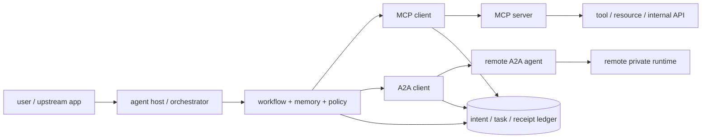
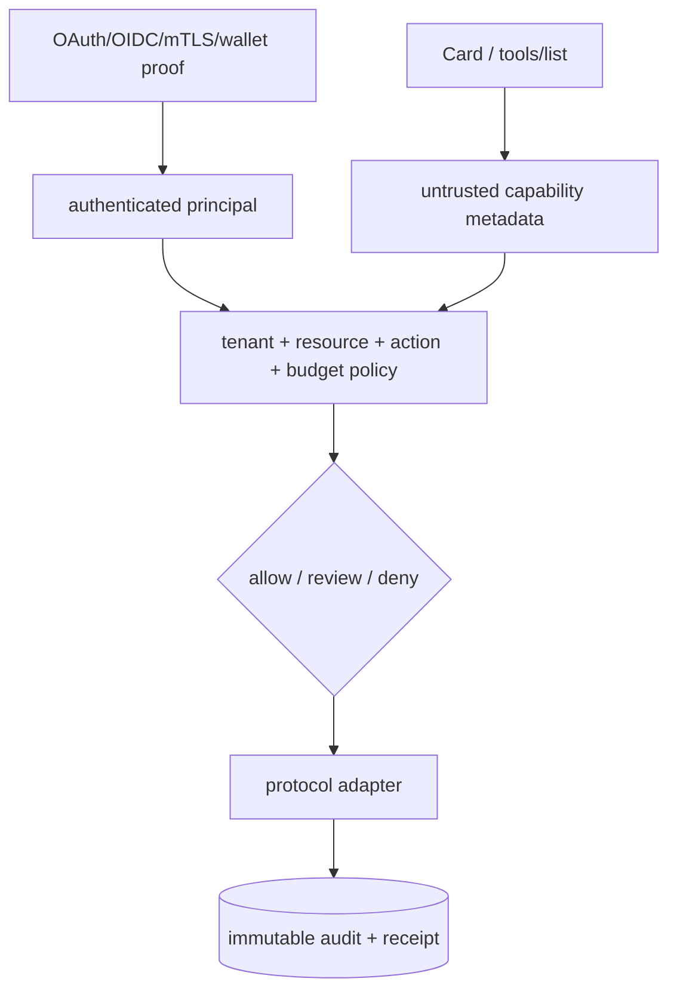

# MCP 与 A2A：Tool、Agent、任务生命周期与跨框架互操作

<a id="oral-card"></a>

## 口述卡（高频必背）

[返回 P0 知识图谱](../_meta/p0-knowledge-graph.md)

!!! abstract "30 秒回答"

    MCP 和 A2A 解决不同边界：MCP 标准化 Host/Agent 如何访问 Tool、Resource、Prompt；
    A2A 标准化独立 Agent 如何发布能力、接收任务并返回消息或制品。生产平台可以让一个
    Agent 通过 MCP 使用内部工具，再通过 A2A 委托远端 Agent，但两条链路都不能替代业务
    授权、幂等和审计。Agent Card、Tool Schema 只是能力描述，不是可信身份或权限证明；
    平台应把外部协议映射到统一的内部 intent/task 状态机，通过版本协商、逐能力授权、
    超时取消、receipt/reconcile 和 conformance test 实现 vendor-neutral 互操作。

**3 分钟展开**

1. MCP 是 Host 内的 client/server 协议，先 `initialize` 协商版本与 capabilities，再访问
   tools/resources/prompts；A2A 面向组织或运行时边界外的 Agent，强调发现、任务生命周期、
   消息、制品以及异步/流式交互。
2. `MCP request id`、`A2A task id` 和业务 `intent_id` 是三个维度；网络超时后不能只换
   request id 重发，必须按业务 intent 查询远端事实。
3. Tool Schema、Tool Annotation、Agent Card、Skill 描述均为不可信输入；身份认证、
   tenant/resource scope、预算、审批和钱包策略由本地 Policy Engine 决定。
4. vendor-neutral 不是“所有框架对象完全一样”，而是定义最小语义内核、保留扩展字段，
   用 golden vectors、协议矩阵和黑盒 conformance suite 验证每个 Adapter。

| 记忆槽 | 内容 |
|--------|------|
| 三个不变量 | 能力描述不等于授权；协议 request/task ID 不等于业务幂等键；未知结果先 reconcile |
| 手画图 | `Host → MCP tool`；`Agent → A2A remote agent`；两者汇入 `policy + task ledger` |
| 项目落点 | 用 OctoAgentFlow 的工作流/HITL 解释内部 task ledger，用 Go MCP Server 解释工具接入；不要声称原型已经通过所有 A2A SDK 兼容验收 |
| 一个取舍 | 统一协议降低框架锁定，但最小公分母会损失厂商特性，因此核心语义标准化、扩展能力显式协商 |

**错误表达**

- ❌ “MCP 是多 Agent 编排协议；A2A 会替代 MCP。”
- ✅ “MCP 主要解决 Agent-to-Tool，A2A 解决 Agent-to-Agent；编排状态和业务授权仍属于平台。”
- ❌ “发现了 Agent Card，就说明该 Agent 可信且具备声明的能力。”
- ✅ “Card 是可发现的能力声明；身份、端点控制、信誉和实际能力必须分别验证。”

**自测追问**：A2A 调用超时但远端任务可能已经创建，为什么不能直接生成新 task 重试？

## 10 分钟版（协议边界 + 统一控制面）

### 先画清四层，不按框架名切系统



| 层 | 解决的问题 | 不解决的问题 |
|----|------------|--------------|
| Agent Framework | planner、graph、memory、checkpoint、HITL | 跨厂商协议天然兼容、业务 exactly-once |
| MCP | Tool/Resource/Prompt 暴露与 Host 连接 | 远端 Agent 的完整任务协作、业务授权 |
| A2A | Agent 发现、消息、任务和制品交换 | Agent 内部如何规划、如何调用私有工具 |
| 业务控制面 | tenant、policy、预算、审批、幂等、审计 | 不应把具体框架私有对象泄漏为公共契约 |

所以 `LangGraph node`、`OpenAI Agent`、`CrewAI task` 或 `ElizaOS action` 不应直接成为开放
平台的稳定 API。公共 API 使用平台自己的 `AgentRef`、`Intent`、`Task`、`Artifact` 和
`Receipt`，再由 Adapter 映射到具体运行时。

### MCP 的关键语义

MCP 基于 JSON-RPC 2.0，连接建立后先协商协议版本和 capabilities。Server 可以暴露
Resources、Prompts、Tools；Client 也可能提供 Roots、Sampling、Elicitation 等能力。

生产实现要额外处理：

- stdio 与远程 Streamable HTTP 的进程、会话和信任边界不同；
- 列表结果与 tool schema 可缓存，但要有版本/变更通知和失效策略；
- schema 校验只保证形状，不保证调用者有权转账、发帖或读取某租户数据；
- tool description、annotation 和返回内容都可能包含注入文本；
- cancellation 表达“调用方不再等待”，不自动证明远端副作用已经停止；
- server 请求 sampling/elicitation 时，Host 仍要执行用户同意、数据最小化和模型预算策略。

### A2A 的关键语义

A2A 把远端 Agent 视为黑盒：客户端不需要知道其 prompt、memory 或内部工具，只通过公开能力和
任务契约协作。典型对象包括：

- **Agent Card**：端点、能力、Skill、认证需求等发现信息；
- **Message/Part**：交互消息及结构化/非结构化内容；
- **Task**：可持续、异步的工作单元；
- **Artifact**：任务产生的交付物；
- **Streaming/Push**：长任务的增量结果或异步通知。

任务状态必须被当作远端事实投影，而不是本地 worker 状态。客户端收到超时、流中断或 push
丢失时，应通过稳定 task id 查询；本地 `CANCEL_REQUESTED` 也不等于远端已经
`CANCELED`。A2A 规范和 SDK 仍会演进，面试时应先讲状态不变量，再按目标版本说明字段。

### 三类 ID 必须分开

```text
intent_id   = 本平台稳定业务意图，负责幂等、审批与审计
request_id  = 某次 MCP/A2A 传输请求，用于关联响应
remote_id   = 远端 tool execution / A2A task / provider object
```

建议持久化：

| 字段 | 用途 |
|------|------|
| `tenant_id + intent_id` | 本地唯一业务谱系 |
| `protocol + protocol_version` | 解释 wire 语义 |
| `adapter + adapter_version` | 定位兼容问题 |
| `remote_agent/tool/skill` | 能力目标 |
| `request_attempt` | 传输重试记录 |
| `remote_task_id` | 远端查询与取消 |
| `payload_digest` | 防止重试时经济语义漂移 |
| `status + receipt_digest` | 对账和审计 |

只保存 trace 而不保存远端 task/object ID，进程重启后就无法区分“请求未到达”和“任务已创建但
响应丢失”。

### 身份、授权与信任



- **发现不等于认证**：HTTPS 上取到 Card 也不能自动把自然语言名称当成稳定身份。
- **认证不等于授权**：token、mTLS 或钱包签名证明某个 principal，不代表可以调用所有工具。
- **Card/Schema 不等于证明**：远端声明“只读”或“幂等”只能作为风险输入，不能直接绕过审批。
- **禁止 token passthrough**：MCP/A2A Gateway 不应把收到的上游 token 原样转发给下游；
  应为目标 audience 获取或交换最小权限凭据。
- **主体传播要显式**：记录 end user、calling agent、service principal、tenant 和代表关系，
  防止 confused deputy。

### vendor-neutral Adapter 怎么设计

内部最小接口可以是：

```text
Discover(ref) -> Capabilities
Submit(intent, auth_context) -> RemoteHandle
Get(remote_handle) -> CanonicalTask
Cancel(remote_handle, reason) -> CancelReceipt
Stream(remote_handle, cursor) -> Event
```

不要承诺“任何框架零损失互转”。正确做法是：

1. 定义稳定的 canonical core：身份引用、输入、状态、artifact、错误、usage 和 receipt。
2. 未识别扩展原样保存或显式拒绝，不能静默丢字段。
3. capability negotiation 决定是否启用 streaming、push、结构化 artifact 等特性。
4. 为 MCP/A2A 版本、SDK 语言和厂商实现维护支持矩阵。
5. Adapter 升级使用双读/影子流量，旧的运行中任务继续绑定旧版本。

### Conformance Suite 必测什么

| 类别 | 用例 |
|------|------|
| 协议 | initialize/version、capability、未知字段、错误码、取消、流恢复 |
| Schema | 必填/可选、整数边界、未知 enum、大 payload、恶意描述 |
| 身份 | 错 audience、过期 token、跨租户 ID、凭据降权、重放 |
| 任务 | 超时但已创建、重复 submit、push 丢失、乱序事件、终态不可逆 |
| 副作用 | 相同 intent 重试、payload 变化、远端无幂等支持、UNKNOWN 对账 |
| 兼容 | N/N-1 协议版本、不同 SDK golden vectors、扩展降级 |

测试通过只能证明选定版本和用例兼容，不等于所有远端 Agent 可信，也不等于其业务实现正确。

## 生产场景

一个“研究后执行链上交易”的 Agent：

1. Orchestrator 通过 A2A 委托研究 Agent，得到带来源的 Artifact。
2. 本地模型生成交易 Intent，但不直接生成可签名最终指令。
3. 通过 MCP 调用报价、模拟和风控工具；每个 tool 从可信 auth context 解析 tenant。
4. Policy Engine 校验资产、合约、滑点、预算和审批。
5. 钱包执行服务广播后保存 tx receipt；timeout 进入 `UNKNOWN` 并按 sender/nonce 查询。
6. 最终 Artifact、审批、tool receipts、A2A task 和链上交易通过同一 intent id 串联。

## 排查与观测

- 维度：`tenant/intent/protocol/version/adapter/remote-agent/tool/task-id`；
- 指标：发现失败、协商失败、授权拒绝、submit latency、task age、unknown ratio、push lag；
- trace 跨 MCP/A2A 边界时传播受控 correlation id，不传播密钥或完整 prompt；
- 保存协议报文 digest 和脱敏摘要；敏感 resource、token 和钱包签名不进入普通日志；
- 升级事故先比较协议版本、Adapter 版本、Card/Schema digest 和 SDK 实现。

## 架构取舍

| 方案 | 优点 | 风险 |
|------|------|------|
| 直接使用框架 SDK 互调 | 上手快、厂商特性完整 | 业务契约被框架对象绑定，升级迁移困难 |
| 统一 Gateway + Canonical Task | 权限、审计、兼容和观测集中 | Gateway 可能成为瓶颈和最小公分母 |
| 每团队自建 Adapter | 团队自治、局部优化 | 语义漂移、重复安全漏洞、难统一验收 |

推荐公共入口统一协议和策略，运行时内部允许框架原生能力；高风险副作用必须经过独立执行面，
不能因为调用来自“可信 Agent”就绕过策略。

## 追问链

1. **MCP 和 A2A 是否竞争？** → 主要边界分别是 Agent-to-Tool 与 Agent-to-Agent，可组合使用。
2. **Agent Card 能否作为登录凭证？** → 不能；它是发现元数据，认证和端点控制需另行验证。
3. **协议 task id 能否直接当幂等键？** → 不应；它通常在远端创建后才出现，本地还需先于调用生成稳定 intent id。
4. **cancel 成功为什么仍要查远端状态？** → 取消请求、传输响应和远端副作用停止不是同一事实。
5. **如何证明 vendor-neutral？** → 用 canonical contract、N/N-1 兼容矩阵和跨 SDK conformance suite 给出限定范围证据。
6. **MCP Tool 标注只读能否免审批？** → 不能只信远端标注；本地策略还要根据真实实现和数据范围判断。

## 反模式与事故

- 把 Tool Schema 自动转换为 RBAC，跨租户读取只因参数合法而被放行。
- A2A submit 超时后创建新 task，两个远端任务都执行了链上交易。
- Gateway 原样转发用户 token，远端服务获得不属于它的 audience/scope。
- Adapter 丢弃未知扩展字段后仍返回成功，导致金额、时限或验收语义变化。
- 把框架 checkpoint 当成远端 Agent 与外部工具的一次执行证明。
- 所有协议升级直接覆盖运行中任务，恢复时使用了新状态语义。

## 延伸阅读

- [MCP Specification](https://modelcontextprotocol.io/specification/2025-11-25)
- [MCP Authorization](https://modelcontextprotocol.io/specification/2025-11-25/basic/authorization)
- [A2A Protocol](https://a2a-protocol.org/latest/)
- [A2A Specification](https://github.com/a2aproject/A2A/blob/main/docs/specification.md)
- 关联：[S-AI-07 Go 实现 MCP Server](./S-AI-07-mcp-server-go.md)、
  [S-AI-09 Agent 工作流与 HITL](./S-AI-09-agent-workflow-hitl-publishing.md)
