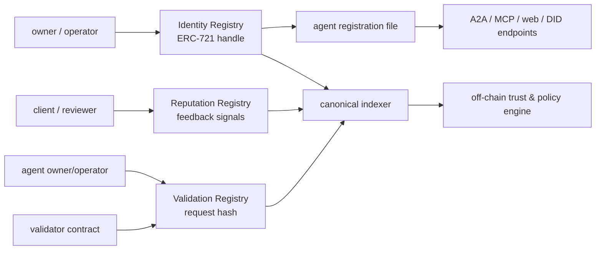
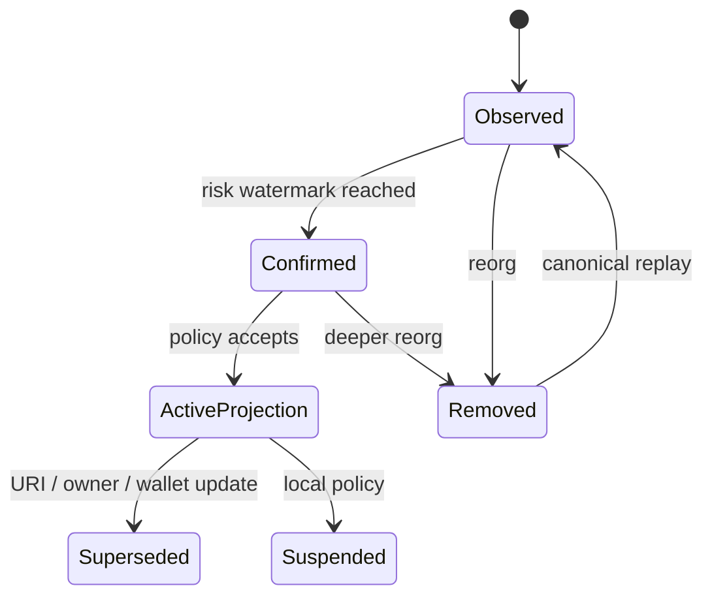

# ERC-8004：Agent 身份、信誉、验证与钱包绑定

<a id="oral-card"></a>

## 口述卡（高频必背）

[返回 P0 知识图谱](../_meta/p0-knowledge-graph.md)

!!! abstract "30 秒回答"

    ERC-8004 当前是 Draft，目标是用三个轻量注册表支持跨组织 Agent 的发现与信任信号：
    Identity Registry 用 ERC-721 agentId 和 URI 指向注册文件；Reputation Registry 记录
    可组合的反馈信号；Validation Registry 记录独立验证请求与结果。它不包含支付，也不能
    证明 Agent 声明的能力一定可用或无恶意。生产平台应把链上身份、端点认证、运行主体、
    agent wallet、业务授权和信誉评分分开；按 `chain + registry + agentId` 索引 canonical
    事件，处理 reorg、所有权转移、URI 变化、Sybil 和 validator 信任模型。

**3 分钟展开**

1. Identity Registry 是基于 ERC-721 的可转移身份句柄；`agentURI` 可声明 A2A、MCP 等端点。
   URI 与所有权会变化，因此缓存必须版本化，不能把名字或 URL 当永久主键。
2. `agentWallet` 需要 EIP-712/EOA 或 ERC-1271 合约签名证明控制权；Agent 身份转移时钱包会
   被清除，但钱包控制权证明仍不等于每笔交易授权。
3. Reputation Registry 提供反馈原语，不规定唯一总分；如果不限制可信 reviewer，
   聚合结果会受 Sybil、互刷、女巫和历史窗口选择影响。
4. Validation Registry 记录谁对哪个 request hash 给出什么结果；安全性取决于 validator、
   TEE/zk/re-execution 方案及其激励，Registry 本身不创造真实性。

| 记忆槽 | 内容 |
|--------|------|
| 三个不变量 | 注册身份不等于运行认证；钱包绑定不等于业务授权；公开反馈不等于可信评分 |
| 手画图 | `ERC-721 identity → registration file → MCP/A2A endpoint`，旁路 `reputation + validation` |
| 项目落点 | 用 Launchpad 类 DEX 的链上事件、Indexer/Reorg 和钱包权限经验解释注册表投影；没有部署过 ERC-8004 就只表述为方案设计 |
| 一个取舍 | 链上注册提高可发现性和可组合审计，但引入 gas、隐私、reorg、Sybil 与不可删除历史 |

**错误表达**

- ❌ “ERC-8004 是去中心化 Agent 登录和支付标准，注册后就可以信任。”
- ✅ “它提供发现、反馈和验证注册表；支付是正交问题，认证、授权和信任策略仍由系统组合。”
- ❌ “agentId 是全局唯一整数。”
- ✅ “稳定引用至少包含 namespace/chainId/registry address/agentId，单独 tokenId 不够。”

**自测追问**：Agent NFT 所有权转移后，为什么旧端点、旧钱包和旧信誉不能简单全部沿用？

## 10 分钟版（身份分层 + 链上投影）

### 先声明规范状态

截至本文复核日期，ERC-8004 在 EIP 页面标记为 **Draft**。Draft 的函数、字段和安全考虑可能继续
变化；面试中可以研究并设计接入，但不能称为“已最终定稿的 Ethereum 标准”。

### 三个 Registry 分别提供什么



| Registry | 记录内容 | 不提供的保证 |
|----------|----------|--------------|
| Identity | agentId、owner、URI、metadata、可验证 wallet | 端点永远在线、代码安全、运行者就是 owner |
| Reputation | reviewer 提交的 value/tag/URI/hash 等反馈 | 防 Sybil、统一评分、公平推荐 |
| Validation | request hash、validator、response、证据引用 | validator 正确、激励充分、结果不可串谋 |

“Trustless Agents”不能理解成完全无需信任，而是把身份和信任信号公开、可组合，再让调用方按风险
选择 reviewer、validator 或其他证明模型。

### 身份至少分六层

| 层 | 示例 | 问题 |
|----|------|------|
| 链上注册身份 | `eip155:chainId:registry + agentId` | 谁拥有/管理注册项 |
| 注册文件 | URI、名称、Skill、服务端点 | Agent 声明了什么 |
| 端点控制 | HTTPS well-known、mTLS、域名控制 | 谁控制网络端点 |
| 运行主体 | OAuth principal、service account、workload identity | 当前进程是谁 |
| 钱包控制 | EOA EIP-712 或 ERC-1271 验签 | 谁能证明控制收款钱包 |
| 业务授权 | scope、budget、allowlist、HITL、session key | 这一次能做什么 |

这六层可以属于同一组织，也可以分离。把 Agent NFT owner 直接映射成平台超级管理员，会把资产
所有权、运行运维权和资金执行权混成一个根权限。

### Identity Registry 接入要点

ERC-8004 的身份引用应使用完整复合键，而不是仅使用名称、URL 或 tokenId：

```text
agent_ref = namespace + chain_id + identity_registry + agent_id
```

注册文件可包含 A2A、MCP、Web、ENS、DID 等服务声明。接入时：

- 保存原始 URI、内容 digest、抓取时间、内容类型和解析版本；
- 对 HTTPS 端点可执行域控制验证，但“控制域名”仍不等于“能力无恶意”；
- IPFS/content-addressed 内容按 CID 校验，普通 HTTPS 内容保存 hash 防止静默变化；
- 对未知 service 类型保留原始字段，不能错误映射成已支持能力；
- 对 `active=false`、URI 更新、所有权转移建立失效和重新审核流程。

所有权转移不会删除该 agentId 的历史 Reputation；规范会清除已绑定的 `agentWallet`，但历史反馈
仍与身份句柄关联。平台应区分“身份句柄连续”和“运营主体连续”，在评分与 UI 中标记转移水位，
必要时对转移前后信誉分窗展示，而不是擅自清空历史或无条件继承全部信任。

### agentWallet 的正确边界

规范为 agent wallet 预留 metadata，并要求新钱包通过 EIP-712 或 ERC-1271 证明控制权；身份转移
时绑定钱包会被清除。这解决“注册项声称的钱包是否获得过控制权证明”，但不解决：

- 当前 Agent runtime 是否能使用该钱包；
- 某个 session key 是否仍有效；
- 该钱包是否允许调用目标合约或花费目标资产；
- 这笔交易是否通过租户预算、审批和风控；
- 钱包、合约账户或签名策略在证明后是否发生状态变化。

因此高风险执行仍走：

```text
agent identity
  → runtime authentication
  → intent normalization
  → policy / budget / simulation
  → approval
  → isolated signer
  → tx receipt / reconcile
```

### Reputation 是信号，不是一个真理分数

Registry 允许 clientAddress 对 agentId 提交带 value、decimals、tag、URI/hash 的反馈。平台不能
简单执行 `average(all feedback)`：

1. 确定哪些 reviewer 进入集合，以及 reviewer 自身的信誉和利益关系；
2. 区分可达率、响应时间、收入、质量等不同 tag，禁止把不同量纲直接平均；
3. 对同一主体多地址、互刷、付费评价、女巫集群和时间衰减建模；
4. 链下证据按 hash 校验，并处理内容不可用；
5. 展示样本量、时间窗口、聚合算法版本和置信范围；
6. 高价值动作不能仅凭公开评分自动放行。

```text
trust_decision =
  selected_reviewers
  + feedback_window
  + aggregation_version
  + validation_evidence
  + local_policy
  + value_at_risk
```

同一个 agentId 对低价值数据查询和高价值资金管理，可以得到完全不同的信任决策。

### Validation 的 request/response 语义

Agent owner/operator 向指定 validator 请求验证并提交 request URI/hash，validator 再写入响应和
可选证据。平台必须问：

- request hash 实际承诺了哪些 input、output、模型/代码版本和环境；
- validator 是重执行、TEE、zk proof、人工裁决还是普通地址；
- 谁为 validator 提供激励、质押或惩罚；
- 多次 response 是渐进确认、覆盖还是冲突；
- 证据 URI 是否可用，hash 是否匹配；
- 验证的是“生成正确”还是只验证“某环境执行过”。

Registry 只保证事件和状态按合约规则记录；不能把任意 `response=100` 解释成数学证明。

### Indexer 与 Reorg



建议保存：

- block number/hash、tx hash、log index 和 canonical 标记；
- owner、operator、agentURI、agentWallet 的版本化投影；
- registration file digest 和抓取证据；
- feedback/validation 的原始事件，不只保存聚合结果；
- `observed/safe/finalized/risk-accepted` 分层水位；
- reorg 回滚后触发缓存、搜索索引和授权决策失效。

跨链注册可能代表同一现实 Agent，也可能是仿冒。除非注册文件或所有权证明建立明确关联，不应仅按
名称、logo 或 endpoint 自动合并。

## 生产场景

Agent Marketplace 上架流程：

1. 开发者提交完整 agent ref；Indexer 获取 canonical Identity 事件。
2. Registry Resolver 抓取并验证 registration file，生成内容 digest。
3. Endpoint Verifier 验证域控制、TLS、A2A/MCP 握手和最小 capability。
4. Trust Engine 按 reviewer allowlist 聚合 Reputation，并核验 Validation evidence。
5. Security Review 决定可见、可试用、可付费和可执行资金动作的不同等级。
6. 任一 owner/URI/wallet/endpoint 变化都使高风险审核失效，直到重新验证。

## 排查与观测

- 查询主键必须包含 `chain/registry/agentId`，日志中附 block lineage；
- 指标：event lag、reorg rollback、URI fetch failure、digest change、endpoint verify failure；
- Reputation 展示 raw count、trusted reviewer count、窗口和算法版本；
- Validation 展示 validator 类型、证据可用率和冲突 response，不能只展示平均值；
- 对 owner transfer、wallet clear、URI change 建立高优先级审计事件。

## 架构取舍

| 方案 | 优点 | 风险 |
|------|------|------|
| 只用中心化平台 ID | 快、隐私和恢复易控 | 跨平台不可移植，平台信任集中 |
| 直接以 ERC-8004 为唯一身份源 | 可组合、公开审计 | Draft、链依赖、reorg、隐私和账户恢复复杂 |
| 链上锚点 + 平台身份映射 | 兼顾开放发现和企业控制 | 需要明确映射、冲突和吊销语义 |

生产开放平台通常采用第三种：链上注册项是公开锚点，平台仍维护组织身份、合规、运行凭据和业务
权限；两套状态通过版本化映射连接。

## 追问链

1. **ERC-8004 是否包含支付？** → 不包含；支付在规范中明确是正交问题，可与 x402 等组合。
2. **agentId 是否全局唯一？** → 单独整数不是；要带 namespace、chainId 和 registry address。
3. **为什么 owner 不能自动成为运行时管理员？** → 资产所有权、端点运维和业务权限是不同安全域。
4. **公开 Reputation 为什么仍会被刷？** → Registry 公开信号但不消除 Sybil，调用方要选择 reviewer 和聚合模型。
5. **Validation response=100 代表什么？** → 只代表指定 validator 按其方案写入该响应，需结合 request commitment 和信任模型解释。
6. **Indexer 遇到 reorg 怎么办？** → 按 block lineage 回滚投影，失效缓存/授权，再从 canonical 链重放。

## 反模式与事故

- 用 `agentId=42` 作为跨链数据库唯一键，合并了不同 Registry 的身份。
- Agent NFT 转移后继续信任旧 wallet、旧 endpoint 和旧平台管理员。
- 把所有公开反馈直接平均，攻击者批量地址刷高分后获得资金权限。
- registration file 内容变化但 URL 不变，平台缓存没有 digest 和版本。
- 将 validation 的自然语言 reason 当成可验证证明，不检查 request/response hash。
- 把 ERC-8004 Draft 写进不可升级核心业务契约，却没有 Adapter 和迁移策略。

## 延伸阅读

- [ERC-8004: Trustless Agents](https://eips.ethereum.org/EIPS/eip-8004)
- [EIP-712 Typed Structured Data](https://eips.ethereum.org/EIPS/eip-712)
- [ERC-1271 Contract Signature Validation](https://eips.ethereum.org/EIPS/eip-1271)
- 关联：[S-BC-05 链上索引器与重组](../12-blockchain-web3/S-BC-05-indexer-reorg.md)、
  [S-BC-08 ERC-4337](../12-blockchain-web3/S-BC-08-erc4337-account-abstraction.md)
