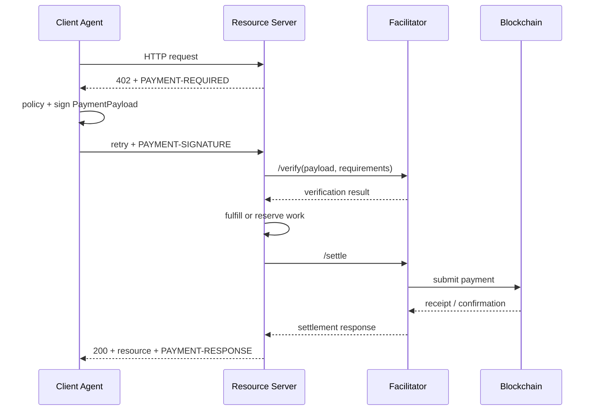
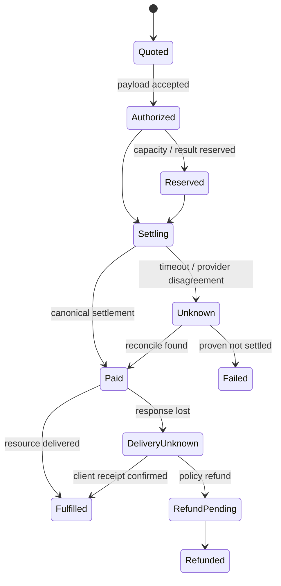
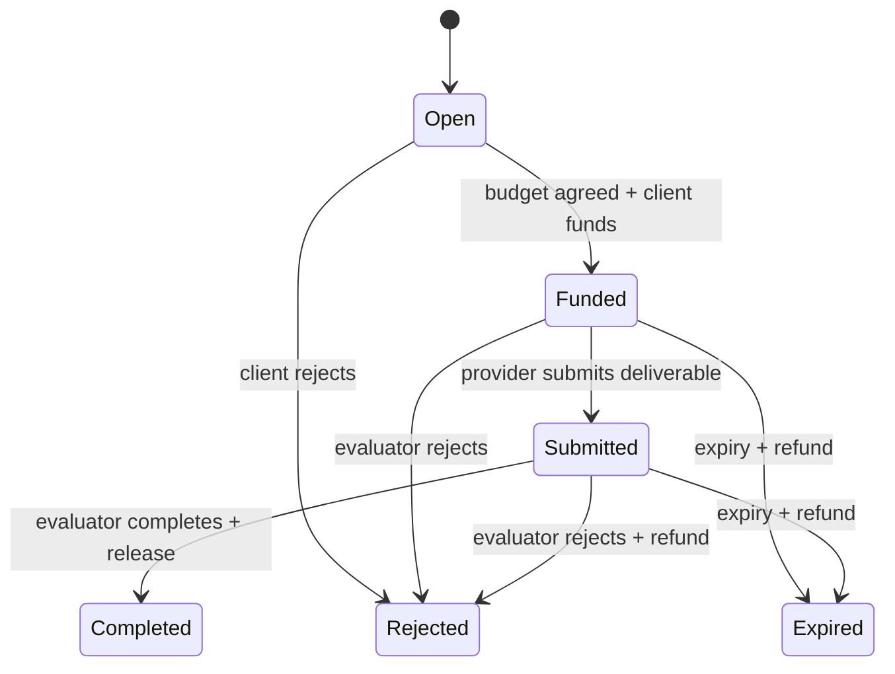

# x402、x402b 与 ERC-8183：Agent 支付、托管、争议和对账

<a id="oral-card"></a>

## 要点卡

[返回 P0 知识图谱](../_meta/p0-knowledge-graph.md)

!!! abstract "30 秒回答"

    x402 用 HTTP 402 协商支付要求，Client 生成 Payment Payload，Resource Server 本地或经
    Facilitator 验证并结算；它适合 API、内容和按次调用，但 verify、settle、链确认与业务
    fulfillment 不是同一原子事务。x402b 是 Pieverse 对 x402 的厂商扩展，不应当成通用标准。
    ERC-8183 当前也是 Draft，用 Client、Provider、Evaluator 和 escrow job 表达长任务：
    Open、Funded、Submitted，再进入 Completed、Rejected 或 Expired。平台要用 Adapter
    隔离协议版本和厂商差异，以 payment/job intent 统一幂等、预算、账本、UNKNOWN 对账、
    退款和争议，不能让 Agent 自由签无限金额或把“已验证”说成“已完成”。

**3 分钟展开**

1. x402 的协商围绕 `scheme + network + asset + amount + payTo`；当前公开实现支持的 scheme
   会演进，客户端和 Facilitator 必须显式声明支持矩阵，不能只看“支持 x402”。
2. `/verify` 只判断 payload 是否满足要求，`/settle` 才尝试执行支付；昂贵或不可逆业务要明确
   settle-before-work、reservation 或补偿策略。
3. x402b 应以“Pieverse 声明的扩展”描述，其 gasless、特定资产/收据能力需要独立适配和验收，
   不能推导为 x402 Foundation 的规范保证。
4. ERC-8183 的 Evaluator 是释放或退款的关键权力点；需要处理 evaluator 偏置/失联、
   expiry、hook 风险、链上 reorg 和链下交付物证据。

| 记忆槽 | 内容 |
|--------|------|
| 三个不变量 | verify 不等于 settle；settle 不等于业务完成；退款/冲正是新账务事件而非改历史 |
| 手画图 | `402 → payment payload → verify → work/reserve → settle → chain receipt → ledger/reconcile` |
| 项目落点 | 用 Launchpad 类 DEX 的账本、分账、链上确认和 UNKNOWN 对账经验讲执行面；没有真实 x402/8183 上线就明确是协议接入设计 |
| 一个取舍 | x402 按请求摩擦低但业务原子性弱；ERC-8183 托管适合长任务但增加资金占用、Evaluator 与合约风险 |

**错误表达**

- ❌ “x402 收到支付签名就已经付款成功，而且 Agent API 与付款天然原子。”
- ✅ “Payment Payload 先被验证，再按 scheme 结算；链确认和资源交付要由业务状态机串联与对账。”
- ❌ “x402b 是 Coinbase 官方 x402 的 BNB 版本；ERC-8183 已经是稳定标准。”
- ✅ “x402b 是 Pieverse 厂商扩展；ERC-8183 当前是 Draft，都应隔离在可替换 Adapter 后。”

**自测追问**：Resource Server 已完成昂贵计算，但 Facilitator `/settle` 超时，应该如何判定和恢复？

## 10 分钟版（支付状态机 + Agent Commerce）

### 先区分三个协议对象

| 对象 | 定位 | 典型场景 | 主要信任/失败点 |
|------|------|----------|-----------------|
| x402 | HTTP 资源按次/按量支付协议 | API、数据、内容、短调用 | Facilitator、链结算、交付原子性 |
| x402b | Pieverse 的 x402 扩展 | 其生态的 gasless 支付和收据 | 厂商、资产、relayer、收据实现 |
| ERC-8183 | 带 Evaluator 的 job escrow Draft | 长任务、可验收服务 | Evaluator、expiry、hook、合约 |

三者可以组合，但不是替代关系。例如 A2A Agent 可以先用 x402 支付一次数据查询，也可以为一个
持续数小时的交付任务创建 ERC-8183 escrow job。

### x402 标准流程



公开规范允许 Resource Server 自行验证/结算，也可以委托 Facilitator。生产系统要显式选择：

- 使用哪个 Facilitator，还是 self-facilitate；
- `scheme/network` 支持矩阵；
- asset、token contract、decimals、recipient 和金额上限；
- 验证后先做工作还是先结算；
- 需要何种 inclusion/finality 才交付不可逆资源；
- Facilitator 超时、链拥堵、reorg 或返回矛盾时如何 reconcile。

不能假定公开测试 Facilitator 就是主网生产默认，也不能把 Facilitator 当成替业务承担所有支付
风险的托管银行。

### Scheme 与 Network 必须作为组合能力

当前 x402 Foundation 仓库列出的 scheme 包括 `exact`、`upto` 和 `batch-settlement`，但这是
版本敏感信息。关键设计原则是：

```text
capability = protocol_version + scheme + network + asset + facilitator
```

- `exact`：支付固定金额；
- `upto`：授权上限，服务端按实际使用量结算；
- `batch-settlement`：通过托管/凭证等机制批量结算小额请求；
- 同名 scheme 在 EVM 与 Solana 等网络上的 payload、签名和结算实现可能不同。

SDK 不应只有 `supportsX402 bool`，而应返回明确矩阵和限制。金额使用整数最小单位，禁止浮点；
asset 必须绑定 chain/network 和 contract/mint，不能只用 `USDC` 字符串。

### verify、settle、fulfill 与账本是四个事实



- **Authorized/Verified**：payload 看起来满足要求，不代表链上资金已移动。
- **Paid/Settled**：支付达到产品要求的链上水位，不代表 Client 已收到资源。
- **Fulfilled**：资源或服务已交付，不代表财务账、平台费和商户应收已经完成。
- **Unknown**：任一跨网络边界超时后，先按 payment intent、payload hash、tx hash、sender/
  nonce 或 Facilitator 查询事实。

HTTP 200、Facilitator success 和链 receipt 都只是不同观察。账本应记录每条资金腿和业务事件，
并通过对账把观察提升为可结算事实。

### x402b 的安全表达

Pieverse Whitepaper 将 x402b 描述为对 x402 的扩展，加入 gasless、特定稳定资产和收据能力。
正确的工程处理是：

```text
Open x402 Core
  └─ PaymentAdapter
      ├─ Foundation-compatible scheme/network
      └─ Pieverse x402b extension
```

接入前必须验证：

- 实际 wire schema 与所基于的 x402 版本；
- relayer 是否可篡改 recipient、amount、deadline 或 replay domain；
- gasless 授权的 nonce、validAfter/validBefore、chain 和 token 绑定；
- wrapped asset 的 mint/redeem、储备、暂停与跨链风险；
- 收据由谁签发、hash 承诺什么、链上/链下存储及删除/隐私边界；
- Facilitator、relayer、receipt service 的故障和退出方案。

不要把 Whitepaper 中的合规或会计宣传直接表述成系统天然满足某司法辖区要求；是否满足仍需看
实际数据、流程、控制和法律意见。

### ERC-8183 状态机

截至本文复核，ERC-8183 页面标记为 **Draft**。它定义 Client、Provider、Evaluator 三个角色
以及六个状态：



| 角色 | 权力 | 风险 |
|------|------|------|
| Client | 创建、设定/同意预算、出资 | 恶意拒付诉求、描述模糊 |
| Provider | 协商预算、提交交付物、完成后收款 | 低质量/虚假 deliverable |
| Evaluator | 对 Submitted 完成或拒绝，Funded 阶段可拒绝 | 偏置、串谋、私钥泄漏、失联 |

Evaluator 可以是 Client，也可以是第三方地址或验证合约。选择谁不是实现细节，而是商业信任模型：

- Client 自评摩擦低，但 Provider 承担客户恶意拒绝风险；
- 第三方评估提高中立性，但产生费用、可用性和串谋风险；
- 自动验证适合可机器判定任务，但必须定义输入、输出和证明；
- 多方仲裁需要额外协议，不能假装单 Evaluator 原语已经包含完整争议法庭。

### Hook 与扩展风险

ERC-8183 Draft 提供可选 Hook 扩展 KYC、分账、转移或竞价等逻辑。Hook 增加组合能力，也增加：

- 外部调用与重入面；
- Hook revert 导致核心动作不可用；
- 创建 job 后升级 Hook，改变进行中任务语义；
- Hook 自持资产后的恢复路径；
- core escrow 与 Hook escrow 的双账对账；
- expiry/refund 路径不对称造成资金滞留。

高风险 Hook 要经过 allowlist、审计、不可变版本和故障演练；不能因为 core contract 使用
`nonReentrant` 就认为所有外部资产和回调状态都安全。Draft 明确让 core `claimRefund` 不经过
Hook，避免恶意 Hook 阻断到期退款；但 Hook 额外托管的资产仍必须设计独立、可验证的恢复路径。

### x402 与 ERC-8183 怎么选

| 问题 | x402 更合适 | ERC-8183 更合适 |
|------|-------------|-----------------|
| 服务时间 | 单次、短调用 | 长任务、异步交付 |
| 验收 | 返回资源即可检查 | 需要 evaluator/attestation |
| 资金模式 | 按次、按量、批结算 | 预算先托管、终态释放/退款 |
| 争议 | 主要靠退款/平台流程 | 有明确 Evaluator，但完整仲裁仍需扩展 |
| HTTP 集成 | 原生 | 需要 API/A2A 映射链上 job |

不要为了追逐新标准把所有调用都上链。低价值、高频、可补偿请求可能使用 off-chain credit 或批量
结算；高价值、长交付、跨组织任务才值得承担 escrow 的 gas 和资金占用。

### 统一 Commerce Ledger

```text
commerce_intent
  - tenant / buyer / seller / agent refs
  - protocol + adapter version
  - scheme / network / asset / amount
  - purpose / resource / job digest
  - budget policy / approval subject
  - payment payload digest / remote job id
  - payment state / fulfillment state / dispute state
```

账务事件使用追加式记录：

- authorization/reservation 不记作最终结算；若占用可用额度，则单独记录 reservation，
  不改写 settled balance；
- settlement、platform fee、evaluator fee、merchant payable 分腿记账；
- refund/reversal 是反向账务事件，不修改原支付；
- 链上事件保存 block lineage 并处理 reorg；
- 业务 order/job、Facilitator 记录、链上交易和内部账本进行三/四方对账。

## 生产场景

一个 Agent 购买研究报告并执行后续交易：

1. Policy Engine 根据 tenant 日预算和报告价格批准 payment intent。
2. Agent 收到 402 后校验 network、asset、amount、recipient、resource digest 和过期时间。
3. 隔离钱包签署有界 payload；Resource Server 验证并执行/结算。
4. 报告交付保存 content digest；支付和交付分别进入账本。
5. 报告若触发链上交易，要新建交易 intent 和独立审批，不能复用购买报告的支付授权。
6. settle 或 delivery 超时进入 UNKNOWN，通过 Facilitator、链和服务端 receipt 对账。

## 排查与观测

- `quote/verify/settle/finality/fulfill/refund` 分段延迟和成功率；
- 按 `protocol-version/scheme/network/asset/facilitator` 统计错误；
- unknown age、重复 payload、replay rejection、settlement reorg、delivery mismatch；
- ERC-8183 监控 funded/submitted age、expiry、evaluator concentration 和 reject ratio；
- 对账主键串起 intent id、payload digest、facilitator id、tx hash、job id、ledger entry。

## 架构取舍

| 方案 | 优点 | 风险 |
|------|------|------|
| verify-then-work | 延迟较低 | 工作完成后结算可能失败 |
| settle-then-work | 资金确定性较高 | Client 先付款，交付失败需退款 |
| escrow job | 双方约束、可验收 | 资金占用、Evaluator 与合约复杂度 |
| 平台内部余额/信用 | 高频低成本 | 托管、合规、信用和集中风险 |

选择依据是 value at risk、工作可逆性、交付验证能力、链成本与争议模型，不是哪个协议更新。

## 深挖问答

1. **x402 的 `/verify` 是否完成付款？** → 否；它验证 payload，实际资金移动由 settle 流程处理。
2. **Facilitator 超时能否换一个重试？** → 先查原 payload/链上事实；多个 Facilitator 可能造成重复提交或状态分叉。
3. **x402b 是什么？** → Pieverse 对 x402 的厂商扩展，应按其具体版本和资产/relayer 模型验收。
4. **ERC-8183 为什么需要 Evaluator？** → Provider 提交不等于达标，由 Evaluator 决定释放或退款。
5. **Expired 是否一定自动退款？** → 规范状态允许 expiry 后触发 refund，但链上状态转换通常仍需交易执行。
6. **支付成功但资源没返回怎么办？** → 进入 delivery unknown，按 receipt 查询、重发交付或按策略退款，账务不删除原支付。

## 反模式与事故

- Agent 只校验 `amount`，没有绑定 network、asset、recipient 和 resource，被替换收款目标。
- `/settle` timeout 后签新 payload，旧新两笔最终都上链。
- 把测试 Facilitator 固定进生产核心，主网网络/资产不受支持时才发现。
- x402b 适配器泄漏厂商字段到公共 SDK，无法升级或切换实现。
- ERC-8183 Evaluator 私钥单点泄漏，攻击者批量完成恶意 job 并释放资金。
- Hook 升级改变进行中 job 的分账和恢复逻辑，产生不可对账余额。

## 延伸阅读

- [x402 Foundation Repository](https://github.com/x402-foundation/x402)
- [Coinbase x402 Documentation](https://docs.cdp.coinbase.com/x402/welcome)
- [Pieverse x402b Whitepaper](https://www.pieverse.io/whitepaper)
- [ERC-8183: Agentic Commerce](https://eips.ethereum.org/EIPS/eip-8183)
- 关联：[S-PAY-01 Web3 支付状态机](../18-web3-payments-stablecoin/S-PAY-01-payment-state-idempotency-reversal.md)、
  [S-PAY-04 清结算与对账](../18-web3-payments-stablecoin/S-PAY-04-ledger-clearing-settlement-reconciliation.md)
