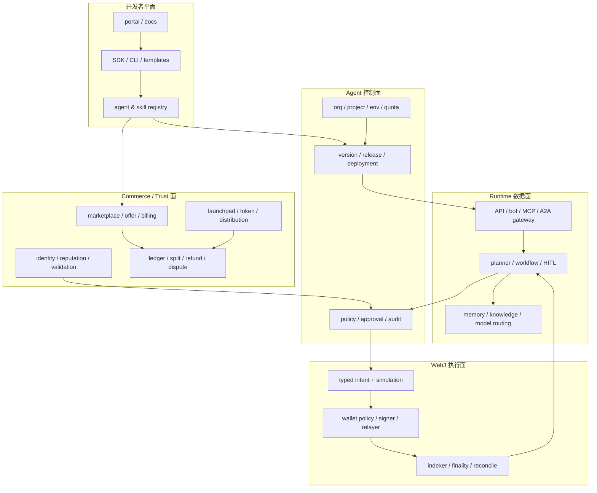
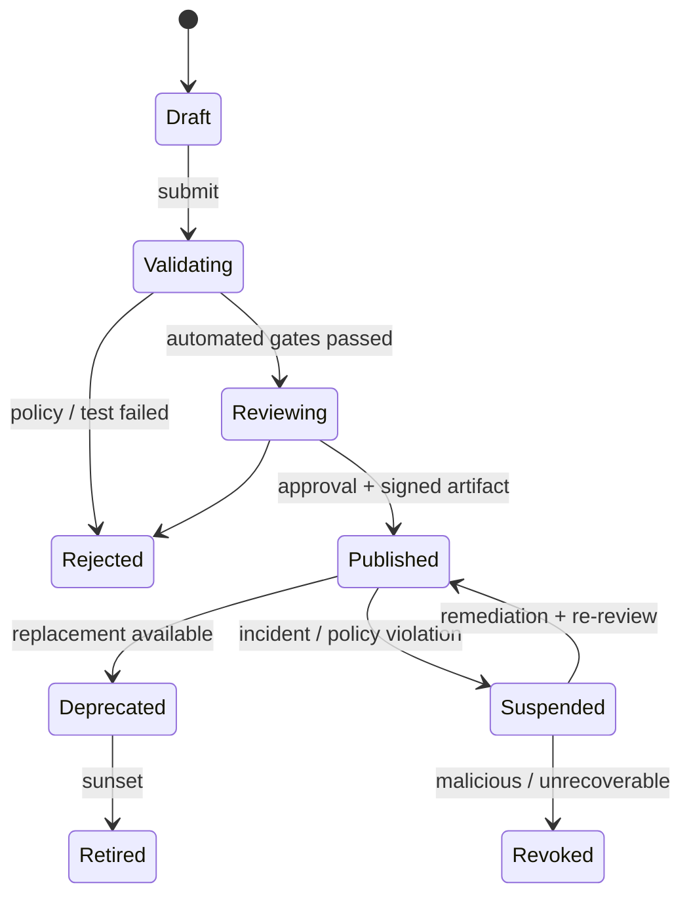

# Crypto Agent SDK、开放平台、Marketplace 与 Launchpad 架构

<a id="oral-card"></a>

## 口述卡（高频必背）

[返回 P0 知识图谱](../_meta/p0-knowledge-graph.md)

!!! abstract "30 秒回答"

    Crypto Agent 生态不是在 LLM 外包一层钱包 API。我会把系统拆成开发者平面、Agent 控制面、
    Runtime 数据面、Web3 执行面和 Commerce/Trust 面：开发者通过 SDK/CLI 创建版本化 Agent
    与 Skill；控制面负责租户、发布、策略和兼容；Runtime 负责工作流、Memory、MCP/A2A；
    执行面把模型 intent 经过模拟、限额、审批和隔离签名后上链；Commerce 面处理身份、支付、
    分账、信誉和争议。Marketplace 是能力发现和交易，Launchpad 还涉及 Agent/Token 创建、
    发行与持续运营。公共契约要 framework-neutral，并用签名制品、SBOM、权限清单、沙箱、
    版本治理和 conformance test 控制插件与供应链风险。

**3 分钟展开**

1. 稳定开放 API 不直接暴露 LangGraph node、ElizaOS action 或 GAME worker，而是定义平台
   `Agent/Version/Skill/Deployment/WalletPolicy/CommerceOffer`，由 Adapter 接不同框架。
2. Agent、Skill 和 Deployment 分离：发布版本不可变，环境绑定凭据，回滚切换 deployment，
   不能在线改包后继续沿用旧审批和审计结论。
3. 钱包能力默认 deny：模型只产生 intent；策略层校验 chain、asset、contract、calldata、
   amount、slippage、session key、budget 和 HITL，Signer 不接收自然语言。
4. Marketplace/Launchpad 需要发布审核、恶意插件隔离、计费分账、退款争议、Reputation/Sybil、
   Token 机制风险和下架/退出路径，不只是一个搜索页和发币合约。

| 记忆槽 | 内容 |
|--------|------|
| 三个不变量 | 发布制品不可静默变化；模型不能直达无限额度签名；平台下架不等于链上资产可撤销 |
| 手画图 | `SDK/Portal → Control Plane → Runtime → Policy/Wallet → Chain`，旁路 `Marketplace/Commerce/Trust` |
| 项目落点 | OctoAgentFlow 讲 Agent 控制面和工作流设计；生产级 Launchpad 类 DEX 讲链上执行、Indexer、分账和团队交付；不要声称两者已在同一生产系统融合 |
| 一个取舍 | 平台抽象提高生态兼容和治理，但过度统一会压平框架创新；稳定核心 + 显式扩展更合适 |

**错误表达**

- ❌ “支持 LangChain、CrewAI、ElizaOS 就等于建成 Agent 开放平台。”
- ✅ “框架只是 Runtime Adapter；开放平台还要有稳定契约、租户/权限、发布、SDK、兼容、计费和运营治理。”
- ❌ “Agent 拥有钱包，所以模型决定后可以直接签名交易。”
- ✅ “钱包属于受策略约束的执行面，模型只能提交有界 intent，签名服务执行代码化 policy。”

**自测追问**：一个已发布 Skill 被发现存在供应链后门，如何阻止新调用、处理运行中任务并追溯影响面？

## 10 分钟版（五个平面 + 生态治理）

### 总体架构



### 核心域对象

| 对象 | 关键字段 | 不变量 |
|------|----------|--------|
| Organization/Project | tenant、owner、plan、region | 跨租户数据和凭据不可共享 |
| Agent | 稳定 ID、owner、metadata | Agent 是逻辑身份，不直接等于进程或钱包 |
| AgentVersion | artifact digest、manifest、schema、runtime | 发布后不可变 |
| Skill/Tool | 输入输出、side effect、权限、成本 | 描述和 annotation 不是授权 |
| Deployment | version、environment、config、replicas | 回滚是切换版本，不覆盖历史 |
| CredentialBinding | provider、scope、secret ref | 密钥不进入 manifest/prompt/log |
| WalletPolicy | chain、asset、contract、limit、approval | Signer 只执行代码化策略 |
| Offer | seller、capability、price、SLA、terms | 能力版本和价格必须可追溯 |
| CommerceJob | buyer/provider、budget、deliverable、state | 支付、交付和争议状态分离 |
| ReputationSignal | reviewer、tag、evidence、window | 原始信号可审计，聚合版本化 |

### SDK 设计：稳定核心，不泄漏框架对象

建议 SDK 分层：

```text
core        AgentRef / Intent / Task / Artifact / Error / Pagination
auth        OAuth/OIDC/API key/wallet challenge
agents      create version deploy invoke observe cancel
tools       MCP-compatible discovery and execution
a2a         remote agent discovery/task adapter
wallet      quote simulate requestApproval submit getReceipt
commerce    offer quote pay job dispute refund
webhooks    signed events cursor replay
```

工程要求：

- OpenAPI/JSON Schema/Proto 作为 wire contract，手写 SDK 只封装语言体验；
- 每次 release 生成 changelog、兼容说明、golden fixtures 和最小示例；
- timeout、context cancellation、pagination、rate-limit、retry-after 和幂等键是一等能力；
- SDK 自动重试仅限已证明安全的请求，创建任务、支付和交易默认不盲重试；
- 错误分为 validation、auth、policy、rate-limit、remote、unknown，不只返回字符串；
- Go、Python、TypeScript SDK 对相同 fixture 产生一致 canonical payload/digest；
- 废弃先 telemetry 观察，再 warning、迁移窗口和 sunset，不能突然删除。

### Framework Adapter

不同框架关注点不同：

- LangGraph/OpenAI Agents 等侧重 graph/run、tool、handoff、checkpoint/HITL；
- ElizaOS 使用 actions、providers、evaluators、services 等插件组件；
- Virtuals GAME 将目标、状态和可执行函数组织为 Agent 决策能力；
- Crypto-native 平台还会把钱包、交易、Token 和商业协议嵌入 Runtime。

公共平台只标准化必要语义：

```text
Load(version) → Start(intent) → Observe(run) → Pause/Resume → Cancel → ExportReceipt
```

框架特有 memory、planner、worker 层级放在 extension namespace。Adapter 必须声明：

- 支持哪些 checkpoint/HITL/streaming/cancel 语义；
- 外部副作用是否可查询、幂等和补偿；
- 运行时版本及兼容范围；
- 未支持能力是拒绝还是降级，禁止静默模拟成功。

### Agent/Skill 发布流水线



发布门禁：

1. manifest/schema 校验和 canonical digest；
2. 依赖锁定、license、SBOM、漏洞和 provenance；
3. secret/PII 扫描、静态分析和恶意 prompt/instruction 检测；
4. Tool 权限、网络 egress、文件系统、CPU/内存/时间/成本声明；
5. 沙箱动态测试、mock wallet、恶意输入和超时取消；
6. 兼容/回归/conformance 测试；
7. 高风险 Skill 人工审核和签名发布；
8. 上线 canary、kill switch、版本回滚和审计。

Skill 包被签名只证明制品来源和完整性，不证明代码无漏洞。运行时仍需最小权限、沙箱、egress
allowlist 和高风险 action 审批。

### 多租户与凭据

资源层级建议：

```text
organization
  └─ project
      └─ environment(dev/staging/prod)
          ├─ agent deployment
          ├─ credentials
          ├─ wallet policy
          └─ quota / billing
```

- Agent Version 不包含环境 secret；Deployment 只引用 secret manager 中的版本化凭据；
- Tool 从可信 auth context 解析 tenant，忽略模型参数中的 `tenant_id`；
- end user、agent、service account、wallet owner 分别建模；
- 跨 Agent 委托传递 delegation chain、scope、deadline 和 budget，不传万能 token；
- 成本限额同时覆盖 LLM token、Tool/API、链上 gas 和商业支付。

### Web3 执行面


Signer 接收的是固定 schema 和 digest，不接收自然语言。策略至少校验：

- chain、account、asset、contract/program、method/instruction；
- amount/notional、slippage、gas/fee、单笔/日累计和速率；
- allowance、delegate/session key、deadline 和 nonce；
- 模拟区块、状态依赖和 simulation freshness；
- recipient 风险、Token/合约版本、pause 和 incident state；
- approval subject 与最终 calldata/message digest 一致。

广播 timeout 进入 UNKNOWN；按链特有 sender/nonce、signature、tx hash 和 finality 查询，不能让
模型重新规划一笔“看起来相同”的交易。

### Marketplace、Registry 与 Launchpad 不要混

| 产品 | 核心价值 | 额外风险 |
|------|----------|----------|
| Registry | 发布、版本和发现 Agent/Skill | 恶意包、仿冒、供应链 |
| Marketplace | 报价、购买、调用、评价和分账 | 虚假能力、刷量、退款、争议 |
| Launchpad | 创建/发行/融资/分配 Agent 或 Agent Token | 证券/合规、Rug、价格操纵、流动性 |

Marketplace 的上架对象可以是：

- 托管 Agent 服务；
- 可部署 Agent 包；
- Tool/Skill/MCP Server；
- 数据、模型或工作流模板；
- 带 SLA 的人工/Agent 混合服务。

必须说明买家买的是代码、调用额度、任务结果还是 Token 权益。Token 所有权通常不自动等于：

- Agent 运行控制权；
- IP/模型权利；
- 收益分配权；
- 治理权；
- 对 Agent wallet 的签名权。

这些权利要在合约、平台条款和权限模型中逐项定义，不能靠“Agent Token”一个词概括。

### Launchpad 生命周期

```text
prototype
  → security/review
  → identity + metadata
  → token/ownership configuration
  → launch mechanism + liquidity/distribution
  → runtime deployment
  → revenue/fee routing
  → upgrades/governance
  → suspension/retirement
```

在 DEX/Launchpad 经验上还要增加：

- Agent runtime 与 Token 合约升级是否耦合；
- 收入来自 Agent 服务、交易费还是 Token 激励；
- 分账合约如何处理退款、chargeback 和协议费用；
- 团队/投资人 vesting、LP、价格操纵和 MEV；
- Agent 被停用后 Token、资金库和用户任务如何退出；
- 链下平台下架无法撤销用户已持有的链上资产。

### Commerce 与 Trust

- ERC-8004 可作为身份/反馈/验证锚点，但 Draft 和 Sybil 边界必须显式；
- x402 适合短请求，job escrow 适合长交付；两者都进入统一 Commerce Ledger；
- 评价只有在真实完成/支付/退款证据绑定后才降低刷量成本，仍不能完全防 Sybil；
- 平台抽成、开发者应收、Evaluator fee、Affiliate 和退款分别记账；
- Reputation 聚合算法、reviewer 集合和时间窗口都要版本化；
- 高风险钱包权限不能由 Marketplace 星级自动放开。

### 开发者体验与生态指标

平台是否成功不能只看 Agent 数量：

| 阶段 | 指标 |
|------|------|
| Onboarding | time-to-first-agent、首次部署成功率、文档搜索失败 |
| Build | SDK error、schema/conformance failure、测试环境稳定性 |
| Publish | review lead time、拒绝原因、漏洞/恶意包发现率 |
| Run | task success、P95 latency、unknown、cost、HITL rate |
| Economy | paid active agents、真实成交、退款/争议、开发者留存 |
| Safety | 越权拦截、重复支付、钱包损失、kill-switch MTTR |

下载量、注册 Agent 数和 Token 市值容易被刷，不能单独作为生态健康指标。

### 竞品研究应该看什么

不要背宣传口号，按同一张表拆解：

| 维度 | 观察问题 |
|------|----------|
| Runtime | planner、memory、workflow、checkpoint、multi-agent |
| Extension | Tool/Plugin/Skill 模型、权限和发布 |
| Wallet | 托管/非托管、chain、session、policy、recovery |
| Commerce | 定价、支付、escrow、分账、退款 |
| Launch | Agent/Token 创建、流动性、治理和退出 |
| Openness | SDK、API、MCP/A2A、导出、协议/数据可迁移性 |

例如 ElizaOS 官方文档强调插件的 actions/providers/services 等组件；Virtuals GAME 强调目标、状态、
函数和决策引擎；Bankr/ClawPump 的公开资料则可以用于观察 Agent API、钱包执行和 MCP-first
Crypto 操作。面试时应说明“研究其公开接口和技术路线”，不要把未读源码或未运行环境说成深度
生产经验。

## 生产场景

开发者发布一个跨链资产管理 Agent：

1. CLI 生成 manifest、Tool schema 和 WalletPolicy，CI 产出 SBOM 和签名 artifact。
2. 沙箱只连接 test wallet，验证恶意 prompt、超额交易、重复 submit 和 provider timeout。
3. 审核通过后发布不可变 AgentVersion；生产 Deployment 绑定独立凭据和 session key。
4. 用户通过 Marketplace 购买服务，Commerce Ledger 记录报价、支付和交付。
5. 每个交易 Intent 独立经过 simulation、budget 和审批；Signer 执行有界交易。
6. Indexer 确认 canonical receipt，收入按规则分账；UNKNOWN、退款和争议进入独立状态机。

## 排查与观测

- `org/project/env/agent/version/deployment/run/intent/wallet/tx` 全链路关联；
- 统计不同框架 Adapter、SDK 版本和 Skill digest 的故障率；
- 供应链事故反查所有受影响 Deployment、运行任务、凭据和钱包动作；
- 发布、策略、审批、签名、交易、支付和分账分别保存审计事件；
- 运行时日志不包含 secret、私钥、完整 wallet signature、敏感 memory 或跨租户 prompt。

## 架构取舍

| 方案 | 优点 | 风险 |
|------|------|------|
| 全托管 Agent + Wallet | 开发体验好、平台易观测 | 托管、密钥、合规和平台集中风险 |
| 自托管 Runtime，平台只做 Registry | 开放、故障域分散 | 兼容、SLA、计费和安全难统一 |
| 混合控制面 + 可插拔执行面 | 平衡治理和生态开放 | 协议、身份与审计映射复杂 |

技术负责人需要先写清信任假设、资金边界和可迁移性，再选择托管程度；不能先选框架，再让安全和
商业模型追着实现补洞。

## 追问链

1. **开放平台和 Agent 框架的区别？** → 框架解决运行时编程，平台还负责租户、发布、SDK、权限、计费、兼容和运营。
2. **为什么 AgentVersion 要不可变？** → 保证审批、审计、回滚和事件都能还原当时实际代码与 schema。
3. **如何做到 vendor-neutral？** → 公共 canonical contract + Adapter + 扩展协商 + 跨 SDK conformance，而不是假装所有框架能力相同。
4. **Skill 签名后能否直接信任？** → 只能证明来源/完整性，还需漏洞扫描、沙箱、最小权限和运行时策略。
5. **Marketplace 与 Launchpad 有什么区别？** → 前者核心是能力/服务发现交易，后者还包含创建、发行、分配、流动性和持续治理。
6. **如何阻止模型盗走钱包资金？** → 模型不持根密钥，只提交 typed intent；Policy、审批、session limit、隔离 Signer 和链上对账共同约束。

## 反模式与事故

- 公共 API 直接暴露框架 checkpoint 数据结构，框架升级导致所有 SDK 破坏性变更。
- 在线修改已发布 Skill 包但版本号不变，旧审批无法证明批准了什么代码。
- MCP Tool 声明 `readOnly` 就免审，实际实现可转账或外发数据。
- 所有 Agent 共用一个平台热钱包/API key，单个租户注入导致横向失陷。
- 下架恶意 Agent 但未吊销 Deployment、session key 和 webhook，后台继续运行。
- 只按 Token 市值和 Agent 数衡量生态，忽略真实调用、退款、争议和安全事故。

## 延伸阅读

- [MCP Specification](https://modelcontextprotocol.io/specification/2025-11-25)
- [A2A Protocol](https://a2a-protocol.org/latest/)
- [ElizaOS Plugin Architecture](https://docs.elizaos.ai/plugins/architecture)
- [Virtuals GAME Framework](https://whitepaper.virtuals.io/builders-hub/game-framework)
- [Bankr Agent API](https://docs.bankr.bot/agent-api/overview/)
- [ClawPump Documentation](https://clawpump.tech/docs)
- 关联：[S-AI-09 Agent 工作流与 HITL](./S-AI-09-agent-workflow-hitl-publishing.md)、
  [S-ARCH-15 API 版本与发布](../03-system-design/S-ARCH-15-release-strategy.md)、
  [S-SEC-03 SBOM 与供应链](../21-security-engineering/S-SEC-03-sbom-provenance-release-admission.md)
