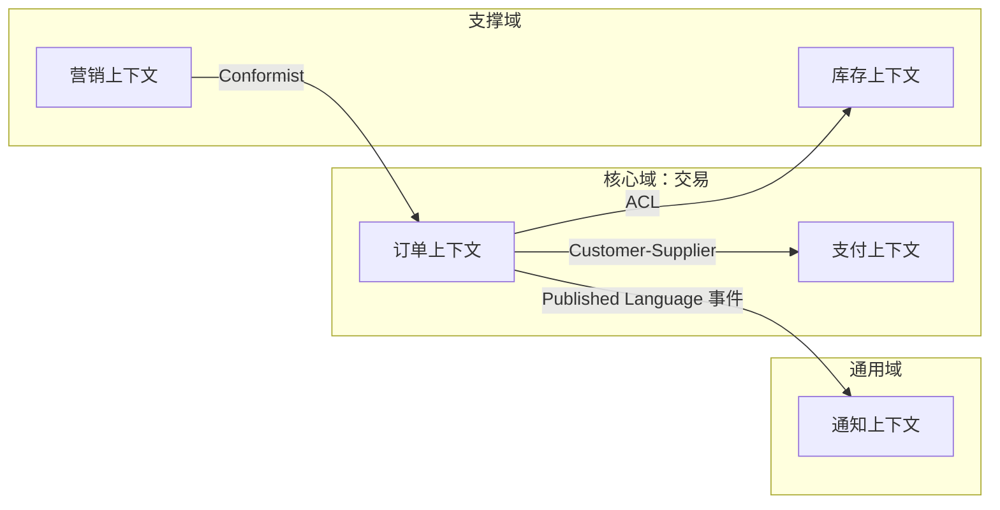

# 限界上下文与 DDD 战略设计

## 30 秒版（开场）

> 架构师先画 **限界上下文（Bounded Context）**，再谈微服务：每个上下文有 **统一语言 + 数据所有权 + 独立演进**。集成用 **上下文映射**（ACL、防腐层、Published Language）。与 [S-ARCH-14](../03-system-design/S-ARCH-14-microservice-boundary.md) 的区别：本题为 **战略设计**，不是「拆几个服务」。

## 3 分钟版（一面深度）

1. **是什么**：DDD 战略设计 = 子域划分（核心/支撑/通用）+ 限界上下文 + 上下文间关系。
2. **为什么**：架构师面试常要求「电商怎么划域」；没有上下文边界会导致 **模型污染**（同一词在不同域含义不同，如「用户」在营销 vs 交易）。
3. **怎么做**：Event Storming 或领域 workshop → 识别聚合根 → 一上下文一团队（Conway）→ 跨上下文只通过 API/事件，禁止跨库 JOIN。

## 10 分钟版（原理 + 图示）



**子域分类（面试必讲）**

| 类型 | 投入 | 示例 |
|------|------|------|
| 核心域 | 自研、最优团队 | 交易、定价 |
| 支撑域 | 必要但非差异化 | 库存、报表 |
| 通用域 | 买/开源 | 短信、对象存储 |

**聚合与一致性边界**

- **聚合根**是唯一事务入口（如 `Order` 改状态，不直接改 `OrderLine` 外库字段）
- 跨聚合 **最终一致**（领域事件 `OrderPaid`）
- Go 实现：领域层纯 struct + repo 接口；应用层 orchestrate；基础设施层 GORM/MySQL

**上下文映射关系（常考）**

| 关系 | 含义 |
|------|------|
| Shared Kernel | 共享少量模型（慎用，耦合高） |
| Customer-Supplier | 下游依赖上游 SLA |
| ACL 防腐层 | 翻译外部模型，保护内部域 |
| Open Host Service | 对外统一 API/事件 schema |

## 生产场景

- **大促前划域**：营销临时需求不能污染订单核心模型 → 营销上下文通过 ACL 调订单
- **多 BU 合并**：两套「会员」定义 → 先统一 Published Language，再渐进合并
- **Go 单体先模块化**：按 package/context 分包，再物理拆服务（见 S-SOL-02）

## 排查与工具

- Event Storming 贴纸墙、Miro 上下文图
- 架构决策记录 [S-ARCH-20 ADR](../03-system-design/S-ARCH-20-tech-decision-doc.md)
- 代码：`internal/order/` vs `internal/billing/` 包边界审查

## 架构取舍

| 过度拆分 | 不足拆分 |
|----------|----------|
| 分布式事务爆炸 | 单体部署风险 |
| 团队沟通成本 | 领域模型互相践踏 |

**何时不强行 DDD**：CRUD 后台、PoC、生命周期 < 1 年的项目。

## 追问链

1. **聚合多大合适？** → 一次事务内保持一致；通常 1 个根 + 少量实体。
2. **和微服务一一对应吗？** → 理想上一上下文一服务，初期可多上下文同进程。
3. **Go 没有继承怎么做 DDD？** → 组合 + 接口；聚合根方法封装不变量。
4. **与 S-ARCH-14 关系？** → 14 讲拆不拆；本题讲 **按什么拆**。

## 反模式与事故

- **按技术层拆**（user-dao-service）→ 改需求跨全栈发版
- **共享数据库表** → 上下文边界名存实亡
- **贫血模型** → 业务规则散落在 Gin handler，架构师无法治理

## 代码示例

```go
// 订单聚合根（示意）
type Order struct {
    ID     string
    Status OrderStatus
    Lines  []Line
}

func (o *Order) Pay() error {
    if o.Status != StatusPending {
        return ErrInvalidTransition
    }
    o.Status = StatusPaid
    return nil
}
```

## 延伸阅读

- [Bounded Context - Martin Fowler](https://martinfowler.com/bliki/BoundedContext.html)
- [Azure 域分析](https://learn.microsoft.com/en-us/azure/architecture/microservices/model/domain-analysis)
