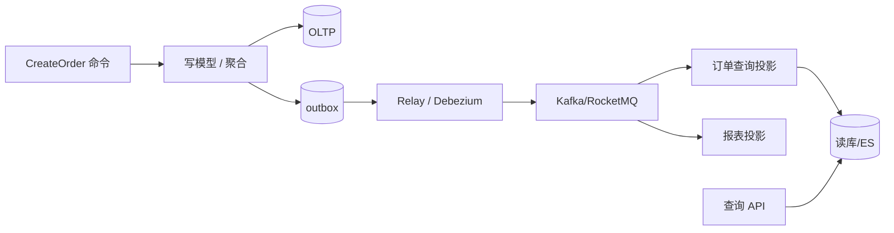

# 事件驱动、CQRS 与一致性边界

## 30 秒版（开场）

> **事件驱动**解耦生产者与消费者；**CQRS** 读写模型分离，支撑复杂查询与写路径优化。架构师必须讲清 **何时最终一致、Outbox 怎么保证至少一次、读模型延迟可接受否**。生产关键词：**领域事件、Transactional Outbox、幂等消费**。

## 3 分钟版（一面深度）

1. **是什么**：写侧处理命令改聚合并发事件；读侧订阅事件更新投影（Elasticsearch/Redis/宽表）。
2. **为什么**：读写在 10x 规模需求不同；同步链路过长（见 [S-ARCH-10 MQ 语义](../03-system-design/S-ARCH-10-mq-semantics.md)）。
3. **怎么做**：DB 事务内写业务表 + outbox 表；Relay 发 MQ；消费者幂等更新读模型。

## 10 分钟版（原理 + 图示）



**请求驱动 vs 事件驱动**

| 维度 | 请求驱动 | 事件驱动 |
|------|----------|----------|
| 耦合 | 同步依赖 | 时间解耦 |
| 一致性 | 易强一致 | 最终一致 |
| 适用 | 实时反馈 | 通知、审计、读模型刷新 |

**CQRS 何时上**

| 上 | 不上 |
|----|------|
| 读写比极端、查询模型复杂 | 简单 CRUD |
| 多视图（C 端列表 vs B 端报表） | 强一致读自己的写 |
| 与 Event Sourcing 配合审计 | 团队无 MQ 运维能力 |

**Transactional Outbox（Go 伪代码）**

```go
func (s *OrderService) Create(ctx context.Context, cmd CreateOrderCmd) error {
    return s.db.Transaction(func(tx *gorm.DB) error {
        if err := s.repo.Save(tx, order); err != nil { return err }
        return s.outbox.Insert(tx, OutboxEvent{
            Topic: "order.created", Payload: order.ToEvent(),
        })
    })
}
```

## 生产场景

- **订单创建后**：同步返回 order_id；列表页 ES 索引 1～3s 延迟 → 产品需接受或 **读己之写** 走主库
- **跨域协作**：支付成功发 `PaymentCompleted`，库存/积分各自订阅
- **与 [S-ARCH-12 状态机](../03-system-design/S-ARCH-12-order-state-machine.md) 结合**：状态变迁 = 事件

## 排查与工具

- 消费 lag、投影延迟 P99
- 对账：写侧事件数 vs 读侧更新数
- RocketMQ/Kafka 事务消息 vs Outbox 选型（见 middleware 专题）

## 架构取舍

| Event Sourcing | 仅 CQRS |
|----------------|---------|
| 完整历史、可回放 | 实现轻 |
| 存储与迁移复杂 | 丢历史需另做审计 |

## 追问链

1. **读己之写？** → 写后短 TTL 读主库 / 带 version 强制读新。
2. **事件乱序？** → 分区键 order_id；版本号丢弃旧事件。
3. **Outbox 堆积？** → Relay 扩容；监控 outbox 表深度。
4. **和分布式事务？** → 优先 Saga + 事件，避免 2PC（[S-DIST-05](../middleware/distributed/S-DIST-05-distributed-transaction.md)）。

## 反模式与事故

- **无幂等** → 重复消费双扣库存
- **巨型事件** → MQ 消息含全量订单 JSON 10MB
- **CQRS  everywhere** → 简单系统运维成本翻倍

## 代码示例

消费端幂等键：`consumer_id + event_id` 存 Redis/DB。

## 延伸阅读

- [CQRS - Martin Fowler](https://martinfowler.com/bliki/CQRS.html)
- [Transactional Outbox](https://microservices.io/patterns/data/transactional-outbox.html)
