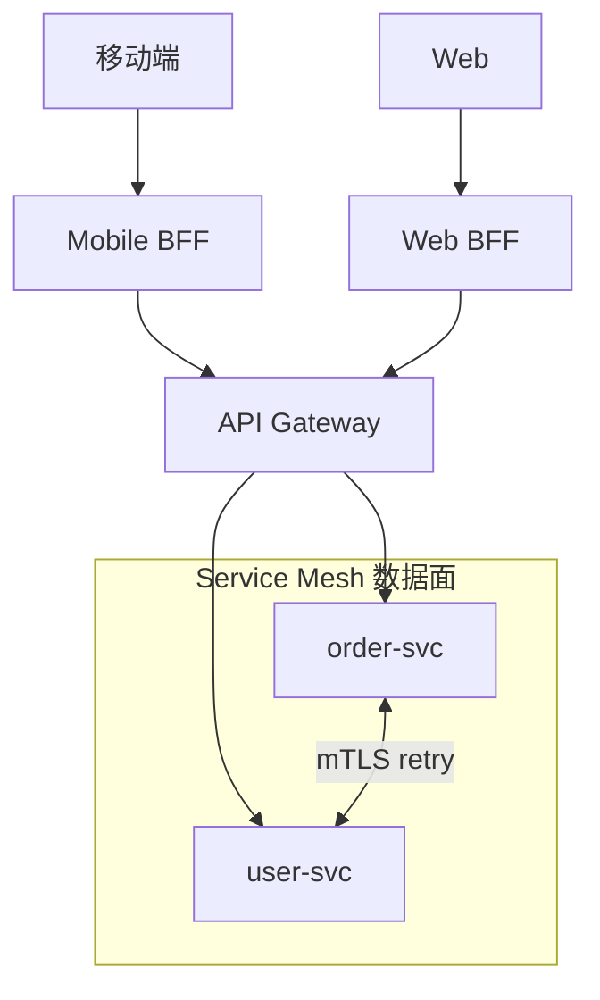

# BFF、API 网关与服务网格职责划分

## 30 秒版（开场）

> **BFF** 为前端/渠道聚合领域 API；**API 网关** 管南北向（鉴权、限流、路由）；**Service Mesh** 管东西向（mTLS、重试、可观测）。架构师面试忌 **三层叠同样逻辑**。生产关键词：**渠道隔离、网关无状态、Mesh 不跑业务逻辑**。

## 3 分钟版（一面深度）

1. **是什么**：BFF = Backend for Frontend，按 App/Web/小程序 定制聚合；网关 = 统一入口；Mesh = Sidecar 代理服务间流量。
2. **为什么**：多客户端需求不同；安全边界在入口；微服务间治理不应侵入每个 Go 服务的 Gin 中间件。
3. **怎么做**：客户端只调 BFF/网关；BFF 调内部 gRPC；Mesh 负责熔断/追踪，BFF 不写 SQL。

## 10 分钟版（原理 + 图示）



**职责矩阵（必背）**

| 能力 | BFF | API 网关 | Service Mesh |
|------|-----|----------|--------------|
| 鉴权 OAuth/JWT | 可选二次 | **主责** | mTLS 服务身份 |
| 限流 | 渠道级 | 全站/租户级 | 服务间配额 |
| 协议转换 | **REST 聚合 gRPC** | 通用 | — |
| 业务编排 | **轻量** | 否 | 否 |
| 熔断重试 | 调下游策略 | 入口 | **Sidecar 统一** |
| 可观测 | 渠道 trace | 入口 metrics | 全链路 span |

**Go 技术栈映射**

| 组件 | 常见选型 |
|------|----------|
| BFF | Gin/Fiber 聚合层 |
| 网关 | APISIX/Kong/Envoy |
| Mesh | Istio/Linkerd + K8s |

与 [S-NET-01 gRPC vs REST](../06-network-governance/S-NET-01-grpc-vs-rest.md)、[S-ARCH-08 限流](../03-system-design/S-ARCH-08-rate-limiting.md) 交叉。

## 生产场景

- **大促**：网关口限流；BFF 降级返回缓存骨架屏；Mesh 自动摘除不健康 Pod
- **多端差异**：Mobile BFF 字段少、Web BFF 含管理字段 — 避免一个 API 撑所有端
- **内部 admin**：独立 Admin BFF + IP 白名单，不走公网网关

## 排查与工具

- 网关 access log vs BFF log vs Mesh trace 三层对齐
- 避免 **retry storm**：Mesh 重试 × 应用重试 叠加

## 架构取舍

| 单 BFF | 多 BFF |
|--------|--------|
| 简单 | 渠道隔离好 |
| 易膨胀 | 运维多份 |

**何时不上 Mesh**：服务 < 20、无 K8s、团队无 SRE — 应用层 resilience（见 S-ARCH-09 熔断）即可。

## 追问链

1. **BFF 能访问 DB 吗？** → 架构师标准答案：**否**，仅调领域服务，防逻辑泄漏。
2. **网关 vs BFF 谁做鉴权？** → 网关验 JWT；BFF 做细粒度权限/聚合。
3. **GraphQL 替代 BFF？** → 部分场景；复杂聚合与缓存仍要服务端设计。
4. **Go 服务如何接 Mesh？** → K8s 注入 sidecar，应用无感；Outbound 走 localhost:15001。

## 反模式与事故

- **胖 BFF** → 第二单体，含订单创建逻辑
- **三层都限流** → 阈值不一致，误杀
- **Mesh 里写业务路由规则** → 不可测试、不可版本化

## 代码示例

```go
// Mobile BFF：聚合订单+用户头像
func (b *MobileBFF) GetOrderDetail(ctx context.Context, id string) (*MobileOrderVO, error) {
    order, err := b.orderClient.Get(ctx, id)
    if err != nil { return nil, err }
    user, _ := b.userClient.Get(ctx, order.UserID) // 降级可 nil
    return toMobileVO(order, user), nil
}
```

## 延伸阅读

- [BFF - Sam Newman](https://samnewman.io/patterns/architectural/bff/)
- [API Gateway pattern](https://microservices.io/patterns/apigateway.html)
