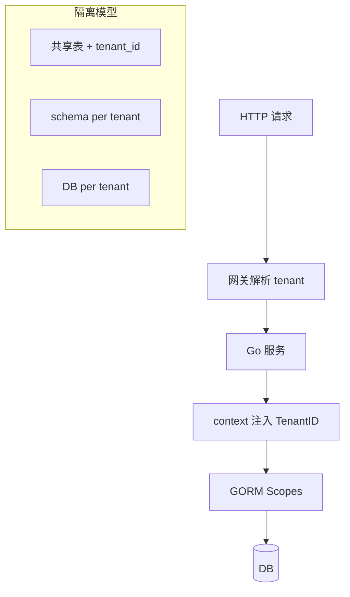

# 多租户 SaaS 隔离与权限架构

## 30 秒版（开场）

> 多租户架构师要定 **隔离模型**（共享库共享表 / 共享库独立 schema / 独立库）+ **租户上下文贯穿全链路** + **RLS/中间件防越权**。生产关键词：**tenant_id、数据泄露 0 容忍、 noisy neighbor 配额**。

## 3 分钟版（一面深度）

1. **是什么**：一套部署服务多个客户（tenant），逻辑或物理隔离数据与配置。
2. **为什么**：B 端 SaaS、内部平台化面试高频；与 [S-AI-05 RAG ACL](../10-ai-engineering/S-AI-05-llm-security.md) 同属权限边界题。
3. **怎么做**：请求入口解析 tenant（JWT claim / 子域名）；GORM scope 自动 `WHERE tenant_id=?`；敏感租户独立库。

## 10 分钟版（原理 + 图示）



**隔离模型对比**

| 模型 | 成本 | 隔离 | 适用 |
|------|------|------|------|
| 共享表 + tenant_id | 低 | 逻辑 | SMB SaaS |
| Schema / 库 per tenant | 中 | 较强 | 中大客户 |
| 部署 per tenant | 高 | 最强 | 金融/政企 |

**权限层次**

1. **租户级**：tenant A 看不见 tenant B 数据
2. **租户内 RBAC**：admin / member / read-only
3. **资源级**：项目、订单、知识库文档 ACL

**Go 实现要点**

```go
type tenantKey struct{}

func WithTenant(ctx context.Context, id string) context.Context {
    return context.WithValue(ctx, tenantKey{}, id)
}

func TenantScope(db *gorm.DB, ctx context.Context) *gorm.DB {
    tid, _ := ctx.Value(tenantKey{}).(string)
    return db.Where("tenant_id = ?", tid)
}
```

中间件：每个 handler 从 JWT 取 `tenant_id`，**禁止**客户端 body 传 tenant 覆盖。

## 生产场景

- **大客户要独立库**：绞杀迁移 tenant 数据；连接池按 tenant 路由（见连接池题）
- **AI 知识库 SaaS**：向量检索必须 filter `tenant_id`（[S-AI-02 RAG](../10-ai-engineering/S-AI-02-rag-architecture.md)）
- **配额 noisy neighbor**：单 tenant QPS/存储/cpu 限流

## 排查与工具

- 渗透测试：横向越权用例自动化
- 审计日志：`who + tenant + action + resource`
- 集成测试：双 tenant 并发写读

## 架构取舍

| 早期全共享 | 过早独立库 |
|------------|------------|
| 快 | 运维爆炸 |

**演进路径**：共享表 → 大客户 silo → 混合（80% 共享 + 20% VIP 独立）。

## 追问链

1. **子域名 tenant 解析？** → `acme.app.com` → tenant=acme；通配证书 + 网关路由。
2. **跨 tenant 运营后台？** → 超级管理员 break-glass + 全审计。
3. **缓存隔离？** → Redis key 前缀 `t:{id}:`。
4. **MQ 隔离？** → topic 带 tenant 或 共享 topic + header filter。

## 反模式与事故

- **忘记 scope** → IDOR 看他人订单，架构师责任
- **tenant_id 来自 query 参数** → 伪造
- **共享连接串** → VIP 客户不接受

## 代码示例

Gin 中间件注入 tenant 后，`c.Request = c.Request.WithContext(WithTenant(...))`。

## 延伸阅读

- [Azure Multitenant guidance](https://learn.microsoft.com/en-us/azure/architecture/guide/multitenant/overview)
- [OWASP Multitenant Cheat Sheet](https://cheatsheetseries.owasp.org/cheatsheets/Multitenant_Security_Cheat_Sheet.html)
