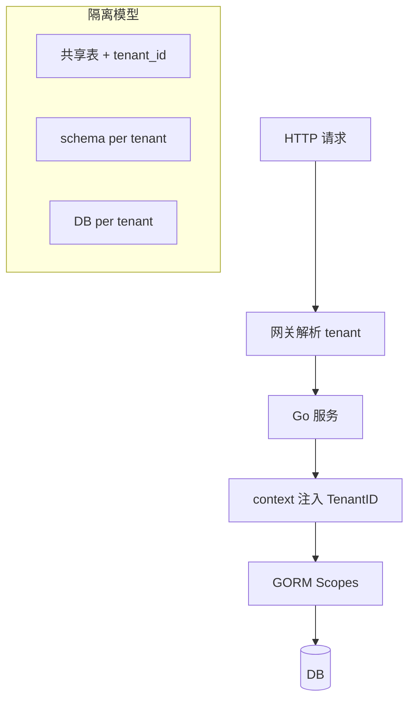

# 多租户 SaaS 隔离与权限架构

<a id="oral-card"></a>

## 要点卡

[返回 P0 知识图谱](../_meta/p0-knowledge-graph.md)

!!! abstract "30 秒回答"

    多租户不是给表加 `tenant_id`，而是让可信租户身份贯穿 API、任务、数据库、缓存、MQ、
    对象存储、搜索、向量检索、日志和备份。隔离强度按合规、噪声、故障域和成本选择共享表、
    schema/库或独立部署；应用 fail-closed scope、复合键和 PostgreSQL RLS 形成纵深防御，
    同时注意 owner/BYPASSRLS、连接池上下文和数据库之外的资源仍需各自授权。

**3 分钟展开**

1. tenant 来自已验证 identity 与服务端 membership，不接受 body/query 覆盖；跨租户运营走独立 break-glass 审批和审计。
2. 共享表的主键/唯一键/外键和常用索引通常都带 `tenant_id`，防止业务约束和查询遗漏形成跨租户引用。
3. PostgreSQL RLS 默认不约束 superuser、`BYPASSRLS`，table owner 通常也绕过；必要时 `FORCE ROW LEVEL SECURITY`，
   应用角色不得拥有绕过能力，pooled connection 在事务内 `SET LOCAL` 并测试上下文清理。
4. 每租户限 QPS、并发、存储、token/tool 成本；大租户可渐进迁移到 silo，控制面维护路由、配置和迁移状态。

| 记忆槽 | 内容 |
|--------|------|
| 三个不变量 | tenant 只能来自可信身份；缺 tenant 必须 fail closed；所有共享资源都要纳入隔离 |
| 手画图 | `identity → tenant context → app scope + RLS → cache/MQ/search/storage` |
| 项目落点 | OctoAgentFlow 讲 persona/memory/tool/credential namespace 和配额；只按真实实现程度表述 |
| 一个取舍 | pool 模型成本低但爆破半径和 noisy neighbor 风险高；silo 隔离强但迁移与运维成本高 |

**错误表达**

- ❌ “有 RLS 就不会串租户；独立数据库一定完全隔离。”
- ✅ “RLS 有绕过角色和连接上下文边界；独立库仍要检查凭证、备份、网络和运维控制面是否共享。”

**自测追问**：使用 pgx 连接池时，tenant session variable 为什么可能泄漏到下一个请求，如何避免？

## 10 分钟版（原理 + 图示）


```mermaid
flowchart TB
  Req[HTTP 请求] --> GW[网关解析 tenant]
  GW --> Svc[Go 服务]
  Svc --> Ctx[context 注入 TenantID]
  Ctx --> ORM[GORM Scopes]
  ORM --> DB[(DB)]
  subgraph models[隔离模型]
    M1[共享表 + tenant_id]
    M2[schema per tenant]
    M3[DB per tenant]
  end
```

**隔离模型对比**

| 模型 | 成本 | 隔离 | 适用 |
|------|------|------|------|
| 共享表 + tenant_id | 低 | 逻辑隔离、共享故障域 | 大量相似租户且合规允许 |
| Schema / 库 per tenant | 中 | 更强数据边界 | 需独立迁移/备份或 noisy-neighbor 治理 |
| 部署 per tenant | 高 | 可分离计算、网络与运维边界 | 合规/性能/故障域要求值得承担成本 |

**权限层次**

1. **租户级**：tenant A 看不见 tenant B 数据
2. **租户内 RBAC**：admin / member / read-only
3. **资源级**：项目、订单、知识库文档 ACL

**Go 实现要点**

```go
type tenantKey struct{}

func WithTenant(ctx context.Context, id string) context.Context {
    return context.WithValue(ctx, tenantKey{}, id)
}

func TenantScope(db *gorm.DB, ctx context.Context) (*gorm.DB, error) {
    tid, ok := ctx.Value(tenantKey{}).(string)
    if !ok || tid == "" {
        return nil, ErrMissingTenant // 缺 tenant 必须 fail closed
    }
    return db.Where("tenant_id = ?", tid), nil
}
```

中间件：从已完成 iss/aud/签名校验的身份中解析 tenant，并再次验证用户对 tenant 的 membership；禁止客户端 body 覆盖。仅靠开发者记得调用 scope 容易漏，关键表还应使用 RLS、带 tenant_id 的唯一键/外键与跨租户测试。

若 PostgreSQL policy 读取 `current_setting('app.tenant_id')`，应在显式事务中用 `SET LOCAL`
绑定，并确保应用角色不是 table owner/superuser/`BYPASSRLS`；`FORCE ROW LEVEL SECURITY`
只处理 table owner 的常见绕过，不能约束 superuser/`BYPASSRLS`。连接池上的 session-level
`SET` 若未可靠 reset，可能把前一个请求的 tenant 带给后一个请求。

## 生产场景

- **大客户要独立库**：绞杀迁移 tenant 数据；连接池按 tenant 路由（见连接池题）
- **AI 知识库 SaaS**：向量检索必须 filter `tenant_id`（[S-AI-02 RAG](../10-ai-engineering/S-AI-02-rag-architecture.md)）
- **配额 noisy neighbor**：单 tenant QPS/存储/cpu 限流
- **异步与外围资源**：job payload、cache key、topic/consumer authorization、object prefix、search
  alias/filter、日志查询和导出都必须携带并验证 tenant，不能只保护主数据库

## 排查与工具

- 渗透测试：横向越权用例自动化
- 审计日志：`who + tenant + action + resource`
- 集成测试：双 tenant 并发写读

## 架构取舍

| 早期全共享 | 过早独立库 |
|------------|------------|
| 快 | 运维爆炸 |

**演进路径**：可从共享表演进到部分租户 silo 的混合模式；比例由合规、噪声、成本与迁移能力决定。

## 深挖问答

1. **子域名 tenant 解析？** → `acme.app.com` → tenant=acme；通配证书 + 网关路由。
2. **跨 tenant 运营后台？** → 超级管理员 break-glass + 全审计。
3. **缓存隔离？** → key 必须含 tenant 防碰撞，还要限制租户配额、保护管理命令和凭证；key 前缀本身不是访问控制。
4. **MQ 隔离？** → 可按监管/规模选择独立 topic/cluster，或共享 topic 携带 tenant；消费者仍必须授权和校验，客户端 header filter 不是安全边界。

## 反模式与事故

- **忘记 scope** → IDOR 看他人订单，架构师责任
- **tenant_id 来自 query 参数** → 伪造
- 宣称“独立库”却共享高权限凭证、备份和运维边界 → 实际隔离强度低于承诺

## 代码示例

Gin 中间件注入 tenant 后，`c.Request = c.Request.WithContext(WithTenant(...))`。

## 延伸阅读

- [Azure Multitenant guidance](https://learn.microsoft.com/en-us/azure/architecture/guide/multitenant/overview)
- [OWASP Multi Tenant Security](https://cheatsheetseries.owasp.org/cheatsheets/Multi_Tenant_Security_Cheat_Sheet.html)
- [PostgreSQL Row Security Policies](https://www.postgresql.org/docs/current/ddl-rowsecurity.html)
