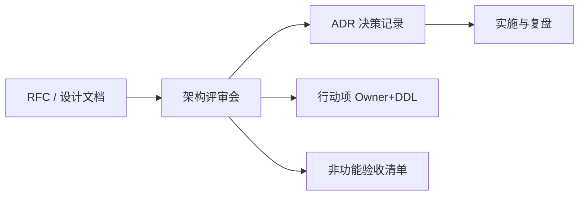

# 架构评审：流程、产出与博弈

## 30 秒版（开场）

> 架构师不只是画架构图，还要 **主持评审**：输入清晰、备选对比、风险显式、决策可追溯。产出 = **架构说明 + ADR + 非功能验收标准**。面试考察：**如何处理反对意见、如何说「不」**。与 [S-ARCH-20 ADR](../03-system-design/S-ARCH-20-tech-decision-doc.md) 互补：20 讲文档怎么写，本题讲 **评审怎么开**。

## 3 分钟版（一面深度）

1. **是什么**：在重大变更前，架构师组织跨角色（研发/测试/运维/安全/产品）评审方案。
2. **为什么**：架构师岗核心软技能；避免「会后各执一词、上线甩锅」。
3. **怎么做**：预读材料 → 30min 讲解 → 结构化讨论（风险/成本/工期）→ 结论：通过 / 有条件通过 / 延期。

## 10 分钟版（原理 + 图示）

**评审输入清单（架构师准备）**

| 章节 | 内容 |
|------|------|
| 背景与目标 | 业务 KPI、约束（工期/预算） |
| 现状 | 痛点数据（P99、成本、故障） |
| 方案 A/B/C | 架构图 + 优缺点 |
| 非功能 | 可用性、扩展、安全、可观测 |
| 迁移与回滚 | 见 [S-SOL-02](./S-SOL-02-strangler-fig-migration.md) |
| 风险登记 | 概率 × 影响 + 缓解 |

**评审输出**

- 通过的 ADR 编号
- 未决问题 owner
- **Architecture Fitness Function**（如：P99 < 200ms，错误率 < 0.01%）

**常见反对意见与应对（面试情景题）**

| 反对 | 架构师回应框架 |
|------|----------------|
| 「太贵了」 | 分阶段 ROI；对比故障成本 |
| 「工期不够」 | MVP 范围 + 绞杀者 Phase 1 |
| 「我们试过不行」 | 问清历史条件是否变化 |
| 「用 X 技术更潮」 | 回到 NFR 与团队能力矩阵 |

## 生产场景

- **上 Kafka vs RocketMQ**：评审对齐运维能力、顺序/事务需求（见 middleware 专题）
- **全量微服务拆分**：架构师建议暂缓，先模块化单体 + 度量耦合
- **AI 功能上线**：拉安全评审 [S-AI-05](../10-ai-engineering/S-AI-05-llm-security.md)

## 排查与工具

- ADR 仓库、Confluence/Markdown RFC 模板
- 架构决策 log 与代码 repo 同版本
- 事后 **Review 有效性复盘**：决策是否被遵守

## 架构取舍

| 重流程 | 无评审 |
|--------|--------|
| 慢但稳 | 快但反复 |

**轻量团队**：2 人 walkthrough + ADR 即可，不必大厂式 ARB。

## 追问链

1. **评审谁有一票否决？** → 视组织；安全/合规常具否决；架构师 **建议权 + 风险升级**。
2. **文档没人看怎么办？** → 一页 executive summary + 会前 24h 预读。
3. **技术债进不进评审？** → 进；与 [S-LEAD-02 技术债](../07-engineering-leadership/S-LEAD-02-tech-debt.md) 联动排优先级。
4. **架构师 vs 开发负责人冲突？** → 数据说话 + 小实验（POC）+ 时间盒。

## 反模式与事故

- **评审变批斗** → 打击创新；Blameless 文化
- **只评不跟** → ADR 睡仓库，实施偏离无感知
- **架构师独裁** → 团队不 ownership

## 代码示例

非代码题；产出物模板见 [S-ARCH-20](../03-system-design/S-ARCH-20-tech-decision-doc.md) ADR 结构。

## 延伸阅读

- [Documenting Architecture Decisions](https://cognitect.com/blog/2011/11/15/documenting-architecture-decisions)
- [ADR GitHub](https://adr.github.io/)
