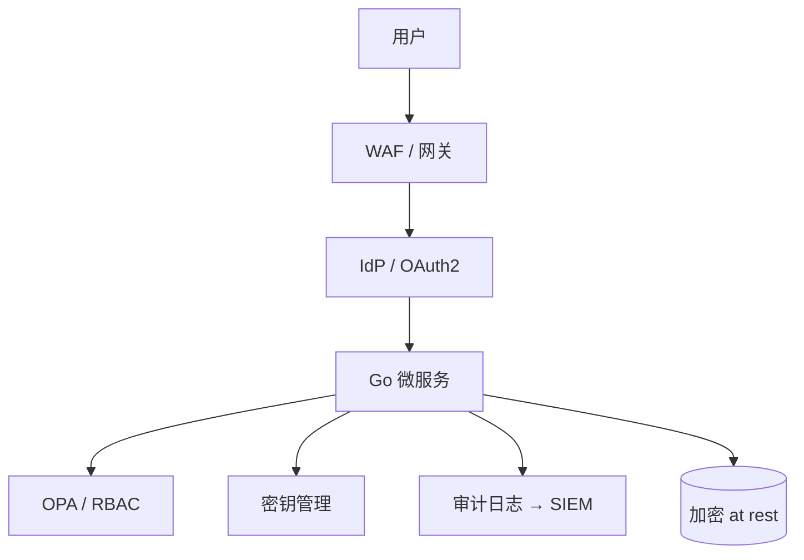

# 安全与审计的全局架构

## 30 秒版（开场）

> 架构师定义 **零信任边界**：默认不信任内网、**最小权限**、全链路 **审计不可篡改**。覆盖认证授权、密钥、PII、供应链（SBOM）。Go 服务：**mTLS、JWT 短 TTL、Secret 不进镜像**。与 [S-AI-05 LLM 安全](../10-ai-engineering/S-AI-05-llm-security.md)、[S-SOL-05 多租户](./S-SOL-05-multi-tenant-saas.md) 形成安全三角。

## 3 分钟版（一面深度）

1. **是什么**：安全架构 = 威胁建模 + 控制措施 + 可验证合规。
2. **为什么**：架构师对 **数据泄露、越权、供应链** 负最终设计责任；后端面 increasingly 问 security by design。
3. **怎么做**：STRIDE 威胁建模；分层防御（网关 WAF → 服务 RBAC → 数据加密）；集中审计日志到不可变存储。

## 10 分钟版（原理 + 图示）



**架构师必讲控制面**

| 域 | 措施 |
|----|------|
| 身份 | SSO、MFA、服务账号 rotation |
| 授权 | RBAC/ABAC；[S-NET-04 JWT](../06-network-governance/S-NET-04-jwt-auth.md) 边界 |
| 数据 | TLS1.3、字段级加密 PII、脱敏日志 |
| 供应链 | 依赖扫描、最小 base 镜像、SBOM |
| 审计 | who/when/what/tenant；WORM 或 hash 链 |

**Go 落地清单**

- `crypto/tls` 最低版本；禁用 weak cipher
- JWT：RS256、短 access + refresh rotation
- SQL：参数化；ORM 仍防 raw 拼接
- 容器：非 root、read-only rootfs

**威胁建模 STRIDE（简表）**

| 威胁 | 示例 | 缓解 |
|------|------|------|
| Spoofing | 伪造 JWT | 验签 + mTLS |
| Tampering | 改订单金额 | 服务端计价 |
| Repudiation | 抵赖操作 | 审计日志 |
| Info Disclosure | 日志泄露 PII | 脱敏 |
| DoS | 接口刷爆 | 限流 [S-ARCH-08](../03-system-design/S-ARCH-08-rate-limiting.md) |
| Elevation | 越权 tenant | [S-SOL-05](./S-SOL-05-multi-tenant-saas.md) |

## 生产场景

- **等保 / SOC2**：架构师输出控制矩阵映射到系统设计
- **密钥轮换**：Vault 动态 DB 凭证，Go 服务热加载
- **LLM 场景**：prompt 不进日志；RAG 文档 ACL

## 排查与工具

- OWASP ASVS L2 自检
- 渗透测试、SAST/DAST CI
- 审计：ELK + 只追加索引

## 架构取舍

| 内网互信 | 零信任 |
|----------|--------|
| 简单 | 每调用都验身份 |

**合规行业**：独立安全架构师评审；后端架构师配合落地。

## 追问链

1. **服务间还要鉴权吗？** → 要；Mesh mTLS + service identity。
2. **审计日志谁删？** → 运维无删权限；break-glass 双审批。
3. **GDPR 删除权？** → 架构预留 soft delete + 物理擦除 job。
4. **Go supply chain？** → `go.sum`、Dependabot、私有 proxy。

## 反模式与事故

- **`.env` 进 Git** → 密钥泄露
- **内网 HTTP 明文** → 横向移动
- **审计只打 info 无结构化** → 无法取证

## 代码示例

```go
// slog 脱敏
logger.Info("user login", "user_id", uid, "ip", ip) // 不打 phone/email
```

## 延伸阅读

- [OWASP ASVS](https://owasp.org/www-project-application-security-verification-standard/)
- [OWASP Cheat Sheet Series](https://cheatsheetseries.owasp.org/)
