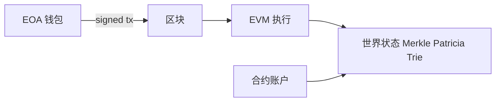

# 区块链基础与 EVM 账户模型

## 30 秒版（开场）

> 以太坊是 **状态机**：交易改变世界状态。两类账户：**EOA**（私钥控制，发交易）与 **合约账户**（代码+存储）。Gas 计量计算与存储成本。Go 后端关键词：**nonce 顺序、finality、链 ID 防重放**。

## 3 分钟版（一面深度）

1. **是什么**：去中心化账本 + 可编程层（EVM）；区块打包交易，共识（PoS）保证安全。
2. **为什么**：Web3 后端必须懂账户/Gas，否则无法估算费用、排查失败交易、设计索引。
3. **怎么做**：读链用 RPC；写链构造 signed tx；业务层区分 **链上确认数** 与 **链下订单状态**。

## 10 分钟版（原理 + 图示）

**账户对比**

| 类型 | 控制 | 有代码 | 典型用途 |
|------|------|--------|----------|
| EOA | 私钥 | 否 | 用户钱包、热钱包 |
| Contract | 代码逻辑 | 是 | ERC20、DEX、NFT |

**交易字段（面试常考）**

| 字段 | 含义 |
|------|------|
| nonce | 该 EOA 交易序号，防重放 |
| gasLimit / maxFee | 计算预算 |
| to | 空 = 部署合约 |
| value | 转 ETH |
| data | 调合约 calldata |

**Gas 机制（EIP-1559 后）**

- `baseFee` 销毁 + `priorityFee` 给验证者
- 合约 **SSTORE** 贵，冷存储更贵 → 架构上链下存大数据

**Finality**

- 以太坊 PoS：一般等 **12+ 确认** 或 safe/f finalized 标签（视业务风险）
- 与 [S-BC-05 重组](./S-BC-05-indexer-reorg.md) 联动

## 生产场景

- **充值**：用户转 ERC20 到平台地址 → 索引器确认 N 块后入账
- **Gas 代付**：元交易 / Paymaster（Account Abstraction）
- **多链**：同 mnemonic 不同 **chainId** 地址派生规则一致但状态隔离

## 排查与工具

- Etherscan / Blockscout 看 tx、internal tx、event logs
- `eth_getTransactionReceipt` 的 `status` 0/1
- Foundry/Hardhat 本地复现

## 架构取舍

| 全链上 | 链下+链上锚定 |
|--------|----------------|
| 透明不可篡改 | 便宜、可扩展 |
| 贵、慢 | 需信任链下服务 |

## 追问链

1. **UTXO vs Account？** → BTC UTXO；ETH 账户余额模型，便于智能合约。
2. **为什么 tx 失败仍耗 Gas？** → 已执行部分计费，防 DoS。
3. **chainId 作用？** → EIP-155 签名域，防跨链重放。
4. **和分布式系统一致性？** → 链上最终一致；跨链桥是额外信任假设。

## 反模式与事故

- **0 确认入账** → 重组双花
- **忽略 chainId** → 测试网 tx 签名到主网格式错误
- **把私钥放后端** → 用热钱包+HSM/KMS，最小余额

## 代码示例

链 ID 写入签名（概念）：`types.NewLondonSigner(chainID)`（go-ethereum）。

## 延伸阅读

- [Ethereum Accounts](https://ethereum.org/en/developers/docs/accounts/)
- [Gas and Fees](https://ethereum.org/en/developers/docs/gas/)
